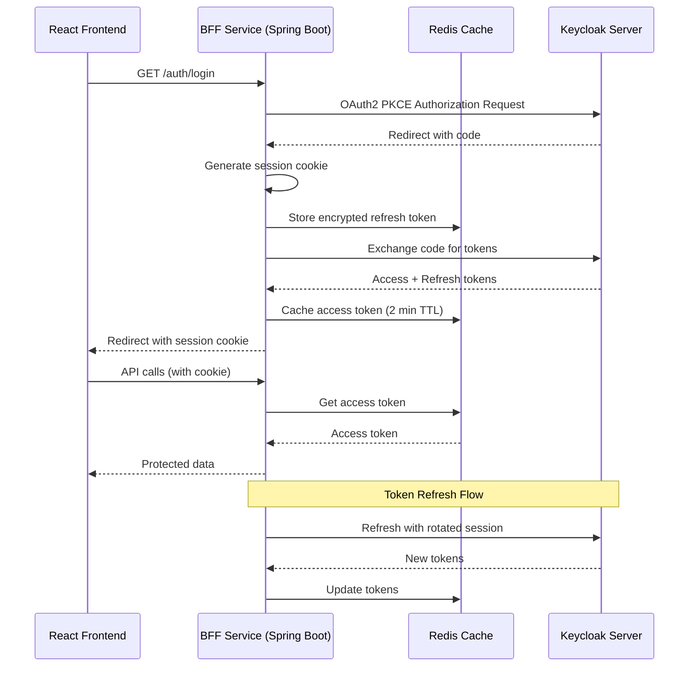

# Архитектура BFF с PKCE для BionicPRO

## Обзор

Данный документ описывает детальный технический план реализации BFF (Backend For Frontend) архитектуры с PKCE (Proof Key for Code Exchange) для проекта BionicPRO.

### Цели архитектуры

1. **Безопасность**: Устранение уязвимостей public client в OAuth2
2. **Управление сессиями**: HTTP-Only Secure SameSite куки для защиты от XSS
3. **Ротация токенов**: Автоматическое обновление refresh-токенов
4. **Кэширование**: Оптимизация производительности через Redis
5. **Изоляция**: Фронтенд не работает напрямую с Keycloak

---

## Архитектурная диаграмма



---

## 1. Keycloak Конфигурация

### 1.1 Обновление realm-export.json

Добавить два новых клиента в `task1/app/keycloak/realm-export.json`:

```json
{
  "clientId": "bionicpro-auth-backend",
  "enabled": true,
  "publicClient": false,
  "clientAuthenticatorType": "client-secret",
  "secret": "${BIONICPRO_AUTH_BACKEND_SECRET}",
  "redirectUris": ["http://localhost:8081/auth/callback"],
  "webOrigins": ["http://localhost:8081"],
  "protocol": "openid-connect",
  "authorizationServicesEnabled": true,
  "pkceCodeChallengeMethod": "S256",
  "standardFlowEnabled": true,
  "directAccessGrantsEnabled": false,
  "serviceAccountsEnabled": false,
  "attributes": {
    "access.token.lifespan": "120",
    "access.token.lifespan.for.authorization.context": "120"
  }
},
{
  "clientId": "bionicpro-frontend-public",
  "enabled": true,
  "publicClient": true,
  "redirectUris": ["http://localhost:3000/*"],
  "webOrigins": ["http://localhost:3000"],
  "protocol": "openid-connect",
  "standardFlowEnabled": true,
  "directAccessGrantsEnabled": false,
  "serviceAccountsEnabled": false
}
```

### 1.2 Генерация client secret

Для `bionicpro-auth-backend` сгенерировать secure secret:

```bash
openssl rand -base64 32
```

### 1.3 Обновление переменных окружения Keycloak

В `docker-compose.yaml` добавить:

```yaml
keycloak:
  environment:
    - BIONICPRO_AUTH_BACKEND_SECRET=your-generated-secret-here
```

---

## 2. BFF-Сервис (Spring Boot)

### 2.1 Структура проекта

```
bionicpro-auth/
├── src/
│   ├── main/
│   │   ├── java/
│   │   │   └── com/
│   │   │       └── bionicpro/
│   │   │           └── auth/
│   │   │               ├── BionicproAuthApplication.java
│   │   │               ├── config/
│   │   │               │   ├── RedisConfig.java
│   │   │               │   ├── SecurityConfig.java
│   │   │               │   ├── OAuth2ClientConfig.java
│   │   │               │   └── CorsConfig.java
│   │   │               ├── controller/
│   │   │               │   ├── AuthController.java
│   │   │               │   └── SessionController.java
│   │   │               ├── filter/
│   │   │               │   └── SessionValidationFilter.java
│   │   │               ├── model/
│   │   │               │   ├── SessionData.java
│   │   │               │   ├── TokenResponse.java
│   │   │               │   └── PKCEParams.java
│   │   │               ├── service/
│   │   │               │   ├── KeycloakService.java
│   │   │               │   ├── SessionService.java
│   │   │               │   └── TokenCacheService.java
│   │   │               └── util/
│   │   │                   ├── CryptoUtil.java
│   │   │                   └── PKCEUtil.java
│   │   └── resources/
│   │       ├── application.yml
│   │       └── application-dev.yml
│   └── test/
│       └── java/
│           └── com/
│               └── bionicpro/
│                   └── auth/
│                       └── BionicproAuthApplicationTests.java
├── pom.xml
└── Dockerfile
```

### 2.2 Зависимости (pom.xml)

```xml
<?xml version="1.0" encoding="UTF-8"?>
<project xmlns="http://maven.apache.org/POM/4.0.0"
         xmlns:xsi="http://www.w3.org/2001/XMLSchema-instance"
         xsi:schemaLocation="http://maven.apache.org/POM/4.0.0 
         http://maven.apache.org/xsd/maven-4.0.0.xsd">
    <modelVersion>4.0.0</modelVersion>
    
    <parent>
        <groupId>org.springframework.boot</groupId>
        <artifactId>spring-boot-starter-parent</artifactId>
        <version>3.2.0</version>
        <relativePath/>
    </parent>
    
    <groupId>com.bionicpro</groupId>
    <artifactId>bionicpro-auth</artifactId>
    <version>1.0.0</version>
    <packaging>jar</packaging>
    
    <name>BionicPRO Auth BFF</name>
    <description>BFF Service with PKCE for BionicPRO</description>
    
    <properties>
        <java.version>17</java.version>
        <project.build.sourceEncoding>UTF-8</project.build.sourceEncoding>
    </properties>
    
    <dependencies>
        <!-- Spring Boot Starters -->
        <dependency>
            <groupId>org.springframework.boot</groupId>
            <artifactId>spring-boot-starter-web</artifactId>
        </dependency>
        <dependency>
            <groupId>org.springframework.boot</groupId>
            <artifactId>spring-boot-starter-security</artifactId>
        </dependency>
        <dependency>
            <groupId>org.springframework.boot</groupId>
            <artifactId>spring-boot-starter-data-redis</artifactId>
        </dependency>
        <dependency>
            <groupId>org.springframework.boot</groupId>
            <artifactId>spring-boot-starter-session</artifactId>
        </dependency>
        
        <!-- Redis -->
        <dependency>
            <groupId>io.lettuce</groupId>
            <artifactId>lettuce-core</artifactId>
        </dependency>
        
        <!-- JWT -->
        <dependency>
            <groupId>io.jsonwebtoken</groupId>
            <artifactId>jjwt-api</artifactId>
            <version>0.11.5</version>
        </dependency>
        <dependency>
            <groupId>io.jsonwebtoken</groupId>
            <artifactId>jjwt-impl</artifactId>
            <version>0.11.5</version>
        </dependency>
        <dependency>
            <groupId>io.jsonwebtoken</groupId>
            <artifactId>jjwt-jackson</artifactId>
            <version>0.11.5</version>
        </dependency>
        
        <!-- Lombok -->
        <dependency>
            <groupId>org.projectlombok</groupId>
            <artifactId>lombok</artifactId>
            <optional>true</optional>
        </dependency>
        
        <!-- Testing -->
        <dependency>
            <groupId>org.springframework.boot</groupId>
            <artifactId>spring-boot-starter-test</artifactId>
            <scope>test</scope>
        </dependency>
        <dependency>
            <groupId>org.springframework.security</groupId>
            <artifactId>spring-security-test</artifactId>
            <scope>test</scope>
        </dependency>
    </dependencies>
    
    <build>
        <plugins>
            <plugin>
                <groupId>org.springframework.boot</groupId>
                <artifactId>spring-boot-maven-plugin</artifactId>
                <configuration>
                    <excludes>
                        <exclude>
                            <groupId>org.projectlombok</groupId>
                            <artifactId>lombok</artifactId>
                        </exclude>
                    </excludes>
                </configuration>
            </plugin>
        </plugins>
    </build>
</project>
```

### 2.3 Конфигурация (application.yml)

```yaml
server:
  port: 8081
  servlet:
    session:
      cookie:
        name: BIONICPRO_SESSION
        http-only: true
        secure: true
        same-site: strict
        path: /
  error:
    include-message: always

spring:
  application:
    name: bionicpro-auth
  data:
    redis:
      host: redis
      port: 6379
      timeout: 2000
  session:
    store-type: redis
    timeout: 10m
  security:
    oauth2:
      client:
        registration:
          keycloak:
            client-id: bionicpro-auth-backend
            client-secret: ${BIONICPRO_AUTH_BACKEND_SECRET}
            provider: keycloak
            authorization-grant-type: authorization_code
            redirect-uri: "{baseUrl}/auth/callback"
            scope:
              - openid
              - profile
              - email
        provider:
          keycloak:
            issuer-uri: http://keycloak:8080/realms/reports-realm
            authorization-uri: http://keycloak:8080/realms/reports-realm/protocol/openid-connect/auth
            token-uri: http://keycloak:8080/realms/reports-realm/protocol/openid-connect/token
            jwk-set-uri: http://keycloak:8080/realms/reports-realm/protocol/openid-connect/certs
            user-name-attribute: sub

logging:
  level:
    root: INFO
    com.bionicpro: DEBUG
    org.springframework.security: DEBUG
    org.springframework.session: DEBUG

bff:
  keycloak:
    issuer-uri: http://keycloak:8080/realms/reports-realm
    token-uri: http://keycloak:8080/realms/reports-realm/protocol/openid-connect/token
    logout-uri: http://keycloak:8080/realms/reports-realm/protocol/openid-connect/logout
  frontend:
    redirect-uri: http://localhost:3000
  session:
    cookie-domain: localhost
    cookie-path: /
```

### 2.4 Основные классы

#### 2.4.1 Main Application

```java
package com.bionicpro.auth;

import org.springframework.boot.SpringApplication;
import org.springframework.boot.autoconfigure.SpringBootApplication;
import org.springframework.session.data.redis.config.annotation.web.http.EnableRedisHttpSession;

@SpringBootApplication
@EnableRedisHttpSession
public class BionicproAuthApplication {
    public static void main(String[] args) {
        SpringApplication.run(BionicproAuthApplication.class, args);
    }
}
```

#### 2.4.2 PKCE Utility

```java
package com.bionicpro.auth.util;

import java.security.MessageDigest;
import java.security.NoSuchAlgorithmException;
import java.util.Base64;
import java.util.UUID;

public class PKCEUtil {
    
    public static String generateCodeVerifier() {
        byte[] codeVerifier = new byte[32];
        UUID.randomUUID().toString().getBytes();
        return UUID.randomUUID().toString().replace("-", "");
    }
    
    public static String generateCodeChallenge(String codeVerifier) {
        try {
            MessageDigest digest = MessageDigest.getInstance("SHA-256");
            byte[] hash = digest.digest(codeVerifier.getBytes());
            return Base64.getUrlEncoder().withoutPadding().encodeToString(hash);
        } catch (NoSuchAlgorithmException e) {
            throw new RuntimeException("SHA-256 not supported", e);
        }
    }
}
```

#### 2.4.3 Crypto Utility

```java
package com.bionicpro.auth.util;

import javax.crypto.Cipher;
import javax.crypto.KeyGenerator;
import javax.crypto.SecretKey;
import javax.crypto.spec.SecretKeySpec;
import java.nio.charset.StandardCharsets;
import java.security.SecureRandom;
import java.util.Base64;

public class CryptoUtil {
    
    private static final String ALGORITHM = "AES";
    private static final String TRANSFORMATION = "AES";
    
    public static String encrypt(String plainText, String encryptionKey) {
        try {
            SecretKey secretKey = generateKey(encryptionKey);
            Cipher cipher = Cipher.getInstance(TRANSFORMATION);
            cipher.init(Cipher.ENCRYPT_MODE, secretKey);
            byte[] encryptedBytes = cipher.doFinal(plainText.getBytes(StandardCharsets.UTF_8));
            return Base64.getEncoder().encodeToString(encryptedBytes);
        } catch (Exception e) {
            throw new RuntimeException("Encryption failed", e);
        }
    }
    
    public static String decrypt(String encryptedText, String encryptionKey) {
        try {
            SecretKey secretKey = generateKey(encryptionKey);
            Cipher cipher = Cipher.getInstance(TRANSFORMATION);
            cipher.init(Cipher.DECRYPT_MODE, secretKey);
            byte[] decodedBytes = Base64.getDecoder().decode(encryptedText);
            byte[] decryptedBytes = cipher.doFinal(decodedBytes);
            return new String(decryptedBytes, StandardCharsets.UTF_8);
        } catch (Exception e) {
            throw new RuntimeException("Decryption failed", e);
        }
    }
    
    private static SecretKey generateKey(String secretKey) {
        byte[] decodedKey = Base64.getDecoder().decode(secretKey);
        return new SecretKeySpec(decodedKey, 0, decodedKey.length, ALGORITHM);
    }
    
    public static String generateEncryptionKey() {
        try {
            KeyGenerator keyGenerator = KeyGenerator.getInstance(ALGORITHM);
            keyGenerator.init(256);
            SecretKey secretKey = keyGenerator.generateKey();
            return Base64.getEncoder().encodeToString(secretKey.getEncoded());
        } catch (Exception e) {
            throw new RuntimeException("Failed to generate encryption key", e);
        }
    }
}
```

#### 2.4.4 Session Data Model

```java
package com.bionicpro.auth.model;

import lombok.AllArgsConstructor;
import lombok.Data;
import lombok.NoArgsConstructor;

@Data
@NoArgsConstructor
@AllArgsConstructor
public class SessionData {
    private String sessionId;
    private String accessToken;
    private String encryptedRefreshToken;
    private Long accessTokenExpiresAt;
    private String userId;
    private String userName;
    private String userEmail;
    private String[] roles;
}
```

#### 2.4.5 Token Response Model

```java
package com.bionicpro.auth.model;

import lombok.AllArgsConstructor;
import lombok.Data;
import lombok.NoArgsConstructor;

import java.util.Map;

@Data
@NoArgsConstructor
@AllArgsConstructor
public class TokenResponse {
    private String accessToken;
    private String refreshToken;
    private String idToken;
    private String tokenType;
    private Integer expiresIn;
    private String scope;
    private Map<String, Object> additionalParameters;
}
```

#### 2.4.6 PKCE Params Model

```java
package com.bionicpro.auth.model;

import lombok.AllArgsConstructor;
import lombok.Data;
import lombok.NoArgsConstructor;

@Data
@NoArgsConstructor
@AllArgsConstructor
public class PKCEParams {
    private String codeVerifier;
    private String codeChallenge;
    private String codeChallengeMethod = "S256";
}
```

#### 2.4.7 Keycloak Service

```java
package com.bionicpro.auth.service;

import com.bionicpro.auth.model.TokenResponse;
import com.bionicpro.auth.model.PKCEParams;
import org.springframework.beans.factory.annotation.Value;
import org.springframework.http.*;
import org.springframework.stereotype.Service;
import org.springframework.web.client.RestTemplate;
import org.springframework.web.util.UriComponentsBuilder;

import java.net.URI;
import java.util.Base64;

@Service
public class KeycloakService {
    
    @Value("${bff.keycloak.issuer-uri}")
    private String issuerUri;
    
    @Value("${bff.keycloak.token-uri}")
    private String tokenUri;
    
    @Value("${bff.keycloak.logout-uri}")
    private String logoutUri;
    
    @Value("${spring.security.oauth2.client.registration.keycloak.client-id}")
    private String clientId;
    
    @Value("${spring.security.oauth2.client.registration.keycloak.client-secret}")
    private String clientSecret;
    
    private final RestTemplate restTemplate = new RestTemplate();
    
    public URI getAuthorizationUri(PKCEParams pkceParams, String redirectUri) {
        String authorizationUri = issuerUri.replace("/realms/reports-realm", "") + 
                                  "/realms/reports-realm/protocol/openid-connect/auth";
        
        return UriComponentsBuilder.fromUriString(authorizationUri)
                .queryParam("client_id", clientId)
                .queryParam("response_type", "code")
                .queryParam("scope", "openid profile email")
                .queryParam("redirect_uri", redirectUri)
                .queryParam("code_challenge", pkceParams.getCodeChallenge())
                .queryParam("code_challenge_method", pkceParams.getCodeChallengeMethod())
                .build()
                .toUri();
    }
    
    public TokenResponse exchangeCodeForTokens(String code, String redirectUri, String codeVerifier) {
        HttpHeaders headers = new HttpHeaders();
        headers.setContentType(MediaType.APPLICATION_FORM_URLENCODED);
        
        String authHeader = "Basic " + Base64.getEncoder().encodeToString(
            (clientId + ":" + clientSecret).getBytes()
        );
        headers.set("Authorization", authHeader);
        
        String body = String.format(
            "grant_type=authorization_code&code=%s&redirect_uri=%s&code_verifier=%s",
            code, redirectUri, codeVerifier
        );
        
        HttpEntity<String> request = new HttpEntity<>(body, headers);
        
        try {
            ResponseEntity<TokenResponse> response = restTemplate.postForEntity(
                tokenUri, request, TokenResponse.class
            );
            return response.getBody();
        } catch (Exception e) {
            throw new RuntimeException("Failed to exchange code for tokens", e);
        }
    }
    
    public TokenResponse refreshTokens(String refreshToken) {
        HttpHeaders headers = new HttpHeaders();
        headers.setContentType(MediaType.APPLICATION_FORM_URLENCODED);
        
        String authHeader = "Basic " + Base64.getEncoder().encodeToString(
            (clientId + ":" + clientSecret).getBytes()
        );
        headers.set("Authorization", authHeader);
        
        String body = String.format(
            "grant_type=refresh_token&refresh_token=%s",
            refreshToken
        );
        
        HttpEntity<String> request = new HttpEntity<>(body, headers);
        
        try {
            ResponseEntity<TokenResponse> response = restTemplate.postForEntity(
                tokenUri, request, TokenResponse.class
            );
            return response.getBody();
        } catch (Exception e) {
            throw new RuntimeException("Failed to refresh tokens", e);
        }
    }
    
    public URI getLogoutUri(String refreshToken, String redirectUri) {
        return UriComponentsBuilder.fromUriString(logoutUri)
                .queryParam("client_id", clientId)
                .queryParam("refresh_token", refreshToken)
                .queryParam("post_logout_redirect_uri", redirectUri)
                .build()
                .toUri();
    }
}
```

#### 2.4.8 Session Service

```java
package com.bionicpro.auth.service;

import com.bionicpro.auth.model.SessionData;
import com.bionicpro.auth.model.TokenResponse;
import com.bionicpro.auth.util.CryptoUtil;
import org.springframework.beans.factory.annotation.Value;
import org.springframework.data.redis.core.RedisTemplate;
import org.springframework.session.Session;
import org.springframework.session.SessionRepository;
import org.springframework.stereotype.Service;

import java.time.Duration;
import java.util.Base64;
import java.util.UUID;

@Service
public class SessionService {
    
    @Value("${bff.encryption.key}")
    private String encryptionKey;
    
    private final SessionRepository<? extends Session> sessionRepository;
    private final RedisTemplate<String, Object> redisTemplate;
    
    public SessionService(SessionRepository<? extends Session> sessionRepository,
                         RedisTemplate<String, Object> redisTemplate) {
        this.sessionRepository = sessionRepository;
        this.redisTemplate = redisTemplate;
    }
    
    public SessionData createSession(TokenResponse tokenResponse, String userId, 
                                    String userName, String userEmail, String[] roles) {
        String sessionId = UUID.randomUUID().toString();
        
        String encryptedRefreshToken = CryptoUtil.encrypt(
            tokenResponse.getRefreshToken(), encryptionKey
        );
        
        SessionData sessionData = new SessionData();
        sessionData.setSessionId(sessionId);
        sessionData.setAccessToken(tokenResponse.getAccessToken());
        sessionData.setEncryptedRefreshToken(encryptedRefreshToken);
        sessionData.setAccessTokenExpiresAt(System.currentTimeMillis() / 1000 + tokenResponse.getExpiresIn());
        sessionData.setUserId(userId);
        sessionData.setUserName(userName);
        sessionData.setUserEmail(userEmail);
        sessionData.setRoles(roles);
        
        // Store in Redis with 10 minute TTL
        redisTemplate.opsForValue().set(
            "session:" + sessionId, 
            sessionData, 
            Duration.ofMinutes(10)
        );
        
        return sessionData;
    }
    
    public SessionData getSessionData(String sessionId) {
        return (SessionData) redisTemplate.opsForValue().get("session:" + sessionId);
    }
    
    public void updateSessionTokens(String sessionId, TokenResponse tokenResponse) {
        SessionData sessionData = getSessionData(sessionId);
        if (sessionData != null) {
            String encryptedRefreshToken = CryptoUtil.encrypt(
                tokenResponse.getRefreshToken(), encryptionKey
            );
            sessionData.setAccessToken(tokenResponse.getAccessToken());
            sessionData.setEncryptedRefreshToken(encryptedRefreshToken);
            sessionData.setAccessTokenExpiresAt(System.currentTimeMillis() / 1000 + tokenResponse.getExpiresIn());
            
            redisTemplate.opsForValue().set(
                "session:" + sessionId, 
                sessionData, 
                Duration.ofMinutes(10)
            );
        }
    }
    
    public void invalidateSession(String sessionId) {
        redisTemplate.delete("session:" + sessionId);
    }
    
    public String getEncryptedRefreshToken(String sessionId) {
        SessionData sessionData = getSessionData(sessionId);
        return sessionData != null ? sessionData.getEncryptedRefreshToken() : null;
    }
    
    public String getAccessToken(String sessionId) {
        SessionData sessionData = getSessionData(sessionId);
        return sessionData != null ? sessionData.getAccessToken() : null;
    }
}
```

#### 2.4.9 Token Cache Service

```java
package com.bionicpro.auth.service;

import org.springframework.data.redis.core.RedisTemplate;
import org.springframework.stereotype.Service;

import java.time.Duration;

@Service
public class TokenCacheService {
    
    private final RedisTemplate<String, String> redisTemplate;
    
    public TokenCacheService(RedisTemplate<String, String> redisTemplate) {
        this.redisTemplate = redisTemplate;
    }
    
    public String getAccessToken(String sessionId) {
        return redisTemplate.opsForValue().get("access_token:" + sessionId);
    }
    
    public void cacheAccessToken(String sessionId, String accessToken) {
        redisTemplate.opsForValue().set(
            "access_token:" + sessionId, 
            accessToken, 
            Duration.ofMinutes(2)
        );
    }
    
    public void invalidateAccessToken(String sessionId) {
        redisTemplate.delete("access_token:" + sessionId);
    }
}
```

#### 2.4.10 Auth Controller

```java
package com.bionicpro.auth.controller;

import com.bionicpro.auth.model.PKCEParams;
import com.bionicpro.auth.model.TokenResponse;
import com.bionicpro.auth.service.KeycloakService;
import com.bionicpro.auth.service.SessionService;
import com.bionicpro.auth.util.PKCEUtil;
import jakarta.servlet.http.HttpServletRequest;
import jakarta.servlet.http.HttpServletResponse;
import org.springframework.beans.factory.annotation.Value;
import org.springframework.http.HttpStatus;
import org.springframework.http.ResponseEntity;
import org.springframework.stereotype.Controller;
import org.springframework.web.bind.annotation.*;
import org.springframework.web.servlet.view.RedirectView;

import java.net.URI;

@Controller
public class AuthController {
    
    @Value("${bff.frontend.redirect-uri}")
    private String frontendRedirectUri;
    
    private final KeycloakService keycloakService;
    private final SessionService sessionService;
    
    public AuthController(KeycloakService keycloakService, SessionService sessionService) {
        this.keycloakService = keycloakService;
        this.sessionService = sessionService;
    }
    
    @GetMapping("/auth/login")
    public ResponseEntity<RedirectView> initiateLogin(HttpServletRequest request) {
        PKCEParams pkceParams = new PKCEParams();
        pkceParams.setCodeVerifier(PKCEUtil.generateCodeVerifier());
        pkceParams.setCodeChallenge(PKCEUtil.generateCodeChallenge(pkceParams.getCodeVerifier()));
        
        // Store code verifier in session temporarily
        String sessionId = request.getSession().getId();
        request.getSession().setAttribute("code_verifier_" + sessionId, pkceParams.getCodeVerifier());
        
        URI authorizationUri = keycloakService.getAuthorizationUri(
            pkceParams, 
            request.getRequestURL().toString().replace("/auth/login", "/auth/callback")
        );
        
        RedirectView redirectView = new RedirectView(authorizationUri.toString());
        return ResponseEntity.status(HttpStatus.FOUND).body(redirectView);
    }
    
    @GetMapping("/auth/callback")
    public ResponseEntity<RedirectView> handleCallback(
            @RequestParam("code") String code,
            HttpServletRequest request,
            HttpServletResponse response) {
        
        String sessionId = request.getSession().getId();
        String codeVerifier = (String) request.getSession().getAttribute("code_verifier_" + sessionId);
        
        if (codeVerifier == null) {
            return ResponseEntity.status(HttpStatus.BAD_REQUEST).build();
        }
        
        try {
            TokenResponse tokenResponse = keycloakService.exchangeCodeForTokens(
                code, 
                request.getRequestURL().toString(),
                codeVerifier
            );
            
            // Extract user info from JWT (simplified)
            String userId = "user1"; // In production, decode JWT and extract
            String userName = "User One";
            String userEmail = "user1@example.com";
            String[] roles = {"user"};
            
            sessionService.createSession(tokenResponse, userId, userName, userEmail, roles);
            
            // Set session cookie
            response.addCookie(createSessionCookie(sessionId));
            
            RedirectView redirectView = new RedirectView(frontendRedirectUri);
            return ResponseEntity.status(HttpStatus.FOUND).body(redirectView);
            
        } catch (Exception e) {
            return ResponseEntity.status(HttpStatus.INTERNAL_SERVER_ERROR).build();
        }
    }
    
    @PostMapping("/auth/refresh")
    public ResponseEntity<Void> refreshTokens(HttpServletRequest request, HttpServletResponse response) {
        String sessionId = request.getSession().getId();
        String encryptedRefreshToken = sessionService.getEncryptedRefreshToken(sessionId);
        
        if (encryptedRefreshToken == null) {
            return ResponseEntity.status(HttpStatus.UNAUTHORIZED).build();
        }
        
        try {
            // Decrypt refresh token
            String refreshToken = CryptoUtil.decrypt(encryptedRefreshToken, encryptionKey);
            
            // Refresh tokens with Keycloak
            TokenResponse tokenResponse = keycloakService.refreshTokens(refreshToken);
            
            // Update session with new tokens
            sessionService.updateSessionTokens(sessionId, tokenResponse);
            
            // Set new session cookie
            response.addCookie(createSessionCookie(sessionId));
            
            return ResponseEntity.status(HttpStatus.OK).build();
            
        } catch (Exception e) {
            sessionService.invalidateSession(sessionId);
            return ResponseEntity.status(HttpStatus.UNAUTHORIZED).build();
        }
    }
    
    @PostMapping("/auth/logout")
    public ResponseEntity<RedirectView> logout(HttpServletRequest request, HttpServletResponse response) {
        String sessionId = request.getSession().getId();
        
        // Invalidate session
        sessionService.invalidateSession(sessionId);
        
        // Clear cookie
        response.addCookie(createSessionCookie(sessionId, true));
        
        URI logoutUri = keycloakService.getLogoutUri(
            "dummy_refresh_token", // In production, get from session
            frontendRedirectUri
        );
        
        RedirectView redirectView = new RedirectView(logoutUri.toString());
        return ResponseEntity.status(HttpStatus.FOUND).body(redirectView);
    }
    
    private Cookie createSessionCookie(String sessionId) {
        return createSessionCookie(sessionId, false);
    }
    
    private Cookie createSessionCookie(String sessionId, boolean clear) {
        Cookie cookie = new Cookie("BIONICPRO_SESSION", clear ? "" : sessionId);
        cookie.setHttpOnly(true);
        cookie.setSecure(true);
        cookie.setSameSite("Strict");
        cookie.setPath("/");
        cookie.setMaxAge(clear ? 0 : 600); // 10 minutes
        return cookie;
    }
}
```

#### 2.4.11 Session Validation Filter

```java
package com.bionicpro.auth.filter;

import com.bionicpro.auth.service.SessionService;
import jakarta.servlet.*;
import jakarta.servlet.http.HttpServletRequest;
import jakarta.servlet.http.HttpServletResponse;
import org.springframework.stereotype.Component;

import java.io.IOException;

@Component
public class SessionValidationFilter implements Filter {
    
    private final SessionService sessionService;
    
    public SessionValidationFilter(SessionService sessionService) {
        this.sessionService = sessionService;
    }
    
    @Override
    public void doFilter(ServletRequest request, ServletResponse response, FilterChain chain)
            throws IOException, ServletException {
        
        HttpServletRequest httpRequest = (HttpServletRequest) request;
        HttpServletResponse httpResponse = (HttpServletResponse) response;
        
        String sessionId = httpRequest.getSession().getId();
        String path = httpRequest.getRequestURI();
        
        // Skip validation for auth endpoints
        if (path.startsWith("/auth/") || path.startsWith("/actuator/")) {
            chain.doFilter(request, response);
            return;
        }
        
        // Validate session exists
        if (sessionService.getSessionData(sessionId) == null) {
            httpResponse.setStatus(HttpServletResponse.SC_UNAUTHORIZED);
            return;
        }
        
        chain.doFilter(request, response);
    }
}
```

#### 2.4.12 Security Configuration

```java
package com.bionicpro.auth.config;

import com.bionicpro.auth.filter.SessionValidationFilter;
import org.springframework.context.annotation.Bean;
import org.springframework.context.annotation.Configuration;
import org.springframework.security.config.annotation.web.builders.HttpSecurity;
import org.springframework.security.config.annotation.web.configuration.EnableWebSecurity;
import org.springframework.security.web.SecurityFilterChain;
import org.springframework.security.web.authentication.UsernamePasswordAuthenticationFilter;
import org.springframework.web.cors.CorsConfiguration;
import org.springframework.web.cors.CorsConfigurationSource;
import org.springframework.web.cors.UrlBasedCorsConfigurationSource;

import java.util.Arrays;

@Configuration
@EnableWebSecurity
public class SecurityConfig {
    
    private final SessionValidationFilter sessionValidationFilter;
    
    public SecurityConfig(SessionValidationFilter sessionValidationFilter) {
        this.sessionValidationFilter = sessionValidationFilter;
    }
    
    @Bean
    public SecurityFilterChain filterChain(HttpSecurity http) throws Exception {
        http
            .csrf(csrf -> csrf.disable())
            .cors(cors -> cors.configurationSource(corsConfigurationSource()))
            .authorizeHttpRequests(authz -> authz
                .requestMatchers("/auth/**").permitAll()
                .requestMatchers("/actuator/**").permitAll()
                .anyRequest().authenticated()
            )
            .addFilterBefore(sessionValidationFilter, UsernamePasswordAuthenticationFilter.class);
        
        return http.build();
    }
    
    @Bean
    public CorsConfigurationSource corsConfigurationSource() {
        CorsConfiguration configuration = new CorsConfiguration();
        configuration.setAllowedOrigins(Arrays.asList("http://localhost:3000"));
        configuration.setAllowedMethods(Arrays.asList("GET", "POST", "PUT", "DELETE", "OPTIONS"));
        configuration.setAllowedHeaders(Arrays.asList("*"));
        configuration.setAllowCredentials(true);
        
        UrlBasedCorsConfigurationSource source = new UrlBasedCorsConfigurationSource();
        source.registerCorsConfiguration("/**", configuration);
        
        return source;
    }
}
```

#### 2.4.13 Redis Configuration

```java
package com.bionicpro.auth.config;

import org.springframework.context.annotation.Bean;
import org.springframework.context.annotation.Configuration;
import org.springframework.data.redis.connection.RedisConnectionFactory;
import org.springframework.data.redis.core.RedisTemplate;
import org.springframework.data.redis.serializer.GenericJackson2JsonRedisSerializer;
import org.springframework.data.redis.serializer.StringRedisSerializer;

@Configuration
public class RedisConfig {
    
    @Bean
    public RedisTemplate<String, Object> redisTemplate(RedisConnectionFactory connectionFactory) {
        RedisTemplate<String, Object> template = new RedisTemplate<>();
        template.setConnectionFactory(connectionFactory);
        
        template.setKeySerializer(new StringRedisSerializer());
        template.setValueSerializer(new GenericJackson2JsonRedisSerializer());
        
        template.setHashKeySerializer(new StringRedisSerializer());
        template.setHashValueSerializer(new GenericJackson2JsonRedisSerializer());
        
        return template;
    }
}
```

#### 2.4.14 CORS Configuration

```java
package com.bionicpro.auth.config;

import org.springframework.context.annotation.Bean;
import org.springframework.context.annotation.Configuration;
import org.springframework.web.cors.CorsConfiguration;
import org.springframework.web.cors.CorsConfigurationSource;
import org.springframework.web.cors.UrlBasedCorsConfigurationSource;

import java.util.Arrays;

@Configuration
public class CorsConfig {
    
    @Bean
    public CorsConfigurationSource corsConfigurationSource() {
        CorsConfiguration configuration = new CorsConfiguration();
        configuration.setAllowedOrigins(Arrays.asList("http://localhost:3000"));
        configuration.setAllowedMethods(Arrays.asList("GET", "POST", "PUT", "DELETE", "OPTIONS", "HEAD"));
        configuration.setAllowedHeaders(Arrays.asList("*"));
        configuration.setAllowCredentials(true);
        configuration.setExposedHeaders(Arrays.asList("Set-Cookie"));
        
        UrlBasedCorsConfigurationSource source = new UrlBasedCorsConfigurationSource();
        source.registerCorsConfiguration("/**", configuration);
        
        return source;
    }
}
```

#### 2.4.15 OAuth2 Client Configuration

```java
package com.bionicpro.auth.config;

import org.springframework.context.annotation.Bean;
import org.springframework.context.annotation.Configuration;
import org.springframework.security.oauth2.client.OAuth2AuthorizedClientManager;
import org.springframework.security.oauth2.client.OAuth2AuthorizedClientProvider;
import org.springframework.security.oauth2.client.OAuth2AuthorizedClientProviderBuilder;
import org.springframework.security.oauth2.client.registration.ClientRegistrationRepository;
import org.springframework.security.oauth2.client.web.DefaultOAuth2AuthorizedClientManager;
import org.springframework.security.oauth2.client.web.OAuth2AuthorizedClientRepository;
import org.springframework.security.oauth2.client.web.HttpSessionOAuth2AuthorizedClientRepository;

@Configuration
public class OAuth2ClientConfig {
    
    @Bean
    public OAuth2AuthorizedClientManager authorizedClientManager(
            ClientRegistrationRepository clientRegistrationRepository,
            OAuth2AuthorizedClientRepository authorizedClientRepository) {
        
        OAuth2AuthorizedClientProvider authorizedClientProvider = 
            OAuth2AuthorizedClientProviderBuilder.builder()
                .authorizationCode()
                .refreshToken()
                .build();
        
        DefaultOAuth2AuthorizedClientManager authorizedClientManager = 
            new DefaultOAuth2AuthorizedClientManager(
                clientRegistrationRepository, authorizedClientRepository);
        authorizedClientManager.setAuthorizedClientProvider(authorizedClientProvider);
        
        return authorizedClientManager;
    }
    
    @Bean
    public OAuth2AuthorizedClientRepository authorizedClientRepository() {
        return new HttpSessionOAuth2AuthorizedClientRepository();
    }
}
```

### 2.5 Dockerfile для BFF

```dockerfile
FROM maven:3.9-eclipse-temurin-17-alpine AS build
WORKDIR /build
COPY pom.xml .
RUN mvn -B dependency:go-offline
COPY src ./src
RUN mvn -B package -DskipTests

FROM eclipse-temurin:17-jre-alpine
WORKDIR /app
COPY --from=build /build/target/bionicpro-auth-1.0.0.jar app.jar
EXPOSE 8081
ENTRYPOINT ["java", "-jar", "app.jar"]
```

---

## 3. Обновление Frontend

### 3.1 Обновление package.json

Удалить зависимости Keycloak:

```json
{
  "dependencies": {
    "@react-keycloak/web": "^3.4.0",
    "keycloak-js": "^21.1.0"
  }
}
```

Заменить на:

```json
{
  "dependencies": {
    "axios": "^1.6.0"
  }
}
```

### 3.2 Обновление .env

```env
REACT_APP_API_URL=http://localhost:8000
REACT_APP_BFF_URL=http://localhost:8081
```

### 3.3 Обновление App.tsx

```tsx
import React, { useState, useEffect } from 'react';
import ReportPage from './components/ReportPage';

const App: React.FC = () => {
  const [authenticated, setAuthenticated] = useState(false);
  const [loading, setLoading] = useState(true);

  useEffect(() => {
    checkAuth();
  }, []);

  const checkAuth = async () => {
    try {
      const response = await fetch(`${process.env.REACT_APP_BFF_URL}/auth/session`, {
        credentials: 'include'
      });
      
      if (response.ok) {
        setAuthenticated(true);
      }
    } catch (error) {
      console.error('Auth check failed:', error);
    } finally {
      setLoading(false);
    }
  };

  const handleLogin = async () => {
    window.location.href = `${process.env.REACT_APP_BFF_URL}/auth/login`;
  };

  const handleLogout = async () => {
    try {
      await fetch(`${process.env.REACT_APP_BFF_URL}/auth/logout`, {
        method: 'POST',
        credentials: 'include'
      });
      setAuthenticated(false);
    } catch (error) {
      console.error('Logout failed:', error);
    }
  };

  if (loading) {
    return <div>Loading...</div>;
  }

  if (!authenticated) {
    return (
      <div className="flex flex-col items-center justify-center min-h-screen bg-gray-100">
        <button
          onClick={handleLogin}
          className="px-4 py-2 bg-blue-500 text-white rounded hover:bg-blue-600"
        >
          Login
        </button>
      </div>
    );
  }

  return (
    <div className="App">
      <ReportPage onLogout={handleLogout} />
    </div>
  );
};

export default App;
```

### 3.4 Обновление ReportPage.tsx

```tsx
import React, { useState } from 'react';

interface ReportPageProps {
  onLogout: () => void;
}

const ReportPage: React.FC<ReportPageProps> = ({ onLogout }) => {
  const [loading, setLoading] = useState(false);
  const [error, setError] = useState<string | null>(null);

  const downloadReport = async () => {
    try {
      setLoading(true);
      setError(null);

      const response = await fetch(`${process.env.REACT_APP_API_URL}/reports`, {
        credentials: 'include'
      });

      if (!response.ok) {
        if (response.status === 401) {
          // Token expired, try to refresh
          await refreshTokens();
          // Retry the request
          const retryResponse = await fetch(`${process.env.REACT_APP_API_URL}/reports`, {
            credentials: 'include'
          });
          if (!retryResponse.ok) {
            throw new Error('Failed to fetch report');
          }
        } else {
          throw new Error('Failed to fetch report');
        }
      }

      // Handle successful response
      const blob = await response.blob();
      const url = window.URL.createObjectURL(blob);
      const a = document.createElement('a');
      a.href = url;
      a.download = 'report.pdf';
      a.click();
      window.URL.revokeObjectURL(url);

    } catch (err) {
      setError(err instanceof Error ? err.message : 'An error occurred');
    } finally {
      setLoading(false);
    }
  };

  const refreshTokens = async () => {
    try {
      const response = await fetch(`${process.env.REACT_APP_BFF_URL}/auth/refresh`, {
        method: 'POST',
        credentials: 'include'
      });

      if (!response.ok) {
        throw new Error('Failed to refresh tokens');
      }
    } catch (error) {
      console.error('Token refresh failed:', error);
      throw error;
    }
  };

  return (
    <div className="flex flex-col items-center justify-center min-h-screen bg-gray-100">
      <div className="p-8 bg-white rounded-lg shadow-md">
        <div className="flex justify-between items-center mb-6">
          <h1 className="text-2xl font-bold">Usage Reports</h1>
          <button
            onClick={onLogout}
            className="px-4 py-2 bg-red-500 text-white rounded hover:bg-red-600"
          >
            Logout
          </button>
        </div>
        
        <button
          onClick={downloadReport}
          disabled={loading}
          className={`px-4 py-2 bg-blue-500 text-white rounded hover:bg-blue-600 ${
            loading ? 'opacity-50 cursor-not-allowed' : ''
          }`}
        >
          {loading ? 'Generating Report...' : 'Download Report'}
        </button>

        {error && (
          <div className="mt-4 p-4 bg-red-100 text-red-700 rounded">
            {error}
          </div>
        )}
      </div>
    </div>
  );
};

export default ReportPage;
```

---

## 4. Обновление Docker Compose

### 4.1 Обновление docker-compose.yaml

```yaml
version: '3.8'

services:
  keycloak_db:
    image: postgres:14
    environment:
      POSTGRES_DB: keycloak_db
      POSTGRES_USER: keycloak_user
      POSTGRES_PASSWORD: keycloak_password
    volumes:
      - ./postgres-keycloak-data:/var/lib/postgresql/data
    ports:
      - "5433:5432"

  keycloak:
    image: quay.io/keycloak/keycloak:21.1
    environment:
      KEYCLOAK_ADMIN: admin
      KEYCLOAK_ADMIN_PASSWORD: admin
      KC_DB: postgres
      KC_DB_URL: jdbc:postgresql://keycloak_db:5432/keycloak_db
      KC_DB_USERNAME: keycloak_user
      KC_DB_PASSWORD: keycloak_password
      BIONICPRO_AUTH_BACKEND_SECRET: your-generated-secret-here
    command: 
      - start-dev
      - --import-realm
    volumes:
      - ./keycloak/realm-export.json:/opt/keycloak/data/import/realm-export.json
    ports:
      - "8080:8080"
    depends_on:
      - keycloak_db

  redis:
    image: redis:7-alpine
    ports:
      - "6379:6379"
    volumes:
      - ./redis-data:/data
    command: redis-server --appendonly yes

  bionicpro-auth:
    build:
      context: ./bionicpro-auth
      dockerfile: Dockerfile
    environment:
      BIONICPRO_AUTH_BACKEND_SECRET: your-generated-secret-here
      BFF_ENCRYPTION_KEY: your-256-bit-encryption-key-here
    ports:
      - "8081:8081"
    depends_on:
      - keycloak
      - redis

  frontend:
    build:
      context: ./frontend
      dockerfile: Dockerfile
    ports:
      - "3000:3000"
    environment:
      REACT_APP_API_URL: http://localhost:8000
      REACT_APP_BFF_URL: http://localhost:8081
    depends_on:
      - bionicpro-auth
```

---

## 5. Инструкции по развертыванию

### 5.1 Генерация секретов

```bash
# Generate client secret for bionicpro-auth-backend
openssl rand -base64 32

# Generate encryption key for Redis (32 bytes for AES-256)
openssl rand -base64 32
```

### 5.2 Обновление realm-export.json

Добавить новые клиенты в `task1/app/keycloak/realm-export.json`:

```json
{
  "clientId": "bionicpro-auth-backend",
  "enabled": true,
  "publicClient": false,
  "clientAuthenticatorType": "client-secret",
  "secret": "${BIONICPRO_AUTH_BACKEND_SECRET}",
  "redirectUris": ["http://localhost:8081/auth/callback"],
  "webOrigins": ["http://localhost:8081"],
  "protocol": "openid-connect",
  "standardFlowEnabled": true,
  "directAccessGrantsEnabled": false,
  "serviceAccountsEnabled": false,
  "pkceCodeChallengeMethod": "S256",
  "attributes": {
    "access.token.lifespan": "120"
  }
},
{
  "clientId": "bionicpro-frontend-public",
  "enabled": true,
  "publicClient": true,
  "redirectUris": ["http://localhost:3000/*"],
  "webOrigins": ["http://localhost:3000"],
  "protocol": "openid-connect",
  "standardFlowEnabled": true,
  "directAccessGrantsEnabled": false,
  "serviceAccountsEnabled": false
}
```

### 5.3 Создание структуры BFF проекта

Создать папку `task1/app/bionicpro-auth/` и добавить все файлы из раздела 2.

### 5.4 Запуск приложения

```bash
cd task1/app
docker-compose up --build
```

### 5.5 Проверка работоспособности

1. Открыть `http://localhost:3000`
2. Нажать кнопку Login
3. Произойдет редирект на BFF
4. BFF перенаправит на Keycloak
5. После авторизации вернуться на фронтенд
6. Попробовать загрузить отчет

---

## 6. Безопасность

### 6.1 HTTP-Only Cookie

- Cookie устанавливается с флагами `HttpOnly`, `Secure`, `SameSite=Strict`
- Невозможно получить доступ через JavaScript (защита от XSS)

### 6.2 PKCE Protection

- Code verifier генерируется случайно для каждого запроса
- Code challenge передается в запросе авторизации
- Code verifier используется при обмене кода на токены

### 6.3 Encrypted Refresh Token

- Refresh token шифруется перед сохранением в Redis
- Используется AES-256 шифрование
- Ключ хранится в переменных окружения

### 6.4 Token Rotation

- При обновлении токенов генерируется новая сессия
- Старые токены инвалидируются

---

## 7. Мониторинг и логирование

### 7.1 Actuator Endpoints

Добавить в `application.yml`:

```yaml
management:
  endpoints:
    web:
      exposure:
        include: health,info,metrics
  endpoint:
    health:
      show-details: when_authorize
```

### 7.2 Логирование

```yaml
logging:
  level:
    root: INFO
    com.bionicpro: DEBUG
    org.springframework.security: DEBUG
    org.springframework.session: DEBUG
```

---

## 8. Тестирование

### 8.1 Unit Tests

```java
@SpringBootTest
class AuthControllerTest {
    @Autowired
    private MockMvc mockMvc;
    
    @Test
    void testInitiateLogin() throws Exception {
        mockMvc.perform(get("/auth/login"))
            .andExpect(status().isFound());
    }
}
```

### 8.2 Integration Tests

```java
@SpringBootTest(webEnvironment = WebEnvironment.RANDOM_PORT)
class AuthIntegrationTest {
    @Test
    void testFullOAuthFlow() {
        // Test full OAuth flow with mock Keycloak
    }
}
```

---

## 9. Troubleshooting

### 9.1 Common Issues

1. **Cookie not set**: Check CORS configuration and secure flag
2. **PKCE validation failed**: Ensure code verifier matches challenge
3. **Redis connection failed**: Verify Redis service is running

### 9.2 Debug Commands

```bash
# Check Redis connection
docker exec -it <redis-container> redis-cli ping

# Check BFF logs
docker logs <bff-container>

# Check Keycloak logs
docker logs <keycloak-container>
```

---

## 10. Будущие улучшения

1. **Rate Limiting**: Добавить защиту от brute force атак
2. **IP Whitelisting**: Ограничить доступ по IP
3. **MFA**: Добавить двухфакторную аутентификацию
4. **Audit Logging**: Логировать все операции аутентификации
5. **Session Management UI**: Панель управления сессиями