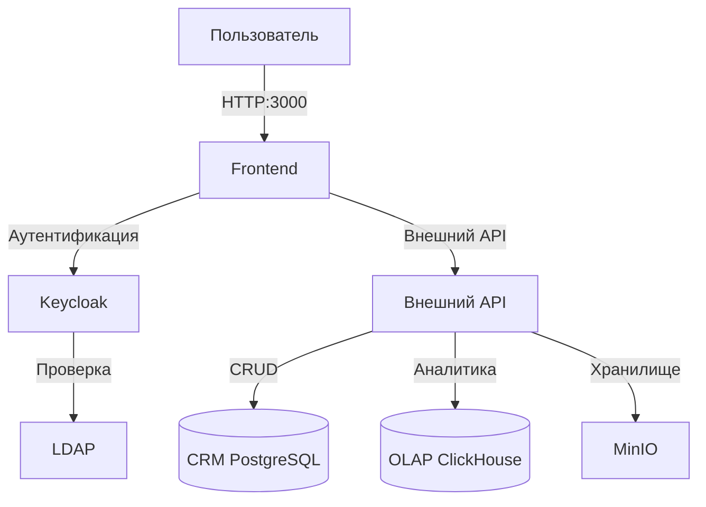

# Архитектура системы BionicPro

## Обзор системы

Система BionicPro представляет собой комплексную платформу для мониторинга протезов и управления данными о клиентах. Система использует микросервисную архитектуру с контейнеризацией Docker.

## Компоненты системы

### 1. Frontend (React)

Веб-приложение на базе React с использованием TypeScript и Tailwind CSS.

**Технологический стек:**
- React 18.2.0
- TypeScript 4.9.5
- Tailwind CSS 3.3.0
- Keycloak JS 21.1.0 для аутентификации

**Конфигурация:**
- Порт: 3000
- Среда: Docker (multi-stage build с Node.js и nginx)

**Переменные окружения:**
```
REACT_APP_API_URL=http://localhost:8000
REACT_APP_KEYCLOAK_URL=http://localhost:8080
REACT_APP_KEYCLOAK_REALM=reports-realm
REACT_APP_KEYCLOAK_CLIENT_ID=reports-frontend
```

### 2. Keycloak (Аутентификация и авторизация)

Сервер идентичности для управления пользователями и ролями.

**Конфигурация:**
- Версия: Keycloak 21.1
- База данных: PostgreSQL 14
- Порт: 8080
- Realm: reports-realm

**Роли системы:**
- `user` - обычный пользователь
- `administrator` - администратор системы
- `prothetic_user` - пользователь протеза с доступом к отчетам

**Клиенты:**
- `reports-frontend` - публичный клиент для веб-интерфейса
- `reports-api` - конфиденциальный клиент для API

### 3. OpenLDAP (Служба каталогов)

LDAP-сервер для централизованного управления пользователями.

**Конфигурация:**
- Версия: OpenLDAP 1.5.0
- Порт: 389 (LDAP), 636 (LDAPS)
- Домен: example.com

**Структура каталога:**
- ou=People - пользователи
- ou=Groups - группы

### 4. CRM База данных (PostgreSQL)

Реляционная база данных для хранения информации о клиентах.

**Конфигурация:**
- Версия: PostgreSQL 14
- Порт: 5444
- База данных: crm_db
- Пользователь: crm_user

**Таблицы:**
- `customers` - данные о клиентах (id, name, email, age, gender, country, address, phone)

### 5. OLAP База данных (ClickHouse)

Колоночная база данных для аналитической обработки данных сенсоров протезов.

**Конфигурация:**
- Версия: ClickHouse Server
- Порт: 8123 (HTTP), 9431 (Native)
- База данных: OLAP

**Таблицы:**
- `emg_sensor_data` - данные с EMG сенсоров
  - user_id - идентификатор пользователя
  - prosthesis_type - тип протеза
  - muscle_group - мышечная группа
  - signal_frequency - частота сигнала
  - signal_duration - длительность сигнала
  - signal_amplitude - амплитуда сигнала
  - signal_time - время сигнала

### 6. MinIO (Объектное хранилище)

S3-совместимое объектное хранилище для бинарных данных.

**Конфигурация:**
- Версия: MinIO
- Порт: 9000 (API), 9001 (Console)
- Пользователь: minio_user
- Пароль: minio_password

## Сетевая архитектура



**Примечание:** В текущей конфигурации проекта внешний API сервер не включен. Frontend настроен для подключения к API по адресу `http://localhost:8000`, который должен быть развернут отдельно.

## Безопасность

### Аутентификация
- Использование Keycloak для централизованной аутентификации
- Поддержка OAuth 2.0 и OpenID Connect
- Токены доступа Bearer для API

### Авторизация
- Ролевая модель доступа (RBAC)
- Разделение прав доступа:
  - Администраторы - полный доступ
  - Пользователи протезов - доступ к отчетам
  - Обычные пользователи - базовый доступ

### Сеть
- Изоляция сервисов через Docker network
- CORS настроен для фронтенда
- SSL/TLS для продакшн окружения

## Развертывание

Система разворачивается с использованием Docker Compose:

```yaml
services:
  - keycloak + keycloak_db
  - frontend
  - openldap
  - crm_db
  - olap_db
  - minio
```

Все сервисы используют именованные тома для персистентности данных.

## Масштабируемость

- Колоночная база ClickHouse для аналитических запросов
- MinIO для распределенного объектного хранения
