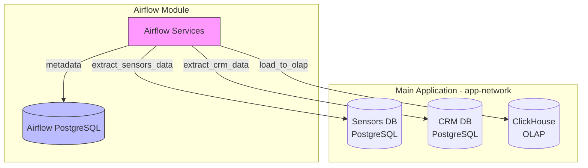
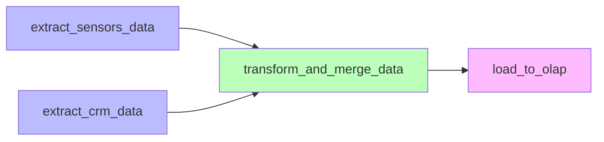
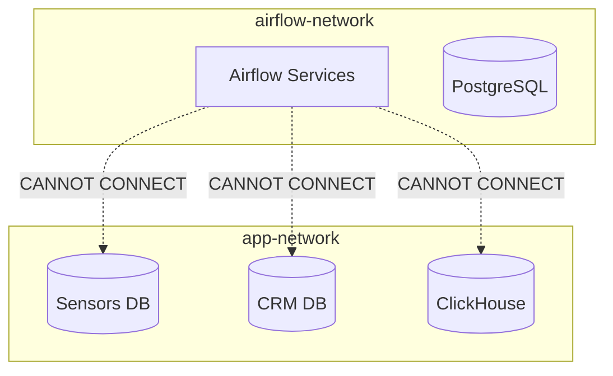

# Airflow Module Decoupling Analysis Report

**Date**: 2026-02-21  
**Project**: BionicPRO Architecture Decoupling - Sprint 9  
**Document Type**: Technical Analysis Report  

---

## Table of Contents

1. [Executive Summary](#1-executive-summary)
2. [File Inventory](#2-file-inventory)
3. [Database Connection Strings](#3-database-connection-strings)
4. [Environment Variables](#4-environment-variables)
5. [External Dependencies](#5-external-dependencies)
6. [Docker Configuration Analysis](#6-docker-configuration-analysis)
7. [DAG Analysis](#7-dag-analysis)
8. [Migration Recommendations](#8-migration-recommendations)
9. [Open Issues](#9-open-issues)

---

## 1. Executive Summary

### Purpose of Analysis

This analysis documents the Airflow module decoupling from the main BionicPRO application monolith. The Airflow module manages ETL (Extract, Transform, Load) pipelines for aggregating prosthetic device sensor data into an OLAP database for analytics and reporting.

### Current State of Airflow Module

The Airflow module has been successfully migrated from [`/app/airflow/`](app/airflow/) to a standalone [`/airflow/`](airflow/) directory at the project root level. The module contains:

- **ETL DAG**: [`bionicpro_etl_dag.py`](airflow/dags/bionicpro_etl_dag.py) - Main data pipeline
- **Unit Tests**: [`test_bionicpro_etl_dag.py`](airflow/tests/test_bionicpro_etl_dag.py) - Comprehensive test coverage
- **Docker Configuration**: Standalone [`docker-compose.yaml`](airflow/docker-compose.yaml) with dedicated PostgreSQL
- **Documentation**: Detailed [`README.md`](airflow/README.md) with deployment instructions

### Migration Status

| Component | Status | Notes |
|-----------|--------|-------|
| DAG files | ✅ Migrated | Files moved from `app/airflow/dags/` to `airflow/dags/` |
| Tests | ✅ Migrated | Test files moved to `airflow/tests/` |
| Configuration | ✅ Created | New `.env.example` and `docker-compose.yaml` |
| Documentation | ✅ Created | Comprehensive README.md |
| Git tracking | ✅ Updated | Old files deleted, new files added |

**Git Status Summary**:
```
 D app/airflow/dags/.gitkeep
 D app/airflow/dags/bionicpro_etl_dag.py
 D app/airflow/dags/test_bionicpro_etl_dag.py
 D app/airflow/logs/.gitkeep
```

---

## 2. File Inventory

### Files in `/airflow/` Directory

| File | Size | Purpose |
|------|------|---------|
| [`.dockerignore`](airflow/.dockerignore) | 74 chars | Docker build exclusions |
| [`.env.example`](airflow/.env.example) | 613 chars | Environment variables template |
| [`docker-compose.yaml`](airflow/docker-compose.yaml) | 5081 chars | Docker Compose service definitions |
| [`README.md`](airflow/README.md) | 10853 chars | Comprehensive deployment documentation |
| [`requirements.txt`](airflow/requirements.txt) | 103 chars | Python package dependencies |

### Files in `/airflow/dags/` Directory

| File | Size | Purpose |
|------|------|---------|
| [`.gitkeep`](airflow/dags/.gitkeep) | 0 chars | Git directory placeholder |
| [`bionicpro_etl_dag.py`](airflow/dags/bionicpro_etl_dag.py) | 6871 chars | Main ETL pipeline DAG definition |

### Files in `/airflow/logs/` Directory

| File | Size | Purpose |
|------|------|---------|
| [`.gitkeep`](airflow/logs/.gitkeep) | 0 chars | Git directory placeholder |

### Files in `/airflow/tests/` Directory

| File | Size | Purpose |
|------|------|---------|
| [`test_bionicpro_etl_dag.py`](airflow/tests/test_bionicpro_etl_dag.py) | 15997 chars | Unit tests for ETL DAG |

### File Migration Mapping

| Original Location (Deleted) | New Location |
|----------------------------|--------------|
| `app/airflow/dags/bionicpro_etl_dag.py` | `airflow/dags/bionicpro_etl_dag.py` |
| `app/airflow/dags/test_bionicpro_etl_dag.py` | `airflow/tests/test_bionicpro_etl_dag.py` |
| `app/airflow/dags/.gitkeep` | `airflow/dags/.gitkeep` |
| `app/airflow/logs/.gitkeep` | `airflow/logs/.gitkeep` |

---

## 3. Database Connection Strings

### Sensors Database (PostgreSQL)

**Purpose**: Source database for EMG sensor data from prosthetic devices

```
postgresql+psycopg2://sensors_user:<SENSORS_DB_PASSWORD>@sensors-db:5432/sensors-data
```

**Connection Parameters**:
| Parameter | Value | Environment Variable |
|-----------|-------|---------------------|
| Host | `sensors-db` | `SENSORS_DB_HOST` |
| Port | `5432` | `SENSORS_DB_PORT` |
| Database | `sensors-data` | (hardcoded) |
| User | `sensors_user` | (hardcoded) |
| Password | - | `SENSORS_DB_PASSWORD` |

**Source Tables**:
- `emg_sensor_data` - EMG sensor readings

### CRM Database (PostgreSQL)

**Purpose**: Source database for customer information

```
postgresql+psycopg2://crm_user:<CRM_DB_PASSWORD>@crm_db:5432/crm_db
```

**Connection Parameters**:
| Parameter | Value | Environment Variable |
|-----------|-------|---------------------|
| Host | `crm_db` | `CRM_DB_HOST` |
| Port | `5432` | `CRM_DB_PORT` |
| Database | `crm_db` | (hardcoded) |
| User | `crm_user` | (hardcoded) |
| Password | - | `CRM_DB_PASSWORD` |

**Source Tables**:
- `customers` - Customer profile data

### OLAP Database (ClickHouse)

**Purpose**: Target database for aggregated analytics data

```
clickhouse://olap_db:9000/default
```

**Connection Parameters**:
| Parameter | Value | Environment Variable |
|-----------|-------|---------------------|
| Host | `olap_db` | `OLAP_DB_HOST` |
| Port | `9000` | `OLAP_DB_PORT` |
| Database | `default` | (hardcoded) |

**Target Tables**:
- `user_reports` - Aggregated user analytics (created by DAG)

### Airflow Metadata Database

**Purpose**: Internal Airflow state management

```
postgresql+psycopg2://airflow:<AIRFLOW_DB_PASSWORD>@postgres/airflow
```

**Connection Parameters**:
| Parameter | Value | Environment Variable |
|-----------|-------|---------------------|
| Host | `postgres` | `AIRFLOW_DB_HOST` |
| Port | `5432` | `AIRFLOW_DB_PORT` |
| Database | `airflow` | `AIRFLOW_DB_NAME` |
| User | `airflow` | `AIRFLOW_DB_USER` |
| Password | - | `AIRFLOW_DB_PASSWORD` |

---

## 4. Environment Variables

### Core Airflow Variables

| Variable | Default | Description |
|----------|---------|-------------|
| `AIRFLOW__CORE__FERNET_KEY` | (required) | Encryption key for sensitive data |
| `AIRFLOW__CORE__EXECUTOR` | `LocalExecutor` | Task execution mode |
| `AIRFLOW__WEBSERVER__SECRET_KEY` | - | Webserver session secret |
| `AIRFLOW_WEBSERVER_PORT` | `8080` | Host port for Web UI |
| `AIRFLOW_UID` | `50000` | Container user ID |

### Database Connection Variables

| Variable | Default | Description |
|----------|---------|-------------|
| `AIRFLOW_DB_HOST` | `postgres` | Airflow metadata DB host |
| `AIRFLOW_DB_PORT` | `5432` | Airflow metadata DB port |
| `AIRFLOW_DB_USER` | `airflow` | Airflow DB username |
| `AIRFLOW_DB_PASSWORD` | (required) | Airflow DB password |
| `AIRFLOW_DB_NAME` | `airflow` | Airflow DB name |
| `SENSORS_DB_HOST` | `sensors-db` | Sensors PostgreSQL host |
| `SENSORS_DB_PORT` | `5432` | Sensors DB port |
| `SENSORS_DB_PASSWORD` | (required) | Sensors DB password |
| `CRM_DB_HOST` | `crm-db` | CRM PostgreSQL host |
| `CRM_DB_PORT` | `5432` | CRM DB port |
| `CRM_DB_PASSWORD` | (required) | CRM DB password |
| `OLAP_DB_HOST` | `olap-db` | ClickHouse host |
| `OLAP_DB_PORT` | `9000` | ClickHouse native port |

### Admin Credentials

| Variable | Default | Description |
|----------|---------|-------------|
| `AIRFLOW_ADMIN_USER` | `admin` | Web UI admin username |
| `AIRFLOW_ADMIN_PASSWORD` | (required) | Web UI admin password |

### Environment Variable Mapping

| [`airflow/.env.example`](airflow/.env.example) | [`app/.env.example`](app/.env.example) | Notes |
|------------------------------------------------|----------------------------------------|-------|
| `SENSORS_DB_PASSWORD` | Not present | ⚠️ Missing in app/.env.example |
| `CRM_DB_PASSWORD` | Not present | ⚠️ Missing in app/.env.example |
| `OLAP_DB_HOST` | Not present | ⚠️ Missing in app/.env.example |
| `OLAP_DB_PORT` | Not present | ⚠️ Missing in app/.env.example |
| `AIRFLOW__CORE__FERNET_KEY` | Not present | Airflow-specific |
| `AIRFLOW_ADMIN_USER` | Not present | Airflow-specific |
| `AIRFLOW_ADMIN_PASSWORD` | Not present | Airflow-specific |
| - | `OAUTH2_AES_KEY` | Auth service only |
| - | `OAUTH2_SALT` | Auth service only |
| - | `KEYCLOAK_BIONICPRO_AUTH_CLIENT_SECRET` | Auth service only |

---

## 5. External Dependencies

### Python Packages (from [`requirements.txt`](airflow/requirements.txt))

| Package | Version | Purpose |
|---------|---------|---------|
| `apache-airflow` | >=2.8.0 | Core workflow orchestration engine |
| `psycopg2-binary` | >=2.9.0 | PostgreSQL database adapter |
| `pandas` | >=2.0.0 | Data manipulation and aggregation |
| `clickhouse-driver` | >=0.2.0 | ClickHouse database client |
| `pytest` | >=7.0.0 | Unit testing framework |

### External Services



### Network Dependencies

| Service | Network | Current Status |
|---------|---------|----------------|
| Sensors DB | `app-network` | ⚠️ Connectivity issue |
| CRM DB | `app-network` | ⚠️ Connectivity issue |
| ClickHouse OLAP | `app-network` | ⚠️ Connectivity issue |
| Airflow PostgreSQL | `airflow-network` | ✅ Internal |

---

## 6. Docker Configuration Analysis

### Structure of [`airflow/docker-compose.yaml`](airflow/docker-compose.yaml)

#### Services Defined

| Service | Image | Purpose |
|---------|-------|---------|
| `postgres` | `postgres:16.0` | Airflow metadata database |
| `airflow-init` | `apache/airflow:2.8.1-python3.11` | Initialization container |
| `airflow-webserver` | `apache/airflow:2.8.1-python3.11` | Web UI and REST API |
| `airflow-scheduler` | `apache/airflow:2.8.1-python3.11` | DAG scheduling engine |
| `airflow-triggerer` | `apache/airflow:2.8.1-python3.11` | Deferred task handler |

#### Network Configuration

```yaml
networks:
  airflow-network:
    driver: bridge
    name: airflow-network
```

#### Volume Configuration

| Volume | Purpose |
|--------|---------|
| `airflow-db` | PostgreSQL data persistence |
| `./dags:/opt/airflow/dags` | DAG definitions |
| `./logs:/opt/airflow/logs` | Task execution logs |
| `./requirements.txt:/opt/airflow/requirements.txt` | Python dependencies |

### Comparison with Reference File

| Aspect | [`airflow/docker-compose.yaml`](airflow/docker-compose.yaml) | [`task2/samples/airflow-docker-compose.yaml`](task2/samples/airflow-docker-compose.yaml) |
|--------|--------------------------------------------------------------|------------------------------------------------------------------------------------------|
| Base Image | `apache/airflow:2.8.1-python3.11` | Build from Dockerfile |
| Network Name | `airflow-network` | `dag_sample` |
| External DB Env | ✅ BionicPRO integration vars | ❌ None |
| Init Command | Full user creation | Simplified user creation |
| Triggerer | ✅ Included | ✅ Included |
| Health Checks | ✅ Comprehensive | ✅ Basic |
| External DB Connections | ✅ Configured | ❌ None |
| PostgreSQL Init | Environment only | SQL init script mount |

### Key Differences from Reference

1. **Image Source**: BionicPRO uses official Airflow image directly vs building from Dockerfile
2. **External Integration**: BionicPRO includes environment variables for source databases
3. **Network Isolation**: BionicPRO uses dedicated `airflow-network` vs shared `dag_sample`
4. **Initialization**: More robust user creation with full attributes

---

## 7. DAG Analysis

### Purpose of [`bionicpro_etl_dag.py`](airflow/dags/bionicpro_etl_dag.py)

The BionicPRO ETL DAG aggregates prosthetic device usage data for analytics and reporting. It extracts EMG sensor readings from the Sensors database, combines them with customer data from CRM, and loads aggregated reports into ClickHouse.

### DAG Configuration

| Property | Value |
|----------|-------|
| DAG ID | `bionicpro_etl_pipeline` |
| Schedule | `0 2 * * *` (Daily at 02:00 UTC) |
| Start Date | 2024-01-01 |
| Catchup | False |
| Tags | `bionicpro`, `etl`, `analytics` |
| Owner | `bionicpro` |

### Task Definitions

#### Task 1: `extract_sensors_data`

**Type**: PythonOperator  
**Purpose**: Extract EMG sensor data from PostgreSQL

```python
# Connection
host=os.environ.get('SENSORS_DB_HOST', 'sensors-db')
port=int(os.environ.get('SENSORS_DB_PORT', '5432'))
dbname='sensors-data'
user='sensors_user'
password=os.environ.get('SENSORS_DB_PASSWORD', '')
```

**SQL Query**:
```sql
SELECT user_id, prosthesis_type, muscle_group, 
       signal_frequency, signal_duration, signal_amplitude, signal_time
FROM emg_sensor_data
WHERE signal_time >= '{{ ds }}' AND signal_time < '{{ tomorrow_ds }}'
```

**Output**: `/tmp/sensors_data.csv`

#### Task 2: `extract_crm_data`

**Type**: PythonOperator  
**Purpose**: Extract customer data from CRM PostgreSQL

```python
# Connection
host=os.environ.get('CRM_DB_HOST', 'crm_db')
port=int(os.environ.get('CRM_DB_PORT', '5432'))
dbname='crm_db'
user='crm_user'
password=os.environ.get('CRM_DB_PASSWORD', '')
```

**SQL Query**:
```sql
SELECT id as user_id, name, email, age, gender, country
FROM customers
```

**Output**: `/tmp/crm_data.csv`

#### Task 3: `transform_and_merge_data`

**Type**: PythonOperator  
**Purpose**: Aggregate sensor data and merge with CRM data

**Transformations**:
- Group by: `user_id`, `prosthesis_type`, `muscle_group`
- Aggregations: mean/max/min amplitude, mean frequency, total sessions, total duration
- Join: Left join with CRM data on `user_id`
- Duration conversion: seconds to hours

**Output**: `/tmp/merged_data.csv`

#### Task 4: `load_to_olap`

**Type**: PythonOperator  
**Purpose**: Load processed data into ClickHouse

```python
# Connection
host=os.environ.get('OLAP_DB_HOST', 'olap_db')
port=int(os.environ.get('OLAP_DB_PORT', '9000'))
database='default'
```

**Target Table Schema**:
```sql
CREATE TABLE IF NOT EXISTS user_reports (
    user_id UInt32,
    report_date Date,
    total_sessions UInt32,
    avg_signal_amplitude Float32,
    max_signal_amplitude Float32,
    min_signal_amplitude Float32,
    avg_signal_frequency Float32,
    total_usage_hours Float32,
    prosthesis_type String,
    muscle_group String,
    customer_name String,
    customer_email String,
    customer_age UInt8,
    customer_gender String,
    customer_country String,
    created_at DateTime DEFAULT now()
) ENGINE = MergeTree()
ORDER BY (user_id, report_date)
```

### Task Dependencies



### Database Hooks and Operators

| Task | Operator | Database Hook |
|------|----------|---------------|
| `extract_sensors_data` | PythonOperator | `psycopg2.connect()` |
| `extract_crm_data` | PythonOperator | `psycopg2.connect()` |
| `transform_and_merge_data` | PythonOperator | `pandas.read_csv()` |
| `load_to_olap` | PythonOperator | `clickhouse_driver.Client()` |

---

## 8. Migration Recommendations

### Network Connectivity Resolution

**Issue**: Airflow uses `airflow-network` but source databases are on `app-network`

**Current State**:


**Recommended Solution**: Add Airflow services to `app-network`

```yaml
services:
  airflow-webserver:
    # ... existing config ...
    networks:
      - airflow-network
      - app-network
  
  airflow-scheduler:
    # ... existing config ...
    networks:
      - airflow-network
      - app-network

networks:
  airflow-network:
    driver: bridge
  app-network:
    external: true
```

### Missing Credentials Documentation

**Issue**: Database credentials not documented in [`app/.env.example`](app/.env.example)

**Required additions to `app/.env.example`**:

```bash
# Sensors Database (for Airflow integration)
SENSORS_DB_USER=sensors_user
SENSORS_DB_PASSWORD=<set-password>

# CRM Database (for Airflow integration)  
CRM_DB_USER=crm_user
CRM_DB_PASSWORD=<set-password>

# ClickHouse (for Airflow integration)
CLICKHOUSE_PASSWORD=<set-password>
```

### Integration Guide for Running Standalone Airflow

#### Option 1: External Network (Recommended for Development)

1. **Create shared network**:
   ```bash
   docker network create app-network
   ```

2. **Update Airflow docker-compose.yaml**:
   ```yaml
   networks:
     airflow-network:
       driver: bridge
     app-network:
       external: true
   ```

3. **Add app-network to Airflow services**:
   ```yaml
   services:
     airflow-webserver:
       networks:
         - airflow-network
         - app-network
   ```

#### Option 2: Unified Docker Compose (Recommended for Production)

Create a unified compose file that includes both stacks:

```bash
# Start both stacks together
docker-compose -f app/docker-compose.yaml -f airflow/docker-compose.yaml up -d
```

#### Option 3: Environment Variable Override

For external database access, override host environment variables:

```bash
# In airflow/.env
SENSORS_DB_HOST=localhost
SENSORS_DB_PORT=5436
CRM_DB_HOST=localhost
CRM_DB_PORT=5444
OLAP_DB_HOST=localhost
OLAP_DB_PORT=8123
```

---

## 9. Open Issues

### Issue 1: Network Connectivity

**Status**: 🔴 Critical  
**Impact**: DAG tasks cannot connect to source databases  
**Description**: Airflow containers on `airflow-network` cannot reach databases on `app-network`  

**Resolution Steps**:
1. Add `app-network` as external network to Airflow docker-compose.yaml
2. Attach Airflow webserver and scheduler to both networks
3. Verify connectivity with `docker-compose exec airflow-webserver ping sensors-db`

### Issue 2: Missing Credential Mapping

**Status**: 🟡 Medium  
**Impact**: Manual credential synchronization required  
**Description**: Database passwords not documented in main application's .env.example  

**Resolution Steps**:
1. Add missing database variables to `app/.env.example`
2. Document credential requirements in deployment guide
3. Consider using Docker secrets or vault for production

### Issue 3: Deployment Integration

**Status**: 🟡 Medium  
**Impact**: Requires separate deployment commands  
**Description**: Airflow and main application must be started separately  

**Resolution Steps**:
1. Create unified deployment script
2. Add dependency ordering (databases before Airflow)
3. Document startup sequence in README

### Issue 4: Hardcoded Database Names and Users

**Status**: 🟢 Low  
**Impact**: Reduced flexibility  
**Description**: Database names and usernames are hardcoded in DAG  

**Current Code**:
```python
dbname='sensors-data'  # Hardcoded
user='sensors_user'    # Hardcoded
```

**Resolution Steps**:
1. Add `SENSORS_DB_NAME`, `SENSORS_DB_USER` environment variables
2. Add `CRM_DB_NAME`, `CRM_DB_USER` environment variables
3. Update DAG code to use environment variables

---

## Appendix A: Quick Reference

### Port Mappings

| Service | Container Port | Host Port |
|---------|---------------|-----------|
| Airflow Web UI | 8080 | `${AIRFLOW_WEBSERVER_PORT:-8080}` |
| Airflow PostgreSQL | 5432 | Internal only |
| Sensors DB | 5432 | 5436 |
| CRM DB | 5432 | 5444 |
| ClickHouse HTTP | 8123 | Internal only |
| ClickHouse Native | 9000 | Internal only |

### Command Reference

```bash
# Start Airflow standalone
cd airflow && docker-compose up -d

# View logs
docker-compose logs -f airflow-webserver

# Check DAG status
docker-compose exec airflow-webserver airflow dags list

# Trigger DAG manually
docker-compose exec airflow-webflow airflow dags trigger bionicpro_etl_pipeline

# Stop and cleanup
docker-compose down -v
```

---

## Appendix B: Related Files

| File | Purpose |
|------|---------|
| [`airflow/README.md`](airflow/README.md) | Detailed deployment documentation |
| [`airflow/docker-compose.yaml`](airflow/docker-compose.yaml) | Docker service definitions |
| [`airflow/dags/bionicpro_etl_dag.py`](airflow/dags/bionicpro_etl_dag.py) | ETL pipeline definition |
| [`airflow/tests/test_bionicpro_etl_dag.py`](airflow/tests/test_bionicpro_etl_dag.py) | Unit tests |
| [`airflow/.env.example`](airflow/.env.example) | Environment template |
| [`app/docker-compose.yaml`](app/docker-compose.yaml) | Main application services |
| [`task2/samples/airflow-docker-compose.yaml`](task2/samples/airflow-docker-compose.yaml) | Reference configuration |

---

**End of Report**
