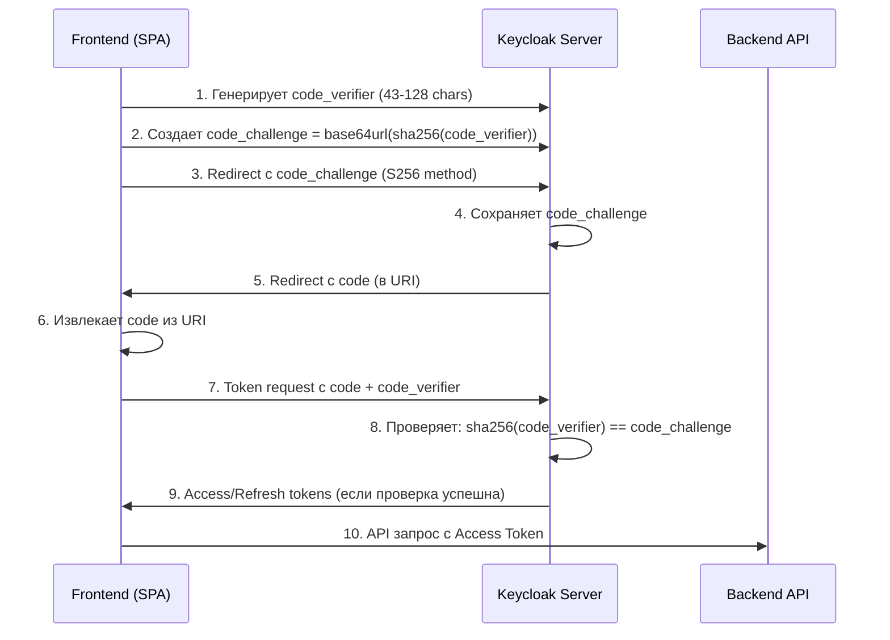

# PKCE (Proof Key for Code Exchange) в приложении BionicPRO

## Что такое PKCE?

PKCE (Proof Key for Code Exchange) — это расширение OAuth 2.0 Authorization Code Grant, которое добавляет дополнительный уровень безопасности для клиентских приложений (SPA, мобильные приложения).

### Проблема, которую решает PKCE

В стандартном Authorization Code Grant:
1. Клиент получает код авторизации (`code`)
2. Клиент обменивает код на токен, передав `client_id` и `client_secret`

**Проблема**: Если злоумышленник перехватит код авторизации (например, через redirect URI), он может обменять его на токен, даже без `client_secret`.

### Решение: PKCE

PKCE добавляет два параметра:
- **`code_verifier`** — случайная строка 43-128 символов (генерируется клиентом)
- **`code_challenge`** — `base64url(sha256(code_verifier))` (передается при запросе авторизации)

При обмене кодом на токен клиент должен передать `code_verifier`. Keycloak проверяет, что `sha256(code_verifier)` соответствует `code_challenge`.

## Как работает PKCE в нашем приложении



## Структура файлов

```
app/
├── frontend/
│   └── src/
│       ├── keycloak/
│       │   ├── pkceUtils.ts      # Утилиты для PKCE (генерация, хэширование)
│       │   └── keycloakService.ts # Сервис для работы с Keycloak
│       ├── App.tsx               # Обновлен для PKCE
│       └── components/
│           └── ReportPage.tsx    # Обновлен для PKCE
└── keycloak/
    └── realm-export.json         # Realm с PKCE поддержкой
```

## Файлы и их назначение

### 1. [`pkceUtils.ts`](app/frontend/src/keycloak/pkceUtils.ts)

Утилиты для генерации PKCE параметров:

```typescript
// Генерация code_verifier (случайная строка)
generateCodeVerifier(length: number = 128): string

// Создание code_challenge из code_verifier (S256 метод)
createCodeChallenge(verifier: string): Promise<string>

// Сохранение/получение code_verifier из sessionStorage
saveCodeVerifier(verifier: string): void
getCodeVerifier(): string | null
clearCodeVerifier(): void
```

### 2. [`keycloakService.ts`](app/frontend/src/keycloak/keycloakService.ts)

Сервис для работы с Keycloak с поддержкой PKCE:

```typescript
class KeycloakService {
  // Инициализация с PKCE
  async init(onAuthenticated?: () => void, onLoginRequired?: () => void): Promise<void>
  
  // Вход с PKCE параметрами
  login(): Promise<void>
  
  // Выход
  logout(): Promise<void>
  
  // Обновление токена
  updateToken(minValidity: number = 60): Promise<boolean>
  
  // Получение токена
  getToken(): string | undefined
  
  // Проверка аутентификации
  isAuthenticated(): boolean
}
```

### 3. [`realm-export.json`](app/keycloak/realm-export.json)

Обновленный realm с PKCE поддержкой:

```json
{
  "clientId": "reports-frontend",
  "publicClient": true,
  "standardFlowEnabled": true,
  "implicitFlowEnabled": false,
  "attributes": {
    "pkce.code.challenge.method": "S256"
  }
}
```

**Ключевые настройки:**
- `standardFlowEnabled: true` — включает Authorization Code Flow
- `implicitFlowEnabled: false` — отключает Implicit Flow (менее безопасно)
- `publicClient: true` — клиент без секрета (SPA)
- `pkce.code.challenge.method: S256` — метод хэширования (SHA-256)

### 4. [`App.tsx`](app/frontend/src/App.tsx)

Обновлен для инициализации Keycloak с PKCE:

```typescript
const keycloakService = new KeycloakService({
  url: process.env.REACT_APP_KEYCLOAK_URL || "",
  realm: process.env.REACT_APP_KEYCLOAK_REALM || "",
  clientId: process.env.REACT_APP_KEYCLOAK_CLIENT_ID || ""
});

useEffect(() => {
  keycloakService.init(
    () => setInitialized(true),
    () => setInitialized(true)
  );
}, []);
```

### 5. [`ReportPage.tsx`](app/frontend/src/components/ReportPage.tsx)

Обновлен для использования PKCE:

```typescript
// Кнопка входа теперь показывает "Login with PKCE"
<button onClick={() => keycloak.login()}>
  Login with PKCE
</button>

// Добавлена кнопка выхода
<button onClick={handleLogout}>
  Logout
</button>

// Показ информации о пользователе
<p>Username: {keycloak.subject}</p>
<p>Roles: {keycloak.realmAccess?.roles?.join(', ')}</p>
```

## Процесс аутентификации с PKCE

### 1. Генерация параметров

При вызове `keycloak.login()` или `keycloakService.init()`:

```typescript
const codeVerifier = generateCodeVerifier(); // Случайная строка 128 символов
const codeChallenge = await createCodeChallenge(codeVerifier); // base64url(sha256(verifier))
saveCodeVerifier(codeVerifier); // Сохраняем в sessionStorage
```

### 2. Redirect к Keycloak

```
GET /auth/realms/reports-realm/protocol/openid-connect/auth
  ?client_id=reports-frontend
  &redirect_uri=http://localhost:3000
  &response_type=code
  &code_challenge={code_challenge}
  &code_challenge_method=S256
```

### 3. Keycloak обрабатывает запрос

Keycloak:
- Проверяет `client_id`
- Сохраняет `code_challenge` в сессии
- Перенаправляет обратно с `code`

```
GET http://localhost:3000/?code={authorization_code}
```

### 4. Обмен кодом на токен

Keycloak JS автоматически:
- Извлекает `code` из URI
- Получает `code_verifier` из sessionStorage
- Отправляет POST запрос:

```
POST /auth/realms/reports-realm/protocol/openid-connect/token
  grant_type=authorization_code
  &client_id=reports-frontend
  &code={authorization_code}
  &redirect_uri=http://localhost:3000
  &code_verifier={code_verifier}
```

### 5. Проверка и выдача токенов

Keycloak:
- Вычисляет `sha256(code_verifier)`
- Сравнивает с сохраненным `code_challenge`
- Если совпадает — выдает `access_token` и `refresh_token`

## Безопасность

### Что защищает PKCE?

1. **Redirect URI перехват**: Даже если злоумышленник перехватит `code`, он не сможет обменять его на токен без `code_verifier`.

2. **SPA без client_secret**: Для public clients (SPA) нет `client_secret`, PKCE добавляет аутентификацию через `code_verifier`.

3. **One-time use**: `code_verifier` используется только один раз и удаляется из sessionStorage после обмена токенами.

### Рекомендации

1. **Длина code_verifier**: 43-128 символов (RFC 7636)
2. **Метод хэширования**: S256 (SHA-256) — предпочтительнее Plain
3. **Хранение**: sessionStorage (не localStorage — уязвим к XSS)
4. **Очистка**: Удалять `code_verifier` после использования

## Запуск приложения

### 1. Запустить Docker Compose

```bash
cd app
docker-compose up -d
```

### 2. Дождаться инициализации Keycloak

Keycloak импортирует realm из `realm-export.json` при первом запуске.

### 3. Открыть приложение

```
http://localhost:3000
```

### 4. Войти

Нажмите кнопку "Login with PKCE" — процесс аутентификации будет использовать PKCE.

## Отладка

### Проверка PKCE в браузере

1. Откройте DevTools (F12)
2. Перейдите в Application → Session Storage
3. Проверьте наличие `pkce_code_verifier` перед входом
4. Проверьте, что он очищен после входа

### Логи Keycloak

```bash
docker logs -f $(docker ps -q -f name=keycloak)
```

## Сравнение: Code Grant vs PKCE

| Параметр | Code Grant | PKCE |
|----------|------------|------|
| `client_secret` | Обязательный | Не требуется (public client) |
| `code_verifier` | Не используется | Обязательный |
| `code_challenge` | Не используется | Обязательный |
| Безопасность | Средняя | Высокая |
| Подходит для | Backend clients | SPA, Mobile apps |

## Ссылки

- [RFC 7636 - PKCE](https://tools.ietf.org/html/rfc7636)
- [Keycloak Documentation - PKCE](https://www.keycloak.org/docs/latest/securing_apps/#_pkce)
- [OAuth 2.0 Security Best Current Practice](https://tools.ietf.org/html/draft-ietf-oauth-security-topics)