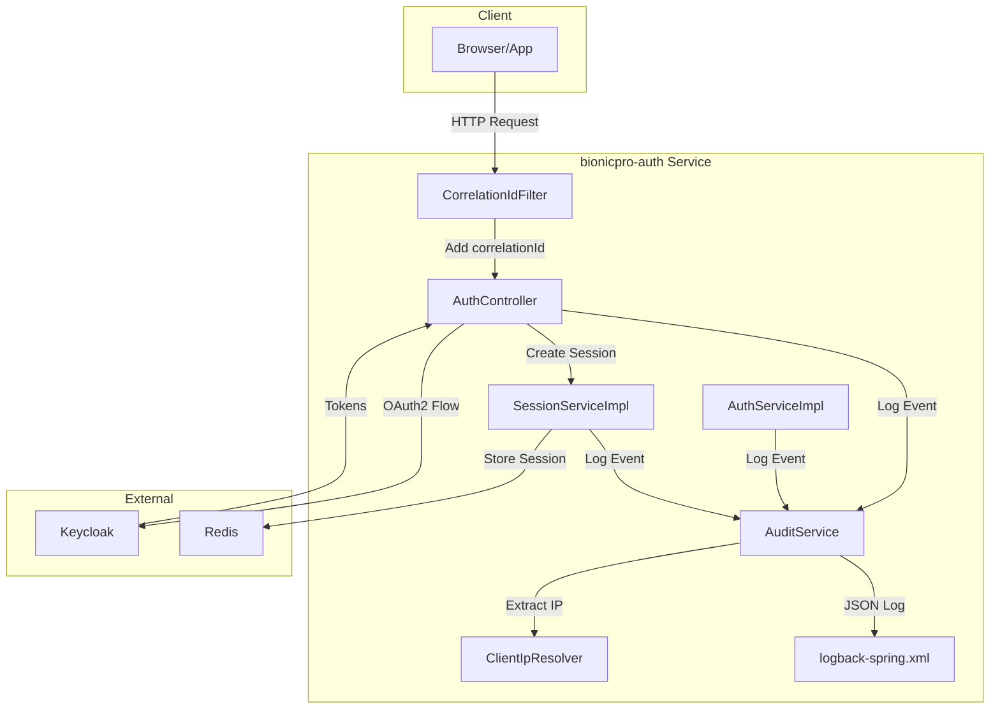

# AUTH-007 Audit Logging Implementation Plan

## 1. Overview

### Summary
Implement comprehensive audit logging for all authentication operations in the `bionicpro-auth` service to meet security compliance requirements. The implementation will add structured audit events for authentication actions while maintaining backward compatibility with existing SLF4J logging.

### Risk Assessment
- **Risk Level**: LOW
- **Rationale**: Changes are additive only - no existing functionality is modified or removed. All new components integrate with existing infrastructure.

### Files to be Created/Modified

| File | Action | Description |
|------|--------|-------------|
| `app/bionicpro-auth/pom.xml` | Modify | Add Logstash dependencies |
| `app/bionicpro-auth/src/main/java/com/bionicpro/audit/AuditEvent.java` | Create | Audit event model |
| `app/bionicpro-auth/src/main/java/com/bionicpro/audit/AuditEventType.java` | Create | Enum for audit event types |
| `app/bionicpro-auth/src/main/java/com/bionicpro/audit/AuditService.java` | Create | Centralized audit logging service |
| `app/bionicpro-auth/src/main/java/com/bionicpro/audit/AuditServiceImpl.java` | Create | Implementation |
| `app/bionicpro-auth/src/main/java/com/bionicpro/util/ClientIpResolver.java` | Create | Utility for extracting client IP |
| `app/bionicpro-auth/src/main/java/com/bionicpro/filter/CorrelationIdFilter.java` | Create | Filter for request correlation ID |
| `app/bionicpro-auth/src/main/resources/logback-spring.xml` | Create | Logback configuration |
| `app/bionicpro-auth/src/main/java/com/bionicpro/controller/AuthController.java` | Modify | Add audit logging calls |
| `app/bionicpro-auth/src/main/java/com/bionicpro/service/AuthServiceImpl.java` | Modify | Add audit logging calls |
| `app/bionicpro-auth/src/main/java/com/bionicpro/service/SessionServiceImpl.java` | Modify | Add audit logging calls |
| `app/bionicpro-auth/src/test/java/com/bionicpro/audit/AuditServiceTest.java` | Create | Unit tests for AuditService |
| `app/bionicpro-auth/src/test/java/com/bionicpro/audit/AuditEventTest.java` | Create | Unit tests for AuditEvent |

---

## 2. Implementation Steps

### Step 1: Add Maven Dependencies

**Description**: Add Logstash Logback encoder for structured JSON logging.

**File**: `app/bionicpro-auth/pom.xml`

**Code Changes**:
```xml
<!-- Add after existing dependencies -->
<!-- Logstash JSON encoder for structured logging -->
<dependency>
    <groupId>net.logstash.logback</groupId>
    <artifactId>logstash-logback-encoder</artifactId>
    <version>7.4</version>
</dependency>
```

**Testing Approach**: Verify Maven build succeeds with new dependency.

---

### Step 2: Create AuditEventType Enum

**Description**: Define all audit event types for authentication operations.

**File**: `app/bionicpro-auth/src/main/java/com/bionicpro/audit/AuditEventType.java`

**Code**:
```java
package com.bionicpro.audit;

import lombok.AllArgsConstructor;
import lombok.Getter;

/**
 * Enum representing all audit event types for authentication operations.
 */
@Getter
@AllArgsConstructor
public enum AuditEventType {
    AUTHENTICATION_SUCCESS("User authentication successful"),
    AUTHENTICATION_FAILURE("User authentication failed"),
    LOGOUT("User logout"),
    TOKEN_REFRESH("Token refresh"),
    SESSION_CREATED("Session created"),
    SESSION_EXPIRED("Session expired"),
    SESSION_INVALIDATED("Session invalidated");

    private final String description;
}
```

**Testing Approach**: Unit test enum values and descriptions.

---

### Step 3: Create AuditEvent Model

**Description**: Create structured audit event model with all required fields.

**File**: `app/bionicpro-auth/src/main/java/com/bionicpro/audit/AuditEvent.java`

**Code**:
```java
package com.bionicpro.audit;

import com.fasterxml.jackson.annotation.JsonInclude;
import com.fasterxml.jackson.annotation.JsonProperty;
import lombok.AllArgsConstructor;
import lombok.Builder;
import lombok.Data;
import lombok.NoArgsConstructor;

import java.time.Instant;

/**
 * Structured audit event for authentication operations.
 */
@Data
@Builder
@NoArgsConstructor
@AllArgsConstructor
@JsonInclude(JsonInclude.Include.NON_NULL)
public class AuditEvent {

    @JsonProperty("@timestamp")
    private Instant timestamp;

    @JsonProperty("correlationId")
    private String correlationId;

    @JsonProperty("eventType")
    private AuditEventType eventType;

    @JsonProperty("principal")
    private String principal;

    @JsonProperty("clientIp")
    private String clientIp;

    @JsonProperty("userAgent")
    private String userAgent;

    @JsonProperty("outcome")
    private String outcome;

    @JsonProperty("errorType")
    private String errorType;

    @JsonProperty("details")
    private String details;
}
```

**Testing Approach**: Unit test serialization/deserialization of AuditEvent.

---

### Step 4: Create ClientIpResolver Utility

**Description**: Utility class to extract real client IP from HTTP requests, handling proxies and load balancers.

**File**: `app/bionicpro-auth/src/main/java/com/bionicpro/util/ClientIpResolver.java`

**Code**:
```java
package com.bionicpro.util;

import jakarta.servlet.http.HttpServletRequest;
import org.springframework.stereotype.Component;

import java.util.List;

/**
 * Utility for resolving client IP address from HTTP requests.
 * Handles X-Forwarded-For header from proxies and load balancers.
 */
@Component
public class ClientIpResolver {

    private static final String X_FORWARDED_FOR = "X-Forwarded-For";
    private static final String X_REAL_IP = "X-Real-IP";
    private static final List<String> PROXY_HEADERS = List.of(
        X_FORWARDED_FOR,
        X_REAL_IP
    );

    /**
     * Extract client IP from request, considering proxy headers.
     */
    public String resolveClientIp(HttpServletRequest request) {
        // Check X-Forwarded-For header first (common for load balancers/proxies)
        String xForwardedFor = request.getHeader(X_FORWARDED_FOR);
        if (xForwardedFor != null && !xForwardedFor.isBlank()) {
            // X-Forwarded-For may contain multiple IPs: client, proxy1, proxy2
            // First one is the original client IP
            return xForwardedFor.split(",")[0].trim();
        }

        // Check X-Real-IP header (common with nginx)
        String xRealIp = request.getHeader(X_REAL_IP);
        if (xRealIp != null && !xRealIp.isBlank()) {
            return xRealIp.trim();
        }

        // Fallback to remote address
        return request.getRemoteAddr();
    }

    /**
     * Extract user agent from request.
     */
    public String resolveUserAgent(HttpServletRequest request) {
        return request.getHeader("User-Agent");
    }
}
```

**Testing Approach**: Unit test with mock requests, verify IP extraction logic.

---

### Step 5: Create AuditService

**Description**: Centralized service for logging audit events with structured data.

**File**: `app/bionicpro-auth/src/main/java/com/bionicpro/audit/AuditService.java`

**Code**:
```java
package com.bionicpro.audit;

import jakarta.servlet.http.HttpServletRequest;

/**
 * Service interface for logging audit events.
 */
public interface AuditService {

    /**
     * Log an audit event.
     */
    void logAuditEvent(AuditEvent auditEvent);

    /**
     * Log authentication success event.
     */
    void logAuthenticationSuccess(HttpServletRequest request, String principal);

    /**
     * Log authentication failure event.
     */
    void logAuthenticationFailure(HttpServletRequest request, String principal, String errorType);

    /**
     * Log logout event.
     */
    void logLogout(HttpServletRequest request, String principal);

    /**
     * Log token refresh event.
     */
    void logTokenRefresh(HttpServletRequest request, String principal, boolean success);

    /**
     * Log session created event.
     */
    void logSessionCreated(HttpServletRequest request, String principal);

    /**
     * Log session expired event.
     */
    void logSessionExpired(HttpServletRequest request, String principal);

    /**
     * Log session invalidated event.
     */
    void logSessionInvalidated(HttpServletRequest request, String principal);
}
```

---

### Step 6: Create AuditServiceImpl

**Description**: Implementation of AuditService using SLF4J with Logstash encoder for structured JSON output.

**File**: `app/bionicpro-auth/src/main/java/com/bionicpro/audit/AuditServiceImpl.java`

**Code**:
```java
package com.bionicpro.audit;

import com.bionicpro.util.ClientIpResolver;
import jakarta.servlet.http.HttpServletRequest;
import lombok.RequiredArgsConstructor;
import lombok.extern.slf4j.Slf4j;
import org.springframework.stereotype.Service;

import java.time.Instant;
import java.util.UUID;

/**
 * Implementation of AuditService for structured audit logging.
 */
@Service
@RequiredArgsConstructor
@Slf4j
public class AuditServiceImpl implements AuditService {

    private static final String AUDIT_MARKER = "AUDIT";
    private static final String OUTCOME_SUCCESS = "SUCCESS";
    private static final String OUTCOME_FAILURE = "FAILURE";

    private final ClientIpResolver clientIpResolver;

    @Override
    public void logAuditEvent(AuditEvent auditEvent) {
        log.info(
            "[AUDIT] eventType={} principal={} clientIp={} outcome={}",
            auditEvent.getEventType(),
            auditEvent.getPrincipal(),
            auditEvent.getClientIp(),
            auditEvent.getOutcome()
        );
    }

    @Override
    public void logAuthenticationSuccess(HttpServletRequest request, String principal) {
        AuditEvent event = AuditEvent.builder()
            .timestamp(Instant.now())
            .correlationId(getCorrelationId(request))
            .eventType(AuditEventType.AUTHENTICATION_SUCCESS)
            .principal(principal)
            .clientIp(clientIpResolver.resolveClientIp(request))
            .userAgent(clientIpResolver.resolveUserAgent(request))
            .outcome(OUTCOME_SUCCESS)
            .build();

        logAuditEvent(event);
    }

    @Override
    public void logAuthenticationFailure(HttpServletRequest request, String principal, String errorType) {
        AuditEvent event = AuditEvent.builder()
            .timestamp(Instant.now())
            .correlationId(getCorrelationId(request))
            .eventType(AuditEventType.AUTHENTICATION_FAILURE)
            .principal(principal)
            .clientIp(clientIpResolver.resolveClientIp(request))
            .userAgent(clientIpResolver.resolveUserAgent(request))
            .outcome(OUTCOME_FAILURE)
            .errorType(errorType)
            .build();

        logAuditEvent(event);
    }

    @Override
    public void logLogout(HttpServletRequest request, String principal) {
        AuditEvent event = AuditEvent.builder()
            .timestamp(Instant.now())
            .correlationId(getCorrelationId(request))
            .eventType(AuditEventType.LOGOUT)
            .principal(principal)
            .clientIp(clientIpResolver.resolveClientIp(request))
            .userAgent(clientIpResolver.resolveUserAgent(request))
            .outcome(OUTCOME_SUCCESS)
            .build();

        logAuditEvent(event);
    }

    @Override
    public void logTokenRefresh(HttpServletRequest request, String principal, boolean success) {
        AuditEvent event = AuditEvent.builder()
            .timestamp(Instant.now())
            .correlationId(getCorrelationId(request))
            .eventType(AuditEventType.TOKEN_REFRESH)
            .principal(principal)
            .clientIp(clientIpResolver.resolveClientIp(request))
            .outcome(success ? OUTCOME_SUCCESS : OUTCOME_FAILURE)
            .build();

        logAuditEvent(event);
    }

    @Override
    public void logSessionCreated(HttpServletRequest request, String principal) {
        AuditEvent event = AuditEvent.builder()
            .timestamp(Instant.now())
            .correlationId(getCorrelationId(request))
            .eventType(AuditEventType.SESSION_CREATED)
            .principal(principal)
            .clientIp(clientIpResolver.resolveClientIp(request))
            .userAgent(clientIpResolver.resolveUserAgent(request))
            .outcome(OUTCOME_SUCCESS)
            .build();

        logAuditEvent(event);
    }

    @Override
    public void logSessionExpired(HttpServletRequest request, String principal) {
        AuditEvent event = AuditEvent.builder()
            .timestamp(Instant.now())
            .correlationId(getCorrelationId(request))
            .eventType(AuditEventType.SESSION_EXPIRED)
            .principal(principal)
            .outcome(OUTCOME_SUCCESS)
            .build();

        logAuditEvent(event);
    }

    @Override
    public void logSessionInvalidated(HttpServletRequest request, String principal) {
        AuditEvent event = AuditEvent.builder()
            .timestamp(Instant.now())
            .correlationId(getCorrelationId(request))
            .eventType(AuditEventType.SESSION_INVALIDATED)
            .principal(principal)
            .clientIp(clientIpResolver.resolveClientIp(request))
            .outcome(OUTCOME_SUCCESS)
            .build();

        logAuditEvent(event);
    }

    /**
     * Get correlation ID from request or generate new one.
     */
    private String getCorrelationId(HttpServletRequest request) {
        String correlationId = (String) request.getAttribute("correlationId");
        if (correlationId == null || correlationId.isBlank()) {
            correlationId = UUID.randomUUID().toString();
        }
        return correlationId;
    }
}
```

**Testing Approach**: Unit test with mock requests, verify log output contains expected fields.

---

### Step 7: Create CorrelationIdFilter

**Description**: Filter to extract or generate correlation ID for request tracing.

**File**: `app/bionicpro-auth/src/main/java/com/bionicpro/filter/CorrelationIdFilter.java`

**Code**:
```java
package com.bionicpro.filter;

import jakarta.servlet.FilterChain;
import jakarta.servlet.ServletException;
import jakarta.servlet.http.HttpServletRequest;
import jakarta.servlet.http.HttpServletResponse;
import lombok.extern.slf4j.Slf4j;
import org.slf4j.MDC;
import org.springframework.core.annotation.Order;
import org.springframework.stereotype.Component;
import org.springframework.web.filter.OncePerRequestFilter;

import java.io.IOException;
import java.util.UUID;

/**
 * Filter to extract or generate correlation ID for request tracing.
 * Sets correlation ID in MDC and request attributes for downstream use.
 */
@Component
@Order(1)
@Slf4j
public class CorrelationIdFilter extends OncePerRequestFilter {

    public static final String CORRELATION_ID_HEADER = "X-Correlation-ID";
    public static final String CORRELATION_ID_MDC_KEY = "correlationId";

    @Override
    protected void doFilterInternal(HttpServletRequest request, 
                                   HttpServletResponse response, 
                                   FilterChain filterChain) throws ServletException, IOException {
        
        String correlationId = getOrGenerateCorrelationId(request);
        
        // Set correlation ID in response header
        response.setHeader(CORRELATION_ID_HEADER, correlationId);
        
        // Set correlation ID in MDC for logging
        MDC.put(CORRELATION_ID_MDC_KEY, correlationId);
        
        // Set correlation ID in request attribute for downstream use
        request.setAttribute("correlationId", correlationId);
        
        try {
            filterChain.doFilter(request, response);
        } finally {
            // Clear MDC after request
            MDC.remove(CORRELATION_ID_MDC_KEY);
        }
    }

    private String getOrGenerateCorrelationId(HttpServletRequest request) {
        String correlationId = request.getHeader(CORRELATION_ID_HEADER);
        
        if (correlationId == null || correlationId.isBlank()) {
            correlationId = UUID.randomUUID().toString();
        }
        
        return correlationId;
    }
}
```

**Testing Approach**: Unit test filter, verify correlation ID is set in header and MDC.

---

### Step 8: Configure logback-spring.xml

**Description**: Configure Logback for structured JSON logging with audit events.

**File**: `app/bionicpro-auth/src/main/resources/logback-spring.xml`

**Code**:
```xml
<?xml version="1.0" encoding="UTF-8"?>
<configuration>
    <include resource="org/springframework/boot/logging/logback/defaults.xml"/>

    <!-- Property for log pattern -->
    <property name="LOG_PATTERN" value="%d{yyyy-MM-dd HH:mm:ss.SSS} [%thread] %-5level %logger{36} - %msg%n"/>

    <!-- Console appender for development -->
    <appender name="CONSOLE" class="ch.qos.logback.core.ConsoleAppender">
        <encoder class="net.logstash.logback.encoder.LogstashEncoder">
            <includeMdcKeyName>correlationId</includeMdcKeyName>
            <customFields>{"service":"bionicpro-auth"}</customFields>
        </encoder>
    </appender>

    <!-- File appender for audit logs -->
    <appender name="AUDIT_FILE" class="ch.qos.logback.core.rolling.RollingFileAppender">
        <file>logs/audit.log</file>
        <rollingPolicy class="ch.qos.logback.core.rolling.TimeBasedRollingPolicy">
            <fileNamePattern>logs/audit.%d{yyyy-MM-dd}.log</fileNamePattern>
            <maxHistory>30</maxHistory>
            <totalSizeCap>1GB</totalSizeCap>
        </rollingPolicy>
        <encoder class="net.logstash.logback.encoder.LogstashEncoder">
            <includeMdcKeyName>correlationId</includeMdcKeyName>
            <customFields>{"service":"bionicpro-auth","type":"audit"}</customFields>
        </encoder>
    </appender>

    <!-- Logger for audit events -->
    <logger name="com.bionicpro.audit" level="INFO" additivity="false">
        <appender-ref ref="AUDIT_FILE"/>
        <appender-ref ref="CONSOLE"/>
    </logger>

    <!-- Application logger -->
    <logger name="com.bionicpro" level="DEBUG"/>

    <!-- Spring Security logger -->
    <logger name="org.springframework.security" level="DEBUG"/>

    <root level="INFO">
        <appender-ref ref="CONSOLE"/>
    </root>
</configuration>
```

**Testing Approach**: Verify logback configuration loads, check log output format.

---

### Step 9: Integrate AuditService into AuthController

**Description**: Add audit logging calls to AuthController for authentication operations.

**File**: `app/bionicpro-auth/src/main/java/com/bionicpro/controller/AuthController.java`

**Code Changes**:

1. Add AuditService dependency:
```java
// ... existing imports ...
import com.bionicpro.audit.AuditService;

// In class:
private final SessionService sessionService;
private final AuditService auditService;
```

2. Add audit logging to callback method (after session creation):
```java
// After: sessionService.createSession(request, response, idToken, accessToken, refreshToken);
// Add:
auditService.logSessionCreated(request, idToken.getSubject());
auditService.logAuthenticationSuccess(request, idToken.getSubject());
```

3. Add audit logging to logout method:
```java
// After getting userId from authentication, before invalidating session
String userId = authentication.getName();
auditService.logLogout(request, userId);
```

4. Add audit logging to refresh method:
```java
// After session rotation
String userId = authentication.getName();
auditService.logTokenRefresh(request, userId, true);
```

**Testing Approach**: Update existing AuthControllerTest to verify audit service is called.

---

### Step 10: Integrate AuditService into AuthServiceImpl

**Description**: Add audit logging calls to AuthServiceImpl for authentication operations.

**File**: `app/bionicpro-auth/src/main/java/com/bionicpro/service/AuthServiceImpl.java`

**Code Changes**:

1. Add AuditService dependency:
```java
import com.bionicpro.audit.AuditService;

// In class:
private final ClientRegistrationRepository clientRegistrationRepository;
private final OAuth2AuthorizedClientService authorizedClientService;
private final SessionService sessionService;
private final AuditService auditService;
```

2. Add audit logging to handleCallback method (on success):
```java
// After: sessionService.createSession(...)
auditService.logSessionCreated(request, idToken.getSubject());
auditService.logAuthenticationSuccess(request, idToken.getSubject());
```

3. Add audit logging on callback error:
```java
// In catch block or error handling
auditService.logAuthenticationFailure(request, null, "token_exchange_failed");
```

**Testing Approach**: Update existing tests or add integration test for audit logging.

---

### Step 11: Integrate AuditService into SessionServiceImpl

**Description**: Add audit logging calls to SessionServiceImpl for session lifecycle events.

**File**: `app/bionicpro-auth/src/main/java/com/bionicpro/service/SessionServiceImpl.java`

**Code Changes**:

1. Add AuditService dependency:
```java
import com.bionicpro.audit.AuditService;

// In class:
private final SessionRepository sessionRepository;
private final BytesEncryptor bytesEncryptor;
private final AuditService auditService;
```

2. Add audit logging to createSession method:
```java
// After: setSessionCookie(response, sessionId);
// Add:
auditService.logSessionCreated(request, sessionData.getUserId());
```

3. Add audit logging to invalidateSession methods:
```java
// In invalidateSessionById
auditService.logSessionInvalidated(null, sessionData.getUserId());
```

4. Add audit logging when session expired:
```java
// In validateAndRefreshSession when session is expired
auditService.logSessionExpired(null, sessionData.getUserId());
```

**Testing Approach**: Update SessionServiceTest to verify audit service is called.

---

### Step 12: Create Unit Tests

**Description**: Add unit tests for audit service and event model.

**File**: `app/bionicpro-auth/src/test/java/com/bionicpro/audit/AuditServiceTest.java`

**Code**:
```java
package com.bionicpro.audit;

import com.bionicpro.util.ClientIpResolver;
import jakarta.servlet.http.HttpServletRequest;
import org.junit.jupiter.api.BeforeEach;
import org.junit.jupiter.api.DisplayName;
import org.junit.jupiter.api.Nested;
import org.junit.jupiter.api.Test;
import org.junit.jupiter.api.extension.ExtendWith;
import org.mockito.Mock;
import org.mockito.junit.jupiter.MockitoExtension;

import static org.mockito.ArgumentMatchers.any;
import static org.mockito.ArgumentMatchers.anyString;
import static org.mockito.Mockito.*;

@ExtendWith(MockitoExtension.class)
@DisplayName("AuditService Tests")
class AuditServiceTest {

    @Mock
    private ClientIpResolver clientIpResolver;

    @Mock
    private HttpServletRequest request;

    private AuditService auditService;

    @BeforeEach
    void setUp() {
        auditService = new AuditServiceImpl(clientIpResolver);
    }

    @Nested
    @DisplayName("logAuthenticationSuccess")
    class AuthenticationSuccessTest {

        @Test
        @DisplayName("Should log authentication success event")
        void shouldLogAuthenticationSuccess() {
            // Arrange
            String principal = "user123";
            String clientIp = "192.168.1.1";
            String userAgent = "Mozilla/5.0";

            when(clientIpResolver.resolveClientIp(request)).thenReturn(clientIp);
            when(clientIpResolver.resolveUserAgent(request)).thenReturn(userAgent);
            when(request.getAttribute(anyString())).thenReturn("corr-123");

            // Act
            auditService.logAuthenticationSuccess(request, principal);

            // Assert - verify logging was called (simplified)
            verify(clientIpResolver).resolveClientIp(request);
            verify(clientIpResolver).resolveUserAgent(request);
        }
    }

    @Nested
    @DisplayName("logAuthenticationFailure")
    class AuthenticationFailureTest {

        @Test
        @DisplayName("Should log authentication failure event")
        void shouldLogAuthenticationFailure() {
            // Arrange
            String principal = "user123";
            String errorType = "invalid_credentials";

            when(clientIpResolver.resolveClientIp(request)).thenReturn("192.168.1.1");
            when(request.getAttribute(anyString())).thenReturn("corr-123");

            // Act
            auditService.logAuthenticationFailure(request, principal, errorType);

            // Assert
            verify(clientIpResolver).resolveClientIp(request);
        }
    }

    @Nested
    @DisplayName("logLogout")
    class LogoutTest {

        @Test
        @DisplayName("Should log logout event")
        void shouldLogLogout() {
            // Arrange
            String principal = "user123";

            when(clientIpResolver.resolveClientIp(request)).thenReturn("192.168.1.1");
            when(clientIpResolver.resolveUserAgent(request)).thenReturn("Mozilla/5.0");
            when(request.getAttribute(anyString())).thenReturn("corr-123");

            // Act
            auditService.logLogout(request, principal);

            // Assert
            verify(clientIpResolver).resolveClientIp(request);
            verify(clientIpResolver).resolveUserAgent(request);
        }
    }

    @Nested
    @DisplayName("logTokenRefresh")
    class TokenRefreshTest {

        @Test
        @DisplayName("Should log token refresh success event")
        void shouldLogTokenRefreshSuccess() {
            // Arrange
            String principal = "user123";

            when(clientIpResolver.resolveClientIp(request)).thenReturn("192.168.1.1");
            when(request.getAttribute(anyString())).thenReturn("corr-123");

            // Act
            auditService.logTokenRefresh(request, principal, true);

            // Assert
            verify(clientIpResolver).resolveClientIp(request);
        }
    }

    @Nested
    @DisplayName("logSessionCreated")
    class SessionCreatedTest {

        @Test
        @DisplayName("Should log session created event")
        void shouldLogSessionCreated() {
            // Arrange
            String principal = "user123";

            when(clientIpResolver.resolveClientIp(request)).thenReturn("192.168.1.1");
            when(clientIpResolver.resolveUserAgent(request)).thenReturn("Mozilla/5.0");
            when(request.getAttribute(anyString())).thenReturn("corr-123");

            // Act
            auditService.logSessionCreated(request, principal);

            // Assert
            verify(clientIpResolver).resolveClientIp(request);
            verify(clientIpResolver).resolveUserAgent(request);
        }
    }

    @Nested
    @DisplayName("logSessionExpired")
    class SessionExpiredTest {

        @Test
        @DisplayName("Should log session expired event")
        void shouldLogSessionExpired() {
            // Arrange
            String principal = "user123";

            when(request.getAttribute(anyString())).thenReturn("corr-123");

            // Act
            auditService.logSessionExpired(request, principal);

            // Assert - verify logging
        }
    }

    @Nested
    @DisplayName("logSessionInvalidated")
    class SessionInvalidatedTest {

        @Test
        @DisplayName("Should log session invalidated event")
        void shouldLogSessionInvalidated() {
            // Arrange
            String principal = "user123";

            when(clientIpResolver.resolveClientIp(request)).thenReturn("192.168.1.1");
            when(request.getAttribute(anyString())).thenReturn("corr-123");

            // Act
            auditService.logSessionInvalidated(request, principal);

            // Assert
            verify(clientIpResolver).resolveClientIp(request);
        }
    }
}
```

**File**: `app/bionicpro-auth/src/test/java/com/bionicpro/audit/AuditEventTest.java`

**Code**:
```java
package com.bionicpro.audit;

import org.junit.jupiter.api.DisplayName;
import org.junit.jupiter.api.Test;

import java.time.Instant;

import static org.junit.jupiter.api.Assertions.*;

@DisplayName("AuditEvent Tests")
class AuditEventTest {

    @Test
    @DisplayName("Should create AuditEvent with all fields")
    void shouldCreateAuditEventWithAllFields() {
        // Arrange
        Instant timestamp = Instant.now();
        String correlationId = "corr-123";
        AuditEventType eventType = AuditEventType.AUTHENTICATION_SUCCESS;
        String principal = "user123";
        String clientIp = "192.168.1.1";
        String userAgent = "Mozilla/5.0";
        String outcome = "SUCCESS";

        // Act
        AuditEvent event = AuditEvent.builder()
            .timestamp(timestamp)
            .correlationId(correlationId)
            .eventType(eventType)
            .principal(principal)
            .clientIp(clientIp)
            .userAgent(userAgent)
            .outcome(outcome)
            .build();

        // Assert
        assertNotNull(event);
        assertEquals(timestamp, event.getTimestamp());
        assertEquals(correlationId, event.getCorrelationId());
        assertEquals(eventType, event.getEventType());
        assertEquals(principal, event.getPrincipal());
        assertEquals(clientIp, event.getClientIp());
        assertEquals(userAgent, event.getUserAgent());
        assertEquals(outcome, event.getOutcome());
    }

    @Test
    @DisplayName("Should create AuditEvent with failure details")
    void shouldCreateAuditEventWithFailureDetails() {
        // Arrange
        String errorType = "invalid_credentials";

        // Act
        AuditEvent event = AuditEvent.builder()
            .timestamp(Instant.now())
            .eventType(AuditEventType.AUTHENTICATION_FAILURE)
            .principal("user123")
            .outcome("FAILURE")
            .errorType(errorType)
            .build();

        // Assert
        assertNotNull(event);
        assertEquals(AuditEventType.AUTHENTICATION_FAILURE, event.getEventType());
        assertEquals("FAILURE", event.getOutcome());
        assertEquals(errorType, event.getErrorType());
    }

    @Test
    @DisplayName("Should allow null fields for optional values")
    void shouldAllowNullFields() {
        // Act
        AuditEvent event = AuditEvent.builder()
            .timestamp(Instant.now())
            .eventType(AuditEventType.LOGOUT)
            .principal("user123")
            .outcome("SUCCESS")
            .build();

        // Assert
        assertNotNull(event);
        assertNull(event.getCorrelationId());
        assertNull(event.getClientIp());
        assertNull(event.getUserAgent());
        assertNull(event.getErrorType());
    }
}
```

**Testing Approach**: Run unit tests to verify event building and serialization.

---

## 3. Rollback Plan

If issues arise during implementation, follow these steps to revert:

### Rollback Steps

1. **Remove Maven Dependencies**
   - Revert changes to `pom.xml` to remove Logstash dependencies

2. **Remove Audit Service Files**
   - Delete `AuditEvent.java`
   - Delete `AuditEventType.java`
   - Delete `AuditService.java`
   - Delete `AuditServiceImpl.java`

3. **Remove Utility and Filter**
   - Delete `ClientIpResolver.java`
   - Delete `CorrelationIdFilter.java`

4. **Remove Logback Configuration**
   - Delete `logback-spring.xml`

5. **Revert Modified Files**
   - Revert changes in `AuthController.java` (remove AuditService injections and calls)
   - Revert changes in `AuthServiceImpl.java` (remove AuditService injections and calls)
   - Revert changes in `SessionServiceImpl.java` (remove AuditService injections and calls)

6. **Remove Test Files**
   - Delete `AuditServiceTest.java`
   - Delete `AuditEventTest.java`

### Verification
After rollback, run existing tests to confirm no functionality was broken:
```bash
cd app/bionicpro-auth
mvn test
```

---

## 4. Verification Checklist

After implementation, verify the following:

### Code Quality
- [ ] All new files compile without errors
- [ ] Existing tests pass
- [ ] New unit tests pass
- [ ] No compilation warnings in modified files

### Functional Verification
- [ ] Application starts successfully
- [ ] Login flow works with audit logging
- [ ] Logout flow works with audit logging
- [ ] Session creation is logged
- [ ] Session expiration is logged
- [ ] Token refresh is logged

### Log Output Verification
- [ ] Audit logs appear in console output with structured format
- [ ] Audit logs contain required fields:
  - `timestamp` (ISO 8601 UTC)
  - `correlationId`
  - `eventType`
  - `principal`
  - `clientIp`
  - `outcome`
- [ ] Correlation ID is propagated across requests

### Integration Points
- [ ] AuditService is properly injected into AuthController
- [ ] AuditService is properly injected into AuthServiceImpl
- [ ] AuditService is properly injected into SessionServiceImpl
- [ ] ClientIpResolver correctly extracts client IP from headers

### Configuration
- [ ] logback-spring.xml is loaded correctly
- [ ] JSON logging format is applied to audit logs
- [ ] File rolling policy works as expected

---

## 5. Architecture Diagram



---

## 6. Implementation Order

| Step | Task | Dependencies |
|------|------|--------------|
| 1 | Add Maven dependencies | None |
| 2 | Create AuditEventType enum | None |
| 3 | Create AuditEvent model | AuditEventType |
| 4 | Create ClientIpResolver utility | None |
| 5 | Create AuditService interface | AuditEvent |
| 6 | Create AuditServiceImpl | AuditEvent, ClientIpResolver |
| 7 | Create CorrelationIdFilter | None |
| 8 | Create logback-spring.xml | None |
| 9 | Modify AuthController | AuditService |
| 10 | Modify AuthServiceImpl | AuditService |
| 11 | Modify SessionServiceImpl | AuditService |
| 12 | Create unit tests | AuditService, AuditEvent |

---

## 7. Risk Mitigation

| Risk | Mitigation |
|------|------------|
| Log volume increase | Use separate log file with rolling policy |
| Performance impact | Use async logging, minimal object creation |
| Missing IP in logs | Fallback to remote address, handle proxy headers |
| Correlation ID missing | Generate UUID if not provided |
| Backward compatibility | Keep existing SLF4J logging alongside audit |
