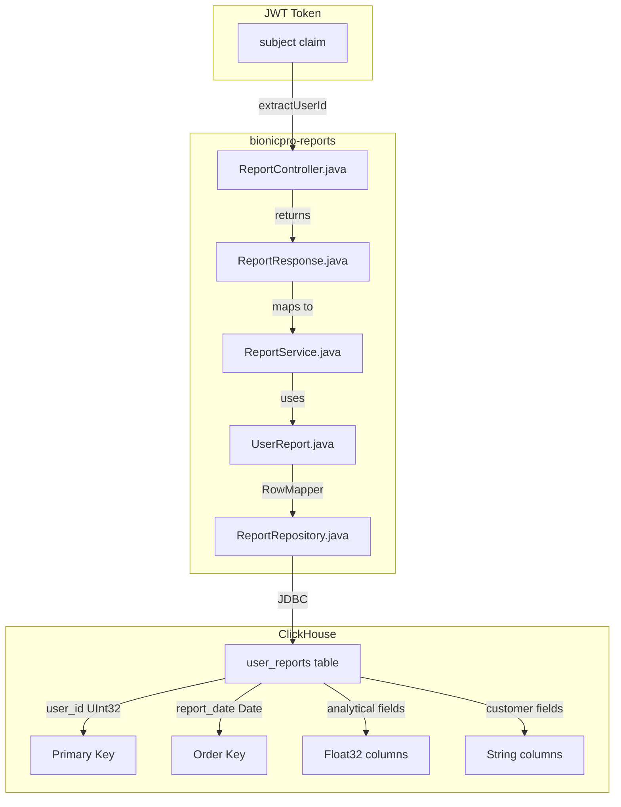

# Data Model Mismatch Remediation Plan

## Executive Summary

**CONFIRMED:** The auditor's findings in section 2.3 are accurate. The `bionicpro-reports` service has significant data model mismatches that will cause runtime failures when connecting to ClickHouse.

## Issue Verification Summary

### Issue 1: UserReport.java Mismatch ✅ CONFIRMED

| Current Field | ClickHouse Column | Status |
|--------------|-------------------|--------|
| `Long id` | - | ❌ DOES NOT EXIST |
| `String userId` | `user_id UInt32` | ❌ WRONG TYPE |
| `String reportType` | - | ❌ DOES NOT EXIST |
| `String title` | - | ❌ DOES NOT EXIST |
| `String content` | - | ❌ DOES NOT EXIST |
| `LocalDateTime generatedAt` | - | ❌ DOES NOT EXIST |
| `LocalDateTime periodStart` | - | ❌ DOES NOT EXIST |
| `LocalDateTime periodEnd` | - | ❌ DOES NOT EXIST |
| `String status` | - | ❌ DOES NOT EXIST |
| - | `report_date Date` | ❌ MISSING |
| - | `total_sessions UInt32` | ❌ MISSING |
| - | `avg_signal_amplitude Float32` | ❌ MISSING |
| - | `max_signal_amplitude Float32` | ❌ MISSING |
| - | `min_signal_amplitude Float32` | ❌ MISSING |
| - | `avg_signal_frequency Float32` | ❌ MISSING |
| - | `total_usage_hours Float32` | ❌ MISSING |
| - | `prosthesis_type String` | ❌ MISSING |
| - | `muscle_group String` | ❌ MISSING |
| - | `customer_name String` | ❌ MISSING |
| - | `customer_email String` | ❌ MISSING |
| - | `customer_age UInt8` | ❌ MISSING |
| - | `customer_gender String` | ❌ MISSING |
| - | `customer_country String` | ❌ MISSING |
| - | `created_at DateTime` | ❌ MISSING |

### Issue 2: ReportResponse.java Mismatch ✅ CONFIRMED

The DTO does not conform to the technical specification in [`task2/impl/03_reports_api_service.md`](task2/impl/03_reports_api_service.md).

**Required Structure:**
```java
public class ReportResponse {
    private Long userId;
    private String reportDate;
    private Integer totalSessions;
    private Double avgSignalAmplitude;
    private Double maxSignalAmplitude;
    private Double minSignalAmplitude;
    private Double avgSignalFrequency;
    private Double totalUsageHours;
    private String prosthesisType;
    private String muscleGroup;
    private CustomerInfo customerInfo;  // Nested object
    
    public static class CustomerInfo {
        private String name;
        private String email;
        private Integer age;
        private String gender;
        private String country;
    }
}
```

### Issue 3: ReportRepository.java Mismatch ✅ CONFIRMED

**Problem:** RowMapper and SQL queries reference non-existent columns:
- `id`, `report_type`, `title`, `content`, `generated_at`, `period_start`, `period_end`, `status`

**Impact:** Will cause `SQLException: Column not found` at runtime.

---

## Affected Files

| File | Changes Required |
|------|------------------|
| [`UserReport.java`](app/bionicpro-reports/src/main/java/com/bionicpro/reports/model/UserReport.java) | Complete rewrite |
| [`ReportResponse.java`](app/bionicpro-reports/src/main/java/com/bionicpro/reports/dto/ReportResponse.java) | Complete rewrite |
| [`ReportRepository.java`](app/bionicpro-reports/src/main/java/com/bionicpro/reports/repository/ReportRepository.java) | Complete rewrite |
| [`ReportService.java`](app/bionicpro-reports/src/main/java/com/bionicpro/reports/service/ReportService.java) | Update mapping logic |
| [`ReportController.java`](app/bionicpro-reports/src/main/java/com/bionicpro/reports/controller/ReportController.java) | Minor updates for userId type |
| [`ReportServiceTest.java`](app/bionicpro-reports/src/test/java/com/bionicpro/reports/service/ReportServiceTest.java) | Update tests |
| [`ReportControllerTest.java`](app/bionicpro-reports/src/test/java/com/bionicpro/reports/controller/ReportControllerTest.java) | Update tests |

---

## Detailed Remediation Steps

### Step 1: Update UserReport.java

**File:** [`app/bionicpro-reports/src/main/java/com/bionicpro/reports/model/UserReport.java`](app/bionicpro-reports/src/main/java/com/bionicpro/reports/model/UserReport.java)

**Action:** Rewrite entity to match ClickHouse schema

```java
package com.bionicpro.reports.model;

import lombok.AllArgsConstructor;
import lombok.Builder;
import lombok.Data;
import lombok.NoArgsConstructor;

import java.time.LocalDate;
import java.time.LocalDateTime;

/**
 * Entity representing a user report stored in ClickHouse.
 * Maps to the user_reports table in the OLAP database.
 */
@Data
@Builder
@NoArgsConstructor
@AllArgsConstructor
public class UserReport {

    private Long userId;                // user_id UInt32
    private LocalDate reportDate;       // report_date Date
    private Integer totalSessions;      // total_sessions UInt32
    private Float avgSignalAmplitude;   // avg_signal_amplitude Float32
    private Float maxSignalAmplitude;   // max_signal_amplitude Float32
    private Float minSignalAmplitude;   // min_signal_amplitude Float32
    private Float avgSignalFrequency;   // avg_signal_frequency Float32
    private Float totalUsageHours;      // total_usage_hours Float32
    private String prosthesisType;      // prosthesis_type String
    private String muscleGroup;         // muscle_group String
    private String customerName;        // customer_name String
    private String customerEmail;       // customer_email String
    private Integer customerAge;        // customer_age UInt8
    private String customerGender;      // customer_gender String
    private String customerCountry;     // customer_country String
    private LocalDateTime createdAt;    // created_at DateTime
}
```

### Step 2: Update ReportResponse.java

**File:** [`app/bionicpro-reports/src/main/java/com/bionicpro/reports/dto/ReportResponse.java`](app/bionicpro-reports/src/main/java/com/bionicpro/reports/dto/ReportResponse.java)

**Action:** Rewrite DTO to match technical specification

```java
package com.bionicpro.reports.dto;

import lombok.AllArgsConstructor;
import lombok.Builder;
import lombok.Data;
import lombok.NoArgsConstructor;

/**
 * Data Transfer Object for API responses containing user report information.
 * Conforms to task2/impl/03_reports_api_service.md specification.
 */
@Data
@Builder
@NoArgsConstructor
@AllArgsConstructor
public class ReportResponse {

    private Long userId;
    private String reportDate;
    private Integer totalSessions;
    private Double avgSignalAmplitude;
    private Double maxSignalAmplitude;
    private Double minSignalAmplitude;
    private Double avgSignalFrequency;
    private Double totalUsageHours;
    private String prosthesisType;
    private String muscleGroup;
    private CustomerInfo customerInfo;

    @Data
    @Builder
    @NoArgsConstructor
    @AllArgsConstructor
    public static class CustomerInfo {
        private String name;
        private String email;
        private Integer age;
        private String gender;
        private String country;
    }
}
```

### Step 3: Update ReportRepository.java

**File:** [`app/bionicpro-reports/src/main/java/com/bionicpro/reports/repository/ReportRepository.java`](app/bionicpro-reports/src/main/java/com/bionicpro/reports/repository/ReportRepository.java)

**Action:** Rewrite repository with correct RowMapper and SQL queries

```java
package com.bionicpro.reports.repository;

import com.bionicpro.reports.model.UserReport;
import org.springframework.jdbc.core.JdbcTemplate;
import org.springframework.jdbc.core.RowMapper;
import org.springframework.stereotype.Repository;

import java.time.LocalDate;
import java.util.List;
import java.util.Optional;

/**
 * Repository for interacting with the ClickHouse user_reports table.
 */
@Repository
public class ReportRepository {

    private final JdbcTemplate jdbcTemplate;

    private final RowMapper<UserReport> reportRowMapper = (rs, rowNum) -> UserReport.builder()
            .userId(rs.getLong("user_id"))
            .reportDate(rs.getDate("report_date") != null ? 
                    rs.getDate("report_date").toLocalDate() : null)
            .totalSessions(rs.getInt("total_sessions"))
            .avgSignalAmplitude(rs.getFloat("avg_signal_amplitude"))
            .maxSignalAmplitude(rs.getFloat("max_signal_amplitude"))
            .minSignalAmplitude(rs.getFloat("min_signal_amplitude"))
            .avgSignalFrequency(rs.getFloat("avg_signal_frequency"))
            .totalUsageHours(rs.getFloat("total_usage_hours"))
            .prosthesisType(rs.getString("prosthesis_type"))
            .muscleGroup(rs.getString("muscle_group"))
            .customerName(rs.getString("customer_name"))
            .customerEmail(rs.getString("customer_email"))
            .customerAge(rs.getInt("customer_age"))
            .customerGender(rs.getString("customer_gender"))
            .customerCountry(rs.getString("customer_country"))
            .createdAt(rs.getTimestamp("created_at") != null ? 
                    rs.getTimestamp("created_at").toLocalDateTime() : null)
            .build();

    public ReportRepository(JdbcTemplate jdbcTemplate) {
        this.jdbcTemplate = jdbcTemplate;
    }

    /**
     * Retrieves all reports for a specific user.
     */
    public List<UserReport> findByUserId(Long userId) {
        String sql = """
            SELECT user_id, report_date, total_sessions, avg_signal_amplitude,
                   max_signal_amplitude, min_signal_amplitude, avg_signal_frequency,
                   total_usage_hours, prosthesis_type, muscle_group,
                   customer_name, customer_email, customer_age, customer_gender,
                   customer_country, created_at
            FROM user_reports 
            WHERE user_id = ? 
            ORDER BY report_date DESC
            """;
        
        return jdbcTemplate.query(sql, reportRowMapper, userId);
    }

    /**
     * Retrieves a specific report by user ID and report date.
     */
    public Optional<UserReport> findByUserIdAndReportDate(Long userId, LocalDate reportDate) {
        String sql = """
            SELECT user_id, report_date, total_sessions, avg_signal_amplitude,
                   max_signal_amplitude, min_signal_amplitude, avg_signal_frequency,
                   total_usage_hours, prosthesis_type, muscle_group,
                   customer_name, customer_email, customer_age, customer_gender,
                   customer_country, created_at
            FROM user_reports 
            WHERE user_id = ? AND report_date = ?
            """;
        
        List<UserReport> results = jdbcTemplate.query(sql, reportRowMapper, userId, reportDate);
        return results.isEmpty() ? Optional.empty() : Optional.of(results.get(0));
    }

    /**
     * Retrieves the latest N reports for a user.
     */
    public List<UserReport> findLatestByUserId(Long userId, int limit) {
        String sql = """
            SELECT user_id, report_date, total_sessions, avg_signal_amplitude,
                   max_signal_amplitude, min_signal_amplitude, avg_signal_frequency,
                   total_usage_hours, prosthesis_type, muscle_group,
                   customer_name, customer_email, customer_age, customer_gender,
                   customer_country, created_at
            FROM user_reports 
            WHERE user_id = ? 
            ORDER BY report_date DESC 
            LIMIT ?
            """;
        
        return jdbcTemplate.query(sql, reportRowMapper, userId, limit);
    }

    /**
     * Retrieves all reports from the database.
     */
    public List<UserReport> findAll() {
        String sql = """
            SELECT user_id, report_date, total_sessions, avg_signal_amplitude,
                   max_signal_amplitude, min_signal_amplitude, avg_signal_frequency,
                   total_usage_hours, prosthesis_type, muscle_group,
                   customer_name, customer_email, customer_age, customer_gender,
                   customer_country, created_at
            FROM user_reports 
            ORDER BY report_date DESC
            """;
        
        return jdbcTemplate.query(sql, reportRowMapper);
    }
}
```

### Step 4: Update ReportService.java

**File:** [`app/bionicpro-reports/src/main/java/com/bionicpro/reports/service/ReportService.java`](app/bionicpro-reports/src/main/java/com/bionicpro/reports/service/ReportService.java)

**Action:** Update method signatures and mapping logic

**Key Changes:**
1. Change `currentUserId` type from `String` to `Long`
2. Update `mapToResponse()` to map new fields
3. Remove `getReportById()` method that relied on non-existent `id` column
4. Add method to get latest report for a user

### Step 5: Update ReportController.java

**File:** [`app/bionicpro-reports/src/main/java/com/bionicpro/reports/controller/ReportController.java`](app/bionicpro-reports/src/main/java/com/bionicpro/reports/controller/ReportController.java)

**Action:** Update userId handling

**Key Changes:**
1. Add `extractUserId()` helper method to convert JWT subject to Long
2. Update endpoint URLs to match specification
3. Remove endpoints that relied on non-existent `id` column

### Step 6: Update Tests

**Files:**
- [`ReportServiceTest.java`](app/bionicpro-reports/src/test/java/com/bionicpro/reports/service/ReportServiceTest.java)
- [`ReportControllerTest.java`](app/bionicpro-reports/src/test/java/com/bionicpro/reports/controller/ReportControllerTest.java)

**Action:** Update test data and assertions to match new model structure

---

## Architecture Diagram



---

## Additional Findings

### Additional Issue: userId Type Mismatch

**Location:** [`ReportController.java`](app/bionicpro-reports/src/main/java/com/bionicpro/reports/controller/ReportController.java:36)

**Problem:** JWT subject is a String, but ClickHouse `user_id` is `UInt32`.

**Recommendation:** Add helper method to convert:
```java
private Long extractUserId(Jwt jwt) {
    Object userIdClaim = jwt.getClaim("user_id");
    if (userIdClaim == null) {
        userIdClaim = jwt.getClaim("sub");
    }
    if (userIdClaim instanceof Number) {
        return ((Number) userIdClaim).longValue();
    }
    return Long.parseLong(userIdClaim.toString());
}
```

---

## Testing Strategy

### Unit Tests
- Test RowMapper with mock ResultSet containing correct columns
- Test ReportService mapping logic
- Test ReportController authorization

### Integration Tests
- Test against real ClickHouse instance with test data
- Verify SQL queries execute without errors
- Verify data mapping is correct

### Test Data Setup
```sql
INSERT INTO user_reports VALUES (
    123,                          -- user_id
    '2024-01-15',                 -- report_date
    45,                           -- total_sessions
    0.75,                         -- avg_signal_amplitude
    1.2,                          -- max_signal_amplitude
    0.3,                          -- min_signal_amplitude
    150.5,                        -- avg_signal_frequency
    12.5,                         -- total_usage_hours
    'upper_limb',                 -- prosthesis_type
    'biceps',                     -- muscle_group
    'Ivan Ivanov',                -- customer_name
    'ivanov@example.com',         -- customer_email
    35,                           -- customer_age
    'male',                       -- customer_gender
    'Russia',                     -- customer_country
    now()                         -- created_at
);
```

---

## Risk Assessment

| Risk | Likelihood | Impact | Mitigation |
|------|------------|--------|------------|
| Runtime SQL errors | HIGH | CRITICAL | Fix all column references |
| Type conversion errors | MEDIUM | HIGH | Add proper type conversion |
| Test failures | HIGH | MEDIUM | Update all test files |
| API contract breakage | MEDIUM | MEDIUM | Update API documentation |

---

## Implementation Order

1. **UserReport.java** - Foundation entity
2. **ReportResponse.java** - DTO structure
3. **ReportRepository.java** - Data access layer
4. **ReportService.java** - Business logic
5. **ReportController.java** - API layer
6. **Test files** - Validation

---

## Conclusion

The auditor's findings are **100% accurate**. The current implementation is fundamentally broken and will fail at runtime. Complete remediation is required for all affected files.
