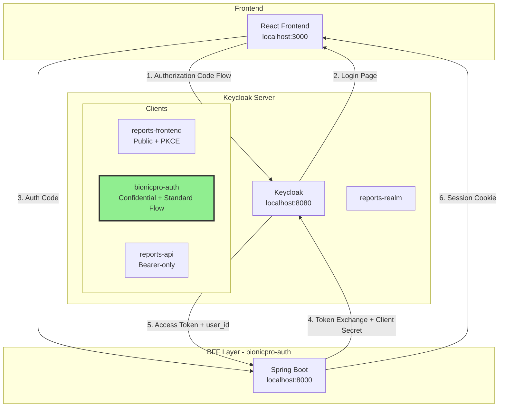

# Implementation Plan: Add Missing Keycloak Client (KC-001)

## Problem Summary

**Finding ID:** KC-001  
**Severity:** Critical  
**Status:** Confirmed

The `bionicpro-auth` confidential client is missing from the Keycloak realm configuration. This prevents the BFF (Backend for Frontend) service from authenticating with Keycloak using the OAuth2 Authorization Code Flow.

### Impact
- The `bionicpro-auth` service cannot exchange authorization codes for tokens
- User authentication flow is broken
- The entire application security chain is non-functional

---

## Analysis of Existing Structure

### Current Clients in [`realm-export.json`](app/keycloak/realm-export.json)

| Client ID | Type | Flow | Purpose |
|-----------|------|------|---------|
| `reports-frontend` | Public | Standard Flow + PKCE | Frontend SPA authentication |
| `reports-api` | Confidential | Bearer-only | Service-to-service token validation |

### Client Configuration Patterns

#### 1. Public Client Pattern (`reports-frontend`)
```json
{
  "clientId": "reports-frontend",
  "enabled": true,
  "publicClient": true,
  "pkceMethod": "S256",
  "redirectUris": ["http://localhost:8081/*", "http://localhost:3000/*"],
  "webOrigins": ["http://localhost:8081", "http://localhost:3000"],
  "directAccessGrantsEnabled": false,
  "standardFlowEnabled": true,
  "implicitFlowEnabled": false,
  "rootUrl": "http://localhost:8081",
  "baseUrl": "/",
  "protocolMappers": [...]
}
```

#### 2. Confidential Bearer-Only Pattern (`reports-api`)
```json
{
  "clientId": "reports-api",
  "enabled": true,
  "clientAuthenticatorType": "client-secret",
  "secret": "${KEYCLOAK_REPORTS_API_CLIENT_SECRET}",
  "bearerOnly": true
}
```

### Required Pattern for `bionicpro-auth`

The `bionicpro-auth` client needs a **hybrid configuration**:
- **Confidential** (like `reports-api`) - requires client secret
- **Standard Flow enabled** (like `reports-frontend`) - for Authorization Code Flow
- **Not bearer-only** - must be able to obtain tokens
- **Protocol mappers** - to include `user_id` claim in tokens

---

## Proposed Client Configuration

### New Client JSON Definition

Add the following client to the `clients` array in [`realm-export.json`](app/keycloak/realm-export.json):

```json
{
  "clientId": "bionicpro-auth",
  "enabled": true,
  "publicClient": false,
  "clientAuthenticatorType": "client-secret",
  "secret": "${KEYCLOAK_BIONICPRO_AUTH_CLIENT_SECRET}",
  "bearerOnly": false,
  "standardFlowEnabled": true,
  "implicitFlowEnabled": false,
  "directAccessGrantsEnabled": false,
  "serviceAccountsEnabled": false,
  "pkceMethod": "S256",
  "redirectUris": [
    "http://localhost:8000/*",
    "http://bionicpro-auth:8000/*"
  ],
  "webOrigins": [
    "http://localhost:8000",
    "http://bionicpro-auth:8000"
  ],
  "rootUrl": "http://localhost:8000",
  "baseUrl": "/",
  "protocolMappers": [
    {
      "name": "user_id",
      "protocol": "openid-connect",
      "protocolMapper": "oidc-usermodel-attribute-mapper",
      "consentRequired": false,
      "config": {
        "userinfo.token.claim": "true",
        "user.attribute": "user_id",
        "id.token.claim": "true",
        "access.token.claim": "true",
        "claim.name": "user_id",
        "jsonType.label": "String"
      }
    }
  ]
}
```

### Configuration Rationale

| Property | Value | Reason |
|----------|-------|--------|
| `publicClient` | `false` | Confidential client requires secret |
| `bearerOnly` | `false` | Must obtain tokens, not just validate them |
| `standardFlowEnabled` | `true` | Authorization Code Flow required |
| `directAccessGrantsEnabled` | `false` | No resource owner password credentials |
| `pkceMethod` | `S256` | Additional security for authorization code flow |
| `redirectUris` | Multiple | Support both local and Docker network access |
| `protocolMappers` | `user_id` | Include user_id claim for downstream services |

---

## Files to Modify

### 1. [`app/keycloak/realm-export.json`](app/keycloak/realm-export.json)
**Change:** Add new client configuration to `clients` array

### 2. [`app/.env`](app/.env)
**Change:** Add client secret environment variable

```env
# Keycloak Client Secrets
KEYCLOAK_REPORTS_API_CLIENT_SECRET=<generate-secure-secret>
KEYCLOAK_BIONICPRO_AUTH_CLIENT_SECRET=<generate-secure-secret>
```

### 3. [`app/docker-compose.yaml`](app/docker-compose.yaml)
**Change:** Add client secret to `bionicpro-auth` service environment

```yaml
bionicpro-auth:
  # ... existing configuration ...
  environment:
    # ... existing environment variables ...
    KEYCLOAK_CLIENT_SECRET: ${KEYCLOAK_BIONICPRO_AUTH_CLIENT_SECRET}
```

---

## Step-by-Step Implementation Instructions

### Step 1: Generate Client Secret
Generate a secure random secret for the client:

```bash
# Using openssl
openssl rand -base64 32

# Or using Python
python3 -c "import secrets; print(secrets.token_urlsafe(32))"
```

### Step 2: Update Environment Variables
Edit [`app/.env`](app/.env) and add:

```env
# Keycloak Client Secrets
KEYCLOAK_REPORTS_API_CLIENT_SECRET=<your-generated-secret-for-reports-api>
KEYCLOAK_BIONICPRO_AUTH_CLIENT_SECRET=<your-generated-secret-for-bionicpro-auth>
```

### Step 3: Update realm-export.json
Edit [`app/keycloak/realm-export.json`](app/keycloak/realm-export.json):

1. Locate the `clients` array (around line 100)
2. Add the new client configuration after the `reports-api` client
3. Ensure proper JSON comma placement

**Insert after the `reports-api` client block:**

```json
      },
      {
        "clientId": "bionicpro-auth",
        "enabled": true,
        "publicClient": false,
        "clientAuthenticatorType": "client-secret",
        "secret": "${KEYCLOAK_BIONICPRO_AUTH_CLIENT_SECRET}",
        "bearerOnly": false,
        "standardFlowEnabled": true,
        "implicitFlowEnabled": false,
        "directAccessGrantsEnabled": false,
        "serviceAccountsEnabled": false,
        "pkceMethod": "S256",
        "redirectUris": [
          "http://localhost:8000/*",
          "http://bionicpro-auth:8000/*"
        ],
        "webOrigins": [
          "http://localhost:8000",
          "http://bionicpro-auth:8000"
        ],
        "rootUrl": "http://localhost:8000",
        "baseUrl": "/",
        "protocolMappers": [
          {
            "name": "user_id",
            "protocol": "openid-connect",
            "protocolMapper": "oidc-usermodel-attribute-mapper",
            "consentRequired": false,
            "config": {
              "userinfo.token.claim": "true",
              "user.attribute": "user_id",
              "id.token.claim": "true",
              "access.token.claim": "true",
              "claim.name": "user_id",
              "jsonType.label": "String"
            }
          }
        ]
      }
```

### Step 4: Update docker-compose.yaml
Edit [`app/docker-compose.yaml`](app/docker-compose.yaml):

1. Locate the `bionicpro-auth` service definition
2. Add the `KEYCLOAK_CLIENT_SECRET` environment variable

**Current configuration:**
```yaml
bionicpro-auth:
  # ...
  environment:
    SPRING_PROFILES_ACTIVE: dev
    REDIS_HOST: redis
    REDIS_PORT: 6379
    REDIS_PASSWORD: ${REDIS_PASSWORD}
    KEYCLOAK_SERVER_URL: http://keycloak:8080
    KEYCLOAK_REALM: reports-realm
    KEYCLOAK_CLIENT_ID: bionicpro-auth
    KEYCLOAK_REDIRECT_URI: http://localhost:8000/api/auth/callback
```

**Add after `KEYCLOAK_REDIRECT_URI`:**
```yaml
    KEYCLOAK_CLIENT_SECRET: ${KEYCLOAK_BIONICPRO_AUTH_CLIENT_SECRET}
```

### Step 5: Restart Services
After making all changes:

```bash
cd app
docker-compose down
docker-compose up -d
```

---

## Verification Steps

### 1. Verify Client Creation in Keycloak

```bash
# Access Keycloak Admin CLI
docker exec -it <keycloak-container> /bin/bash

# Login to Keycloak
/opt/keycloak/bin/kcadm.sh config credentials \
  --server http://localhost:8080 \
  --realm master \
  --user admin \
  --password <admin-password>

# List clients
/opt/keycloak/bin/kcadm.sh get clients -r reports-realm \
  --fields clientId,publicClient,bearerOnly,standardFlowEnabled
```

**Expected output should include:**
```
[ {
  "clientId" : "reports-frontend",
  "publicClient" : true,
  "bearerOnly" : false,
  "standardFlowEnabled" : true
}, {
  "clientId" : "reports-api",
  "publicClient" : false,
  "bearerOnly" : true,
  "standardFlowEnabled" : false
}, {
  "clientId" : "bionicpro-auth",
  "publicClient" : false,
  "bearerOnly" : false,
  "standardFlowEnabled" : true
} ]
```

### 2. Test Authorization Code Flow

```bash
# Build authorization URL
AUTH_URL="http://localhost:8080/realms/reports-realm/protocol/openid-connect/auth?client_id=bionicpro-auth&redirect_uri=http://localhost:8000/api/auth/callback&response_type=code&scope=openid&code_challenge_method=S256"

# Open in browser or use curl
curl -v "$AUTH_URL"
```

**Expected:** HTTP 302 redirect to login page (not 400/401 error)

### 3. Test Token Endpoint

After completing the authorization flow:

```bash
curl -X POST "http://localhost:8080/realms/reports-realm/protocol/openid-connect/token" \
  -H "Content-Type: application/x-www-form-urlencoded" \
  -d "grant_type=authorization_code" \
  -d "client_id=bionicpro-auth" \
  -d "client_secret=<your-client-secret>" \
  -d "code=<authorization-code>" \
  -d "redirect_uri=http://localhost:8000/api/auth/callback"
```

**Expected:** JSON response with `access_token`, `refresh_token`, `id_token`

### 4. Verify user_id Claim in Token

```bash
# Decode the access token JWT
echo "<access_token>" | cut -d. -f2 | base64 -d | jq .
```

**Expected:** Token payload should include `user_id` claim

### 5. End-to-End Test

1. Navigate to `http://localhost:3000`
2. Click "Login"
3. Enter credentials (e.g., `user1` / password)
4. Verify successful authentication
5. Check session in Redis

---

## Architecture Diagram



---

## Risk Assessment

| Risk | Likelihood | Impact | Mitigation |
|------|------------|--------|------------|
| Client secret exposure | Low | High | Use environment variables, rotate secrets |
| Redirect URI mismatch | Medium | Medium | Test all redirect URIs |
| Token claim missing | Low | Medium | Verify protocol mapper configuration |
| Service startup order | Low | Low | Docker depends_on already configured |

---

## Rollback Plan

If issues arise after implementation:

1. **Remove the client from realm-export.json:**
   ```bash
   # Restore original file
   git checkout app/keycloak/realm-export.json
   ```

2. **Remove environment variable:**
   ```bash
   # Remove KEYCLOAK_BIONICPRO_AUTH_CLIENT_SECRET from .env
   ```

3. **Restart Keycloak:**
   ```bash
   docker-compose restart keycloak
   ```

---

## References

- [Keycloak Client Configuration Documentation](https://www.keycloak.org/docs/latest/server_admin/#_oidc_clients)
- [OAuth 2.0 Authorization Code Flow](https://oauth.net/2/grant-types/authorization-code/)
- [PKCE RFC 7636](https://datatracker.ietf.org/doc/html/rfc7636)
- [`bionicpro-auth` application.yml](app/bionicpro-auth/src/main/resources/application.yml)
