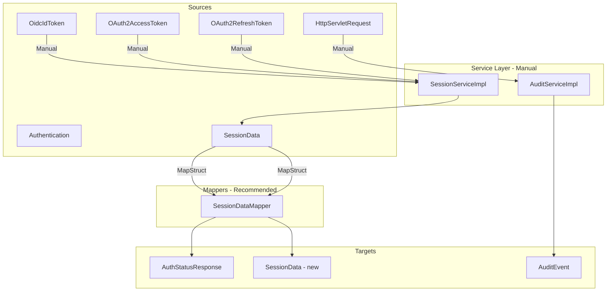

# MapStruct Feasibility Analysis for bionicpro-auth

## Executive Summary

MapStruct is **already configured** in the `bionicpro-auth` module dependencies and can be used to implement mapping logic. This analysis identifies all DTO mapping locations and assesses the feasibility of using MapStruct.

---

## 1. Current MapStruct Configuration

The module already has MapStruct dependencies configured in [`pom.xml`](app/bionicpro-auth/pom.xml):

| Dependency | Version | Scope |
|------------|---------|-------|
| `org.mapstruct:mapstruct` | 1.5.5.Final | compile |
| `org.mapstruct:mapstruct-processor` | 1.5.5.Final | provided |

**No additional configuration is required** to start using MapStruct.

---

## 2. DTO and Model Classes Identified

### 2.1 DTO Classes

| Class | Location | Fields |
|-------|----------|--------|
| [`AuthStatusResponse`](app/bionicpro-auth/src/main/java/com/bionicpro/dto/AuthStatusResponse.java) | `dto` package | authenticated, userId, username, roles, sessionExpiresAt |

### 2.2 Model Classes

| Class | Location | Fields |
|-------|----------|--------|
| [`SessionData`](app/bionicpro-auth/src/main/java/com/bionicpro/model/SessionData.java) | `model` package | sessionId, userId, username, roles, accessToken, refreshToken, accessTokenExpiresAt, refreshTokenExpiresAt, createdAt, expiresAt, lastAccessedAt |
| [`TokenData`](app/bionicpro-auth/src/main/java/com/bionicpro/model/TokenData.java) | `model` package | accessToken, refreshToken, accessTokenExpiresAt, refreshTokenExpiresAt, tokenType, scope |
| [`AuditEvent`](app/bionicpro-auth/src/main/java/com/bionicpro/audit/AuditEvent.java) | `audit` package | timestamp, correlationId, eventType, principal, clientIp, userAgent, sessionId, outcome, errorType, errorMessage, details |

---

## 3. Mapping Locations Identified

### 3.1 AuthController - getStatus Method

**File:** [`AuthController.java`](app/bionicpro-auth/src/main/java/com/bionicpro/controller/AuthController.java:162-190)

**Current Implementation:**
```java
@GetMapping("/status")
public ResponseEntity<AuthStatusResponse> getStatus(HttpServletRequest request) {
    Authentication authentication = SecurityContextHolder.getContext().getAuthentication();
    
    if (authentication == null || !authentication.isAuthenticated()) {
        return ResponseEntity.status(HttpStatus.UNAUTHORIZED)
                .body(AuthStatusResponse.builder()
                        .authenticated(false)
                        .build());
    }
    
    String userId = authentication.getName();
    List<String> roles = List.of();
    
    // Extract roles from authentication
    if (authentication.getAuthorities() != null) {
        roles = authentication.getAuthorities().stream()
                .map(a -> a.getAuthority())
                .toList();
    }
    
    // Get session expiration
    Instant expiresAt = sessionService.getSessionExpiration(request);
    
    AuthStatusResponse response = AuthStatusResponse.builder()
            .authenticated(true)
            .userId(userId)
            .username(userId)
            .roles(roles)
            .sessionExpiresAt(expiresAt != null ? expiresAt.toString() : null)
            .build();
    
    return ResponseEntity.ok(response);
}
```

**Mapping Type:** `Authentication` + `SessionData` → `AuthStatusResponse`

### 3.2 SessionServiceImpl - createSession Method

**File:** [`SessionServiceImpl.java`](app/bionicpro-auth/src/main/java/com/bionicpro/service/SessionServiceImpl.java:100-120)

**Current Implementation:**
```java
SessionData sessionData = SessionData.builder()
        .sessionId(sessionId)
        .userId(idToken.getSubject())
        .username(idToken.getClaimAsString("preferred_username"))
        .roles(idToken.getClaimAsStringList("roles"))
        .accessToken(encryptToken(accessToken.getTokenValue()))
        .refreshToken(refreshToken != null ? encryptToken(refreshToken.getTokenValue()) : null)
        .accessTokenExpiresAt(accessToken.getExpiresAt())
        .refreshTokenExpiresAt(refreshToken != null ? refreshToken.getExpiresAt() : null)
        .createdAt(Instant.now())
        .expiresAt(Instant.now().plus(Duration.ofMinutes(sessionTimeoutMinutes)))
        .lastAccessedAt(Instant.now())
        .build();
```

**Mapping Type:** `OidcIdToken` + `OAuth2AccessToken` + `OAuth2RefreshToken` → `SessionData`

**Note:** This mapping includes business logic:
- Token encryption via `encryptToken()`
- Session timeout calculation
- Timestamp generation

### 3.3 SessionServiceImpl - rotateSession Method

**File:** [`SessionServiceImpl.java`](app/bionicpro-auth/src/main/java/com/bionicpro/service/SessionServiceImpl.java:276-295)

**Current Implementation:**
```java
SessionData newSession = SessionData.builder()
        .sessionId(newSessionId)
        .userId(oldSession.getUserId())
        .username(oldSession.getUsername())
        .roles(oldSession.getRoles())
        .accessToken(oldSession.getAccessToken())
        .refreshToken(oldSession.getRefreshToken())
        .accessTokenExpiresAt(oldSession.getAccessTokenExpiresAt())
        .refreshTokenExpiresAt(oldSession.getRefreshTokenExpiresAt())
        .createdAt(oldSession.getCreatedAt())
        .expiresAt(oldSession.getExpiresAt())
        .lastAccessedAt(Instant.now())
        .build();
```

**Mapping Type:** `SessionData` → `SessionData` (copy with new sessionId and lastAccessedAt)

### 3.4 AuditServiceImpl - Multiple Methods

**File:** [`AuditServiceImpl.java`](app/bionicpro-auth/src/main/java/com/bionicpro/audit/AuditServiceImpl.java)

**Mapping Type:** Various input parameters → `AuditEvent`

This uses a helper method `buildAuditEvent()`:
```java
private AuditEvent.AuditEventBuilder buildAuditEvent(AuditEventType eventType, 
                                                      String userId, 
                                                      String sessionId, 
                                                      HttpServletRequest request) {
    String clientIp = clientIpResolver.getClientIp(request);
    String userAgent = ClientIpResolver.sanitizeUserAgent(
            clientIpResolver.getUserAgent(request));

    return AuditEvent.builder()
            .timestamp(Instant.now())
            .correlationId(getCorrelationId())
            .eventType(eventType)
            .principal(sanitizeUserId(userId))
            .clientIp(clientIp)
            .userAgent(userAgent)
            .sessionId(sanitizeSessionId(sessionId));
}
```

**Note:** This includes sanitization logic and MDC context integration.

---

## 4. MapStruct Feasibility Assessment

### 4.1 ✅ Suitable for MapStruct

| Mapping | Source → Target | Feasibility |
|---------|-----------------|-------------|
| SessionData to AuthStatusResponse | `SessionData` → `AuthStatusResponse` | **High** - Direct field mapping with simple transformations |
| SessionData copy for rotation | `SessionData` → `SessionData` | **High** - Simple copy with few field changes |

### 4.2 ⚠️ Requires Custom Logic

| Mapping | Source → Target | Considerations |
|---------|-----------------|----------------|
| OAuth tokens to SessionData | `OidcIdToken`, `OAuth2AccessToken`, `OAuth2RefreshToken` → `SessionData` | **Medium** - Requires custom methods for token encryption and timeout calculation |
| AuditEvent creation | Multiple sources → `AuditEvent` | **Medium** - Requires sanitization and MDC context integration |

---

## 5. Recommended MapStruct Implementation

### 5.1 Create SessionDataMapper

```java
@Mapper(componentModel = "spring")
public interface SessionDataMapper {

    @Mapping(target = "authenticated", constant = "true")
    @Mapping(target = "sessionExpiresAt", expression = "java(session.getExpiresAt() != null ? session.getExpiresAt().toString() : null)")
    AuthStatusResponse toAuthStatusResponse(SessionData session);
    
    @Mapping(target = "sessionId", source = "newSessionId")
    @Mapping(target = "lastAccessedAt", expression = "java(java.time.Instant.now())")
    SessionData copyForRotation(SessionData source, String newSessionId);
}
```

### 5.2 Keep Manual Mapping For

- **createSession** - Business logic with token encryption is better suited for service layer
- **AuditEvent creation** - Sanitization and security-sensitive logic should remain in service

---

## 6. Architecture Diagram



---

## 7. Benefits of Using MapStruct

| Benefit | Description |
|---------|-------------|
| **Type Safety** | Compile-time checking of mapping code |
| **Performance** | No reflection at runtime - pure method calls |
| **Maintainability** | Generated code is easy to debug |
| **Less Boilerplate** | Reduces manual mapping code |
| **IDE Support** | Full code completion and navigation |
| **Lombok Integration** | Works seamlessly with `@Builder` |

---

## 8. Implementation Checklist

- [ ] Create `mapper` package under `com.bionicpro`
- [ ] Implement `SessionDataMapper` interface
- [ ] Update `AuthController` to use mapper
- [ ] Update `SessionServiceImpl.rotateSession` to use mapper
- [ ] Add unit tests for mappers
- [ ] Configure Maven compiler plugin if not already configured

---

## 9. Conclusion

**MapStruct is fully viable for this module.** The library is already configured, and there are clear use cases where it can reduce boilerplate code:

1. **Immediate benefit**: `SessionData` → `AuthStatusResponse` mapping
2. **Immediate benefit**: `SessionData` copy for session rotation

For complex mappings involving encryption, sanitization, or multi-source aggregation, manual mapping in the service layer remains the appropriate choice.
