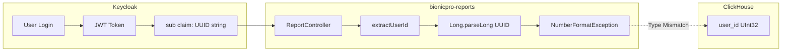
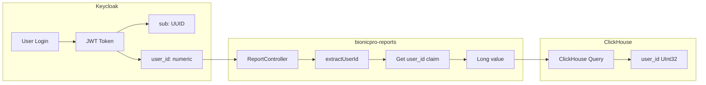

# UserId Type Mismatch Fix - Implementation Plan

## Executive Summary

**Issue:** The auditor identified a critical type mismatch between Keycloak's JWT `sub` claim (UUID string) and ClickHouse's `user_id` column (UInt32), causing `NumberFormatException` at runtime.

**Solution:** Add a Keycloak Protocol Mapper to include a numeric `user_id` claim in JWT tokens.

**Risk Level:** Low - Minimal code changes, leverages existing infrastructure.

---

## Problem Analysis

### Current State



### Root Cause

| Component | Type | Example Value |
|-----------|------|---------------|
| Keycloak `sub` claim | String (UUID) | `550e8400-e29b-41d4-a716-446655440000` |
| ClickHouse `user_id` | UInt32 | `512`, `887`, `316` |
| sensors-db `user_id` | INTEGER | `512`, `887`, `316` |

The [`extractUserId()`](app/bionicpro-reports/src/main/java/com/bionicpro/reports/controller/ReportController.java:118) method attempts `Long.parseLong()` on a UUID string, which fails.

### Existing Code Analysis

The [`ReportController.java`](app/bionicpro-reports/src/main/java/com/bionicpro/reports/controller/ReportController.java) already has logic to check for a `user_id` claim:

```java
private Long extractUserId(Jwt jwt) {
    // Try user_id claim first (custom claim)
    Object userIdClaim = jwt.getClaim("user_id");
    
    if (userIdClaim == null) {
        // Fall back to subject claim
        userIdClaim = jwt.getClaim("sub");
    }
    
    if (userIdClaim instanceof Number) {
        return ((Number) userIdClaim).longValue();
    }
    
    try {
        return Long.parseLong(userIdClaim.toString());
    } catch (NumberFormatException e) {
        logger.error("Failed to parse user ID from JWT: {}", userIdClaim);
        throw new IllegalArgumentException("Invalid user ID in token");
    }
}
```

**Key Insight:** The code already supports a custom `user_id` claim. We just need to configure Keycloak to provide it.

---

## Solution Design

### Target State



### Implementation Components

1. **Keycloak User Attributes** - Store numeric user ID for each user
2. **Protocol Mapper** - Include `user_id` attribute as JWT claim
3. **User Mapping** - Map Keycloak users to database user IDs

---

## Detailed Implementation Steps

### Step 1: Define User ID Mappings

Based on analysis of the existing data:

| Keycloak User | LDAP User | Numeric user_id | Role |
|---------------|-----------|-----------------|------|
| user1 | - | 512 | user |
| user2 | - | 887 | user |
| admin1 | - | 316 | administrator |
| prothetic1 | - | 779 | prothetic_user |
| prothetic2 | - | 355 | prothetic_user |
| prothetic3 | - | 256 | prothetic_user |
| - | john.doe | 961 | user |
| - | jane.smith | 428 | user |
| - | alex.johnson | 643 | prothetic_user |
| - | admin | 127 | administrator |

**Note:** The numeric IDs should match existing data in sensors-db. The sample data shows user_ids: `512, 887, 316, 779, 355, 256, 961, 428, 643, 127`.

### Step 2: Update Keycloak realm-export.json

**File:** [`app/keycloak/realm-export.json`](app/keycloak/realm-export.json)

Add user attributes and protocol mapper:

```json
{
  "realm": "reports-realm",
  "users": [
    {
      "username": "user1",
      "enabled": true,
      "email": "user1@example.com",
      "firstName": "User",
      "lastName": "One",
      "attributes": {
        "user_id": ["512"]
      },
      "credentials": [
        {
          "type": "password",
          "value": "${KEYCLOAK_USER1_PASSWORD}",
          "temporary": false
        }
      ],
      "realmRoles": ["user"]
    },
    {
      "username": "user2",
      "enabled": true,
      "email": "user2@example.com",
      "firstName": "User",
      "lastName": "Two",
      "attributes": {
        "user_id": ["887"]
      },
      "credentials": [
        {
          "type": "password",
          "value": "${KEYCLOAK_USER1_PASSWORD}",
          "temporary": false
        }
      ],
      "realmRoles": ["user"]
    },
    {
      "username": "admin1",
      "enabled": true,
      "email": "admin1@example.com",
      "firstName": "Admin",
      "lastName": "One",
      "attributes": {
        "user_id": ["316"]
      },
      "credentials": [
        {
          "type": "password",
          "value": "${KEYCLOAK_ADMIN1_PASSWORD}",
          "temporary": false
        }
      ],
      "realmRoles": ["administrator"]
    },
    {
      "username": "prothetic1",
      "enabled": true,
      "email": "prothetic1@example.com",
      "firstName": "Prothetic",
      "lastName": "One",
      "attributes": {
        "user_id": ["779"]
      },
      "credentials": [
        {
          "type": "password",
          "value": "${KEYCLOAK_PROTHETIC_PASSWORD}",
          "temporary": false
        }
      ],
      "realmRoles": ["prothetic_user"]
    },
    {
      "username": "prothetic2",
      "enabled": true,
      "email": "prothetic2@example.com",
      "firstName": "Prothetic",
      "lastName": "Two",
      "attributes": {
        "user_id": ["355"]
      },
      "credentials": [
        {
          "type": "password",
          "value": "${KEYCLOAK_PROTHETIC_PASSWORD}",
          "temporary": false
        }
      ],
      "realmRoles": ["prothetic_user"]
    },
    {
      "username": "prothetic3",
      "enabled": true,
      "email": "prothetic3@example.com",
      "firstName": "Prothetic",
      "lastName": "Three",
      "attributes": {
        "user_id": ["256"]
      },
      "credentials": [
        {
          "type": "password",
          "value": "${KEYCLOAK_PROTHETIC_PASSWORD}",
          "temporary": false
        }
      ],
      "realmRoles": ["prothetic_user"]
    }
  ],
  "clients": [
    {
      "clientId": "reports-frontend",
      "enabled": true,
      "publicClient": true,
      "pkceMethod": "S256",
      "redirectUris": ["http://localhost:8081/*", "http://localhost:3000/*"],
      "webOrigins": ["http://localhost:8081", "http://localhost:3000"],
      "directAccessGrantsEnabled": false,
      "standardFlowEnabled": true,
      "implicitFlowEnabled": false,
      "rootUrl": "http://localhost:8081",
      "baseUrl": "/",
      "protocolMappers": [
        {
          "name": "user_id_mapper",
          "protocol": "openid-connect",
          "protocolMapper": "oidc-usermodel-attribute-mapper",
          "consentRequired": false,
          "config": {
            "userinfo.token.claim": "true",
            "user.attribute": "user_id",
            "id.token.claim": "true",
            "access.token.claim": "true",
            "claim.name": "user_id",
            "jsonType.label": "String"
          }
        }
      ]
    }
  ]
}
```

### Step 3: Update LDAP Configuration for user_id Attribute

**File:** [`app/ldap/config.ldif`](app/ldap/config.ldif)

Add `employeeNumber` attribute to store numeric user ID:

```ldif
# LDAP Users with numeric user_id (employeeNumber)
dn: uid=john.doe,ou=users,dc=bionicpro,dc=local
objectClass: top
objectClass: inetOrgPerson
objectClass: organizationalPerson
cn: John
sn: Doe
uid: john.doe
mail: john@bionicpro.com
employeeNumber: 961
userPassword: ${LDAP_USER_PASSWORD}

dn: uid=jane.smith,ou=users,dc=bionicpro,dc=local
objectClass: top
objectClass: inetOrgPerson
objectClass: organizationalPerson
cn: Jane
sn: Smith
uid: jane.smith
mail: jane@bionicpro.com
employeeNumber: 428
userPassword: ${LDAP_USER_PASSWORD}

dn: uid=alex,ou=users,dc=bionicpro,dc=local
objectClass: inetOrgPerson
objectClass: organizationalPerson
cn: Alex
sn: Johnson
uid: alex.johnson
mail: alex@bionicpro.com
employeeNumber: 643
userPassword: ${LDAP_USER_PASSWORD}

dn: uid=admin,ou=users,dc=bionicpro,dc=local
objectClass: inetOrgPerson
objectClass: organizationalPerson
cn: Admin
sn: User
uid: admin
mail: admin@bionicpro.com
employeeNumber: 127
userPassword: ${LDAP_ADMIN_PASSWORD}
```

### Step 4: Update Keycloak LDAP Federation Mapper

**File:** [`app/keycloak/realm-export.json`](app/keycloak/realm-export.json)

Add LDAP attribute mapper for `employeeNumber` → `user_id`:

```json
{
  "components": {
    "org.keycloak.userfed.UserFederationMapper": {
      "ldap-user-attribute-mapper": {
        "name": "LDAP User Attributes",
        "providerName": "ldap",
        "config": {
          "user.model.enabled": ["true"],
          "LDAPAttribute": ["mail=email, givenName=firstName, sn=lastName, employeeNumber=user_id"],
          "keycloak.model.enabled": ["true"]
        }
      }
    }
  }
}
```

---

## Code Changes

### No Changes Required to ReportController.java

The existing [`extractUserId()`](app/bionicpro-reports/src/main/java/com/bionicpro/reports/controller/ReportController.java:118) method already handles the `user_id` claim correctly:

1. Checks for `user_id` claim first
2. Falls back to `sub` claim if not present
3. Handles both `Number` type and String parsing

### Optional Enhancement: Improve Error Handling

Consider adding more descriptive error messages:

```java
private Long extractUserId(Jwt jwt) {
    Object userIdClaim = jwt.getClaim("user_id");
    
    if (userIdClaim == null) {
        userIdClaim = jwt.getClaim("sub");
        logger.warn("user_id claim not found in JWT, falling back to sub claim. " +
                    "Ensure Keycloak protocol mapper is configured.");
    }
    
    if (userIdClaim instanceof Number) {
        return ((Number) userIdClaim).longValue();
    }
    
    try {
        return Long.parseLong(userIdClaim.toString());
    } catch (NumberFormatException e) {
        logger.error("Failed to parse user ID from JWT. " +
                     "Claim value: {}, Expected: numeric user_id", userIdClaim);
        throw new IllegalArgumentException(
            "Invalid user ID in token. Expected numeric user_id claim.");
    }
}
```

---

## Testing Strategy

### Unit Tests

**File:** [`ReportControllerTest.java`](app/bionicpro-reports/src/test/java/com/bionicpro/reports/controller/ReportControllerTest.java)

Add test cases for `user_id` claim handling:

```java
@Test
void extractUserId_WithNumericUserIdClaim_ReturnsLongValue() {
    // Given
    Map<String, Object> claims = Map.of("user_id", 512L);
    Jwt jwt = Jwt.withTokenValue("token")
        .header("alg", "RS256")
        .claims(c -> c.putAll(claims))
        .build();
    
    // When
    Long userId = reportController.extractUserId(jwt);
    
    // Then
    assertThat(userId).isEqualTo(512L);
}

@Test
void extractUserId_WithStringUserIdClaim_ParsesCorrectly() {
    // Given
    Map<String, Object> claims = Map.of("user_id", "512");
    Jwt jwt = Jwt.withTokenValue("token")
        .header("alg", "RS256")
        .claims(c -> c.putAll(claims))
        .build();
    
    // When
    Long userId = reportController.extractUserId(jwt);
    
    // Then
    assertThat(userId).isEqualTo(512L);
}

@Test
void extractUserId_WithUUIDSubClaimAndNoUserId_ThrowsException() {
    // Given
    Map<String, Object> claims = Map.of("sub", "550e8400-e29b-41d4-a716-446655440000");
    Jwt jwt = Jwt.withTokenValue("token")
        .header("alg", "RS256")
        .claims(c -> c.putAll(claims))
        .build();
    
    // When/Then
    assertThatThrownBy(() -> reportController.extractUserId(jwt))
        .isInstanceOf(IllegalArgumentException.class)
        .hasMessageContaining("Invalid user ID");
}
```

### Integration Tests

1. **Keycloak Integration Test:**
   - Start Keycloak with updated realm configuration
   - Authenticate as test user
   - Verify JWT contains `user_id` claim with correct numeric value

2. **End-to-End Test:**
   - Authenticate via Keycloak
   - Call `/api/v1/reports` endpoint
   - Verify response contains correct user data

### Manual Testing Checklist

- [ ] Start Keycloak container with updated `realm-export.json`
- [ ] Login as `user1` via reports-frontend
- [ ] Decode JWT token and verify `user_id: "512"` claim exists
- [ ] Call `/api/v1/reports` endpoint
- [ ] Verify no `NumberFormatException` in logs
- [ ] Verify correct report data returned for user_id 512

---

## Migration Considerations

### Existing Users

| Scenario | Action Required |
|----------|-----------------|
| Keycloak users in `realm-export.json` | Add `attributes.user_id` to each user |
| LDAP users | Add `employeeNumber` attribute to each user entry |
| Users without numeric ID | Assign unique numeric ID from available range |

### Data Consistency

1. **Verify user_id uniqueness:** Ensure each user has a unique numeric ID
2. **Verify data exists:** Confirm sensors-db has data for the assigned user_ids
3. **Update CRM mapping:** Ensure CRM `customers.id` aligns with user_ids (if applicable)

### Rollback Plan

If issues arise:
1. Revert `realm-export.json` to previous version
2. Restart Keycloak container
3. The fallback to `sub` claim will work (but fail for UUIDs)

### Zero-Downtime Deployment

1. Update `realm-export.json` with new attributes and mapper
2. Restart Keycloak container (users will need to re-authenticate)
3. Existing sessions will continue until token expiration
4. New tokens will include `user_id` claim

---

## Implementation Checklist

### Phase 1: Keycloak Configuration

- [ ] Update [`realm-export.json`](app/keycloak/realm-export.json) with user attributes
- [ ] Add protocol mapper to `reports-frontend` client
- [ ] Update LDAP federation mapper configuration
- [ ] Update [`config.ldif`](app/ldap/config.ldif) with `employeeNumber` attributes

### Phase 2: Testing

- [ ] Add unit tests for `user_id` claim handling
- [ ] Add integration test for Keycloak JWT token
- [ ] Perform manual testing checklist

### Phase 3: Deployment

- [ ] Deploy updated Keycloak configuration
- [ ] Verify JWT tokens contain `user_id` claim
- [ ] Monitor logs for `NumberFormatException`
- [ ] Verify report API returns correct data

---

## Risk Assessment

| Risk | Likelihood | Impact | Mitigation |
|------|------------|--------|------------|
| User ID collision | Low | High | Use unique IDs from existing data |
| Missing user_id claim | Medium | Medium | Fallback to sub with warning log |
| LDAP sync issues | Low | Medium | Test LDAP federation before deployment |
| Token format change | Low | Low | Protocol mapper is standard Keycloak feature |

---

## Dependencies

- Keycloak must be restarted after configuration changes
- LDAP must be updated before Keycloak federation sync
- sensors-db must contain data for assigned user_ids

---

## Conclusion

This implementation plan provides a low-risk solution to the UserId type mismatch issue by leveraging Keycloak's built-in protocol mapper functionality. The existing code in [`ReportController.java`](app/bionicpro-reports/src/main/java/com/bionicpro/reports/controller/ReportController.java) already supports the `user_id` claim, requiring only Keycloak configuration changes.

**Estimated Effort:** 2-4 hours for configuration and testing

**Files to Modify:**
1. [`app/keycloak/realm-export.json`](app/keycloak/realm-export.json) - Add user attributes and protocol mapper
2. [`app/ldap/config.ldif`](app/ldap/config.ldif) - Add `employeeNumber` attributes
3. [`ReportControllerTest.java`](app/bionicpro-reports/src/test/java/com/bionicpro/reports/controller/ReportControllerTest.java) - Add test cases (optional)
