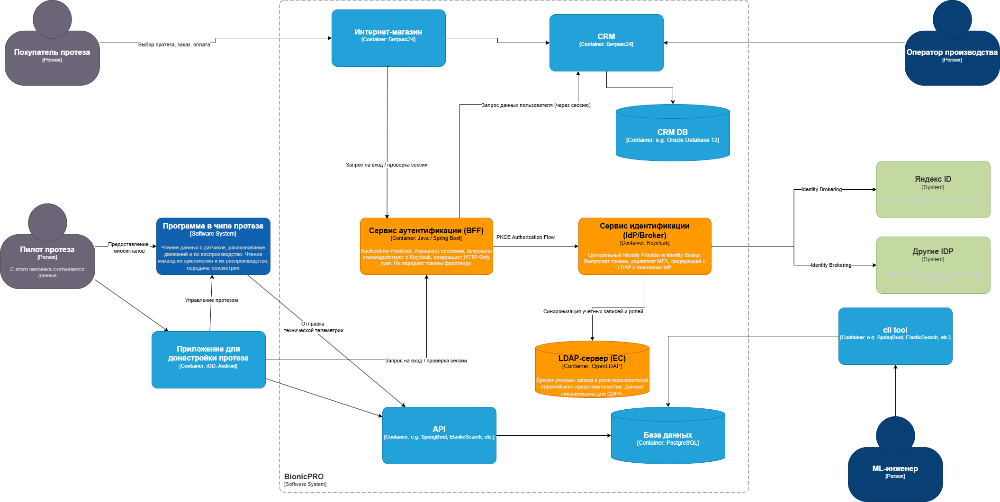

# Архитектура управления учётными данными BionicPRO

## Проблема
Существующая архитектура BionicPRO имеет критические уязвимости в безопасности (утечка токенов, слабая аутентификация) и не соответствует требованиям для международной экспансии: отсутствует единая точка управления доступом, нет поддержки локального хранения данных в разных юрисдикциях, токены передаются напрямую фронтенду.

## Решение
Внедрена многоуровневая архитектура аутентификации и авторизации на основе паттерна **Backend for Frontend (BFF)** и Identity Broker.

### Ключевые компоненты:
1.  **BionicPRO Auth Service (BFF)**: Центральный сервис, который обрабатывает все запросы на аутентификацию от фронтенда. Он реализует безопасный поток OAuth 2.0 с PKCE, изолирует access/refresh токены от клиента, управляет сессиями пользователей через HTTP-Only куки.
2.  **Keycloak как Identity Broker**: Выступает единой точкой федерации идентичности. Управляет внутренними пользователями, синхронизируется с LDAP и предоставляет возможность входа через внешние провайдеры (Яндекс ID и др.).
3.  **Локальные LDAP-серверы**: Для каждого географического региона (например, ЕС) разворачивается отдельный экземпляр OpenLDAP. В нём хранятся учётные данные пользователей этого региона, что обеспечивает соблюдение законодательства о локализации данных (GDPR).
4.  **Внешние Identity Provider (IdP)**: Keycloak настроен как брокер для поддержки аутентификации через внешние системы (Яндекс ID), с обязательным получением согласия (consent) пользователя.

### Преимущества новой архитектуры:
- **Безопасность**: Токены не доступны фронтенду, используются защищённые сессионные куки, обязательная MFA.
- **Соответствие законодательству**: Персональные данные пользователей хранятся в LDAP внутри страны пребывания.
- **Гибкость и масштабируемость**: Легко добавить новый LDAP для нового региона или нового внешнего IdP.
- **Унификация**: Единый интерфейс входа для пользователей из всех регионов через один фронтенд.

### Схема взаимодействия (C4 Level 2: Контейнеры)
Диаграмма ниже иллюстрирует взаимодействие ключевых компонентов системы.

---

### 📊 Архитектурная диаграмма
