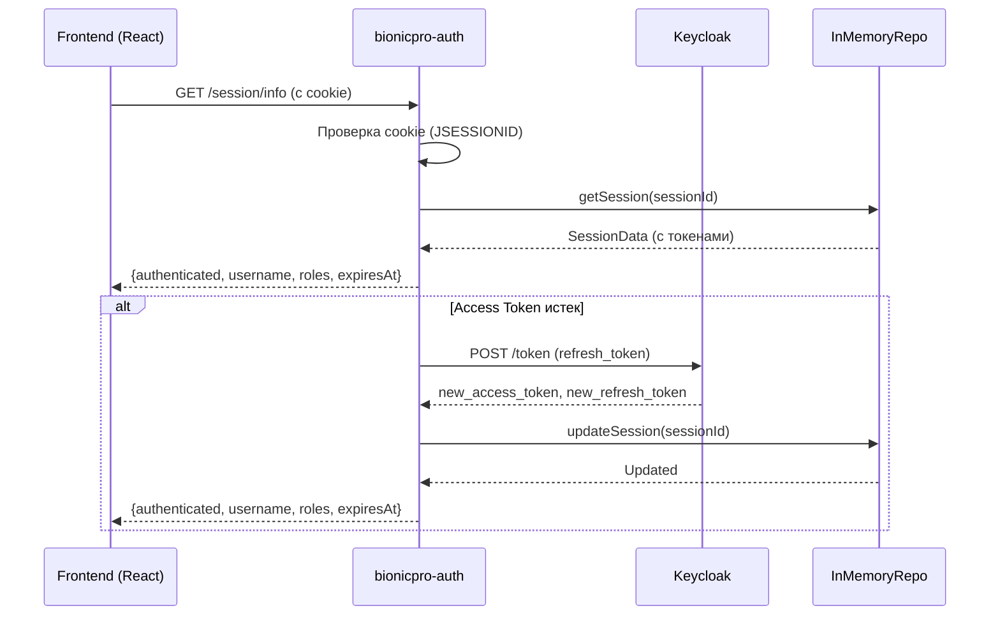
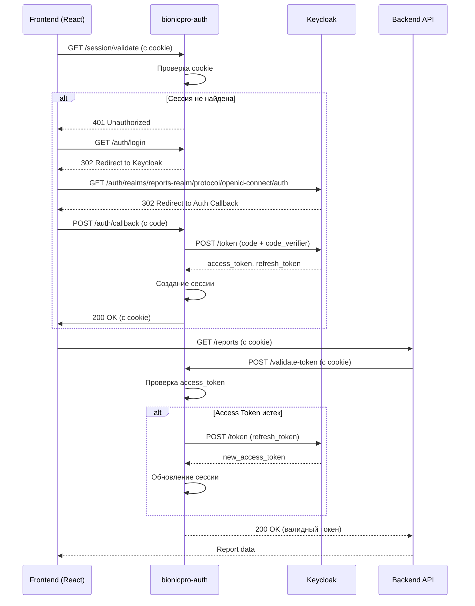

# План архитектурных изменений: BionicPRO Auth Service

## Обзор

Перенос механизма управления токенами из фронтенда в новый бэкенд-сервис `bionicpro-auth` для повышения безопасности и централизации управления сессиями.

---

## 1. Архитектура нового бэкенд-сервиса `bionicpro-auth`

### 1.1 Технологический стек

| Компонент | Технология |
|-----------|------------|
| Framework | Spring Boot 3.x |
| Security | Spring Security 6.x + OAuth2 Resource Server |
| JWT Library | Nimbus JOSE + JWT |
| Cache | In-Memory (ConcurrentHashMap) |
| Build Tool | Maven |
| Java Version | 17+ |

### 1.2 Структура пакетов

```
bionicpro-auth/
├── src/main/java/com/bionicpro/auth/
│   ├── BionicProAuthApplication.java          # Main class
│   ├── config/                                # Конфигурация Spring Security
│   │   ├── SecurityConfig.java
│   │   ├── JwtConfig.java
│   │   └── KeycloakConfig.java
│   ├── controller/                            # REST контроллеры
│   │   ├── AuthController.java
│   │   └── SessionController.java
│   ├── model/                                 # DTO и модели
│   │   ├── request/
│   │   │   ├── LoginRequest.java
│   │   │   └── RefreshRequest.java
│   │   └── response/
│   │       ├── AuthResponse.java
│   │       ├── TokenResponse.java
│   │       └── SessionInfo.java
│   ├── service/                               # Бизнес-логика
│   │   ├── AuthService.java
│   │   ├── TokenService.java
│   │   └── SessionService.java
│   ├── repository/                            # Репозитории (если потребуется)
│   │   └── InMemorySessionRepository.java
│   └── util/                                  # Утилиты
│       ├── JwtUtil.java
│       └── CookieUtil.java
└── src/main/resources/
    ├── application.yml
    └── application-dev.yml
```

### 1.3 Контроллеры

#### [`AuthController.java`](bionicpro-auth/src/main/java/com/bionicpro/auth/controller/AuthController.java)

**Методы:**

| Метод | Путь | Описание |
|-------|------|----------|
| POST | `/auth/login` | Инициация входа (перенаправление к Keycloak) |
| POST | `/auth/callback` | Обработка callback от Keycloak (PKCE) |
| POST | `/auth/refresh` | Обновление access token через refresh token |
| POST | `/auth/logout` | Выход из системы |

#### [`SessionController.java`](bionicpro-auth/src/main/java/com/bionicpro/auth/controller/SessionController.java)

**Методы:**

| Метод | Путь | Описание |
|-------|------|----------|
| GET | `/session/info` | Получение информации о текущей сессии |
| GET | `/session/validate` | Проверка валидности сессии |

---

## 2. Настройки Keycloak для refresh_token

### 2.1 Обновленный realm-export.json

```json
{
  "clientId": "reports-frontend",
  "enabled": true,
  "publicClient": true,
  "redirectUris": ["http://localhost:8081/*"],
  "webOrigins": ["http://localhost:8081"],
  "standardFlowEnabled": true,
  "implicitFlowEnabled": false,
  "directAccessGrantsEnabled": false,
  "fullScopeAllowed": true,
  "protocol": "openid-connect",
  "attributes": {
    "pkce.code.challenge.method": "S256",
    "access.token.lifespan": "120",
    "refresh.token.lifespan": "3600",
    "client.session.timeout": "3600"
  }
}
```

### 2.2 Ключевые настройки

| Параметр | Значение | Описание |
|----------|----------|----------|
| `access.token.lifespan` | `120` | Access token живет 2 минуты |
| `refresh.token.lifespan` | `3600` | Refresh token живет 1 час |
| `client.session.timeout` | `3600` | Сессия клиента 1 час |
| `pkce.code.challenge.method` | `S256` | PKCE метод SHA-256 |

### 2.3 Обновленный client `reports-frontend`

```json
{
  "clientId": "reports-frontend",
  "enabled": true,
  "publicClient": true,
  "redirectUris": ["http://localhost:8081/auth/callback"],
  "webOrigins": ["http://localhost:8081"],
  "standardFlowEnabled": true,
  "implicitFlowEnabled": false,
  "directAccessGrantsEnabled": false,
  "fullScopeAllowed": true,
  "protocol": "openid-connect",
  "attributes": {
    "pkce.code.challenge.method": "S256",
    "access.token.lifespan": "120",
    "refresh.token.lifespan": "3600",
    "client.session.timeout": "3600"
  }
}
```

---

## 3. Структура бэкенд-сервиса

### 3.1 Модели

#### [`LoginRequest.java`](bionicpro-auth/src/main/java/com/bionicpro/auth/model/request/LoginRequest.java)

```java
public class LoginRequest {
    private String code;           // Authorization code от Keycloak
    private String codeVerifier;   // PKCE code verifier
    private String redirectUri;
    
    // getters and setters
}
```

#### [`RefreshRequest.java`](bionicpro-auth/src/main/java/com/bionicpro/auth/model/request/RefreshRequest.java)

```java
public class RefreshRequest {
    private String refreshToken;
    
    // getters and setters
}
```

#### [`AuthResponse.java`](bionicpro-auth/src/main/java/com/bionicpro/auth/model/response/AuthResponse.java)

```java
public class AuthResponse {
    private String sessionId;
    private boolean authenticated;
    private String redirectUrl;
    
    // getters and setters
}
```

#### [`TokenResponse.java`](bionicpro-auth/src/main/java/com/bionicpro/auth/model/response/TokenResponse.java)

```java
public class TokenResponse {
    private String accessToken;
    private String refreshToken;
    private int accessTokenExpiresIn;
    private String sessionId;
    
    // getters and setters
}
```

#### [`SessionInfo.java`](bionicpro-auth/src/main/java/com/bionicpro/auth/model/response/SessionInfo.java)

```java
public class SessionInfo {
    private String sessionId;
    private String username;
    private List<String> roles;
    private long sessionTimeout;
    private boolean isActive;
    
    // getters and setters
}
```

### 3.2 Сервисы

#### [`AuthService.java`](bionicpro-auth/src/main/java/com/bionicpro/auth/service/AuthService.java)

**Методы:**

| Метод | Описание |
|-------|----------|
| `initiateLogin()` | Генерация URL для перенаправления к Keycloak |
| `handleCallback(LoginRequest)` | Обработка callback от Keycloak, обмен кодом на токены |
| `refreshTokens(String)` | Обновление токенов через refresh token |
| `logout(String)` | Выход из системы (удаление сессии) |

#### [`TokenService.java`](bionicpro-auth/src/main/java/com/bionicpro/auth/service/TokenService.java)

**Методы:**

| Метод | Описание |
|-------|----------|
| `generateTokens(String)` | Генерация access и refresh токенов |
| `validateAccessToken(String)` | Валидация access token |
| `refreshAccessToken(String)` | Обновление access token через refresh token |
| `revokeToken(String)` | Отзыв токена |

#### [`SessionService.java`](bionicpro-auth/src/main/java/com/bionicpro/auth/service/SessionService.java)

**Методы:**

| Метод | Описание |
|-------|----------|
| `createSession(String, String)` | Создание новой сессии |
| `getSession(String)` | Получение сессии по ID |
| `updateSession(String)` | Обновление времени жизни сессии |
| `invalidateSession(String)` | Удаление сессии |

### 3.3 Репозиторий (In-Memory)

#### [`InMemorySessionRepository.java`](bionicpro-auth/src/main/java/com/bionicpro/auth/repository/InMemorySessionRepository.java)

```java
@Component
public class InMemorySessionRepository {
    private final ConcurrentHashMap<String, SessionData> sessions = new ConcurrentHashMap<>();
    
    public void save(String sessionId, SessionData data) {
        sessions.put(sessionId, data);
    }
    
    public SessionData find(String sessionId) {
        return sessions.get(sessionId);
    }
    
    public void delete(String sessionId) {
        sessions.remove(sessionId);
    }
    
    public boolean exists(String sessionId) {
        return sessions.containsKey(sessionId);
    }
}
```

#### [`SessionData.java`](bionicpro-auth/src/main/java/com/bionicpro/auth/model/SessionData.java)

```java
public class SessionData {
    private String sessionId;
    private String accessToken;
    private String refreshToken;
    private String keycloakUserId;
    private String username;
    private List<String> roles;
    private long createdAt;
    private long lastAccessed;
    private long expiresAt;
    
    // getters and setters
}
```

---

## 4. Механизм работы с сессиями

### 4.1 Сессионная модель



### 4.2 Жизненный цикл сессии

| Этап | Описание | Время |
|------|----------|-------|
| 1. Создание | Пользователь проходит аутентификацию | 0s |
| 2. Access Token | Валиден 2 минуты | 120s |
| 3. Refresh Token | Валиден 1 час | 3600s |
| 4. Сессия | Валидна 1 час | 3600s |
| 5. Auto-refresh | Access token обновляется автоматически | Каждые 110s |

### 4.3 Cookie-настройки

| Параметр | Значение | Описание |
|----------|----------|----------|
| `name` | `SESSION_ID` | Имя cookie |
| `value` | UUID v4 | Уникальный ID сессии |
| `httpOnly` | `true` | Недоступен для JavaScript |
| `secure` | `true` | Только HTTPS (в продакшене) |
| `sameSite` | `Lax` | Защита от CSRF |
| `path` | `/` | Доступен для всех путей |
| `maxAge` | `3600` | 1 час |

---

## 5. Обновление фронтенда

### 5.1 Изменения в [`App.tsx`](app/frontend/src/App.tsx)

**Удалить:**
- Импорт `KeycloakService`
- Инициализация Keycloak с PKCE
- `ReactKeycloakProvider`

**Добавить:**
- HTTP клиент с `withCredentials: true`

```typescript
import React, { useEffect, useState } from 'react';
import ReportPage from './components/ReportPage';

const App: React.FC = () => {
  const [initialized, setInitialized] = useState(false);
  const [error, setError] = useState<string | null>(null);

  useEffect(() => {
    // Проверка сессии через бэкенд
    fetch(`${process.env.REACT_APP_AUTH_URL}/session/validate`, {
      credentials: 'include'
    })
      .then(response => response.json())
      .then(data => {
        setInitialized(true);
      })
      .catch(err => {
        setError(err instanceof Error ? err.message : 'Session validation error');
        setInitialized(true);
      });
  }, []);

  // ... остальной код
};
```

### 5.2 Изменения в [`ReportPage.tsx`](app/frontend/src/components/ReportPage.tsx)

**Удалить:**
- Импорт `useKeycloak`
- Логика входа через Keycloak
- Ручное добавление `Authorization` header

**Добавить:**
- HTTP клиент с `withCredentials: true`
- Проверка сессии через бэкенд

```typescript
import React, { useState, useEffect } from 'react';

const ReportPage: React.FC = () => {
  const [loading, setLoading] = useState(false);
  const [error, setError] = useState<string | null>(null);
  const [sessionInfo, setSessionInfo] = useState<any>(null);

  useEffect(() => {
    // Получение информации о сессии
    fetch(`${process.env.REACT_APP_AUTH_URL}/session/info`, {
      credentials: 'include'
    })
      .then(res => res.json())
      .then(data => setSessionInfo(data))
      .catch(err => setError(err.message));
  }, []);

  const downloadReport = async () => {
    try {
      setLoading(true);
      setError(null);

      const response = await fetch(`${process.env.REACT_APP_API_URL}/reports`, {
        credentials: 'include'  // Важно: отправка cookie
      });

      // ... остальной код
    } catch (err) {
      setError(err instanceof Error ? err.message : 'An error occurred');
    } finally {
      setLoading(false);
    }
  };

  // ... остальной код
};
```

### 5.3 Удаление файлов

| Файл | Действие | Причина |
|------|----------|---------|
| `app/frontend/src/keycloak/keycloakService.ts` | Удалить | Больше не нужен |
| `app/frontend/src/keycloak/pkceUtils.ts` | Удалить | PKCE теперь на бэкенде |
| `app/frontend/src/App.tsx` | Изменить | Убрать Keycloak инициализацию |

### 5.4 Обновление [`package.json`](app/frontend/package.json)

**Удалить зависимости:**
```json
{
  "dependencies": {
    "@react-keycloak/web": "^3.4.0",
    "keycloak-js": "^21.1.0"
  }
}
```

---

## 6. Интеграция между фронтендом и бэкендом

### 6.1 Диаграмма взаимодействия



### 6.2 API endpoints

#### Auth Service (`bionicpro-auth`)

| Метод | Путь | Описание | Cookie |
|-------|------|----------|--------|
| GET | `/session/validate` | Проверка сессии | Обязательная |
| GET | `/session/info` | Информация о сессии | Обязательная |
| GET | `/auth/login` | Инициация входа | Не требуется |
| POST | `/auth/callback` | Обработка callback | Не требуется |
| POST | `/auth/refresh` | Обновление токенов | Обязательная |
| POST | `/auth/logout` | Выход | Обязательная |

#### Backend API (`reports-api`)

| Метод | Путь | Описание | Cookie |
|-------|------|----------|--------|
| GET | `/reports` | Получение отчетов | Обязательная |

### 6.3 Конфигурация CORS

```yaml
# application.yml
spring:
  cors:
    allowed-origins: "http://localhost:3000"
    allowed-methods: "GET, POST, PUT, DELETE, OPTIONS"
    allowed-headers: "*"
    allow-credentials: true
```

---

## 7. Конфигурация Spring Boot

### 7.1 [`application.yml`](bionicpro-auth/src/main/resources/application.yml)

```yaml
server:
  port: 8081
  servlet:
    session:
      cookie:
        name: SESSION_ID
        http-only: true
        secure: false  # true в продакшене
        same-site: Lax
      timeout: 3600s

spring:
  application:
    name: bionicpro-auth
  security:
    oauth2:
      resourceserver:
        jwt:
          issuer-uri: http://localhost:8080/realms/reports-realm
  cors:
    allowed-origins: http://localhost:3000
    allowed-methods: GET, POST, PUT, DELETE, OPTIONS
    allowed-headers: "*"
    allow-credentials: true

keycloak:
  url: http://localhost:8080
  realm: reports-realm
  client-id: reports-frontend
  client-secret: ${KEYCLOAK_CLIENT_SECRET}
```

### 7.2 [`SecurityConfig.java`](bionicpro-auth/src/main/java/com/bionicpro/auth/config/SecurityConfig.java)

```java
@Configuration
@EnableWebSecurity
public class SecurityConfig {
    
    @Bean
    public SecurityFilterChain filterChain(HttpSecurity http) throws Exception {
        http
            .cors(cors -> cors.configurationSource(corsConfigurationSource()))
            .csrf(csrf -> csrf.disable())
            .authorizeHttpRequests(auth -> auth
                .requestMatchers("/auth/**", "/session/validate").permitAll()
                .anyRequest().authenticated()
            )
            .sessionManagement(session -> session
                .sessionCreationPolicy(SessionCreationPolicy.ALWAYS)
            )
            .oauth2ResourceServer(oauth2 -> oauth2
                .jwt(jwt -> jwt
                    .decoder(jwtDecoder())
                )
            );
        
        return http.build();
    }
    
    @Bean
    public JwtDecoder jwtDecoder() {
        // Конфигурация JWT декодера
    }
}
```

---

## 8. Порядок реализации

### Этап 1: Создание бэкенд-сервиса

1. Создать новый Maven проект `bionicpro-auth`
2. Настроить `pom.xml` с зависимостями Spring Boot, Spring Security, OAuth2
3. Создать структуру пакетов и классов
4. Настроить `application.yml`

### Этап 2: Реализация аутентификации

1. Реализовать `AuthService` для обмена кодом на токены
2. Реализовать `SessionService` для управления сессиями
3. Реализовать `TokenService` для валидации и обновления токенов
4. Настроить Keycloak конфигурацию

### Этап 3: Обновление фронтенда

1. Удалить Keycloak зависимости из `package.json`
2. Удалить файлы `keycloakService.ts` и `pkceUtils.ts`
3. Обновить `App.tsx` и `ReportPage.tsx`
4. Настроить HTTP клиент с `withCredentials`

### Этап 4: Интеграция

1. Настроить CORS в бэкенд-сервисе
2. Обновить `docker-compose.yaml` для запуска нового сервиса
3. Протестировать полный цикл аутентификации

---

## 9. Файлы, которые нужно создать/изменить

### Создать

| Файл | Описание |
|------|----------|
| `bionicpro-auth/pom.xml` | Maven конфигурация |
| `bionicpro-auth/src/main/java/com/bionicpro/auth/BionicProAuthApplication.java` | Main class |
| `bionicpro-auth/src/main/resources/application.yml` | Конфигурация Spring Boot |
| `bionicpro-auth/src/main/java/com/bionicpro/auth/config/SecurityConfig.java` | Конфигурация безопасности |
| `bionicpro-auth/src/main/java/com/bionicpro/auth/config/JwtConfig.java` | Конфигурация JWT |
| `bionicpro-auth/src/main/java/com/bionicpro/auth/config/KeycloakConfig.java` | Конфигурация Keycloak |
| `bionicpro-auth/src/main/java/com/bionicpro/auth/controller/AuthController.java` | Контроллер аутентификации |
| `bionicpro-auth/src/main/java/com/bionicpro/auth/controller/SessionController.java` | Контроллер сессий |
| `bionicpro-auth/src/main/java/com/bionicpro/auth/model/request/LoginRequest.java` | DTO запроса входа |
| `bionicpro-auth/src/main/java/com/bionicpro/auth/model/request/RefreshRequest.java` | DTO запроса обновления |
| `bionicpro-auth/src/main/java/com/bionicpro/auth/model/response/AuthResponse.java` | DTO ответа аутентификации |
| `bionicpro-auth/src/main/java/com/bionicpro/auth/model/response/TokenResponse.java` | DTO ответа токенов |
| `bionicpro-auth/src/main/java/com/bionicpro/auth/model/response/SessionInfo.java` | DTO информации о сессии |
| `bionicpro-auth/src/main/java/com/bionicpro/auth/model/SessionData.java` | Модель данных сессии |
| `bionicpro-auth/src/main/java/com/bionicpro/auth/service/AuthService.java` | Сервис аутентификации |
| `bionicpro-auth/src/main/java/com/bionicpro/auth/service/TokenService.java` | Сервис токенов |
| `bionicpro-auth/src/main/java/com/bionicpro/auth/service/SessionService.java` | Сервис сессий |
| `bionicpro-auth/src/main/java/com/bionicpro/auth/repository/InMemorySessionRepository.java` | Репозиторий сессий |
| `bionicpro-auth/src/main/java/com/bionicpro/auth/util/JwtUtil.java` | Утилита JWT |
| `bionicpro-auth/src/main/java/com/bionicpro/auth/util/CookieUtil.java` | Утилита cookie |

### Изменить

| Файл | Изменения |
|------|----------|
| `app/keycloak/realm-export.json` | Обновить настройки токенов |
| `app/frontend/src/App.tsx` | Убрать Keycloak инициализацию |
| `app/frontend/src/components/ReportPage.tsx` | Убрать Keycloak логику |
| `app/frontend/package.json` | Удалить Keycloak зависимости |
| `app/docker-compose.yaml` | Добавить сервис bionicpro-auth |

### Удалить

| Файл | Причина |
|------|---------|
| `app/frontend/src/keycloak/keycloakService.ts` | Больше не нужен |
| `app/frontend/src/keycloak/pkceUtils.ts` | PKCE теперь на бэкенде |

---

## 10. Безопасность

### 10.1 Защита от атак

| Атака | Защита |
|-------|--------|
| XSS | `httpOnly: true` для cookie |
| CSRF | `sameSite: Lax` + CSRF токены |
| Replay | Валидация access token по времени |
| Token Theft | Short-lived access token (2 мин) |

### 10.2 Рекомендации

1. **HTTPS**: В продакшене использовать только HTTPS
2. **Rate Limiting**: Ограничить количество запросов к `/auth/login`
3. **Logging**: Логировать события аутентификации
4. **Monitoring**: Мониторинг сессий и токенов

---

## 11. Тестирование

### 11.1 Unit тесты

| Класс | Тесты |
|-------|-------|
| `AuthService` | `testLoginSuccess`, `testLoginFailure` |
| `TokenService` | `testValidateToken`, `testRefreshToken` |
| `SessionService` | `testCreateSession`, `testInvalidateSession` |

### 11.2 Integration тесты

| Сценарий | Описание |
|----------|----------|
| Полный цикл входа | Проверка авторизации через Keycloak |
| Auto-refresh | Проверка автоматического обновления access token |
| Logout | Проверка удаления сессии |

---

## 12. Запуск

### 12.1 Docker Compose

```yaml
services:
  bionicpro-auth:
    build:
      context: ./bionicpro-auth
      dockerfile: Dockerfile
    ports:
      - "8081:8081"
    environment:
      KEYCLOAK_CLIENT_SECRET: ${KEYCLOAK_CLIENT_SECRET}
    depends_on:
      - keycloak
```

### 12.2 Запуск локально

```bash
cd bionicpro-auth
mvn spring-boot:run
```

---

## 13. Миграция

### 13.1 План миграции

1. Запустить `bionicpro-auth` параллельно с текущим фронтендом
2. Обновить фронтенд для использования нового сервиса
3. Протестировать полный цикл
4. Удалить старые Keycloak зависимости

### 13.2 Backward compatibility

- Старый фронтенд продолжает работать с Keycloak
- Новый фронтенд использует `bionicpro-auth`
- Постепенный переход пользователей

---

## 14. Заключение

Новый бэкенд-сервис `bionicpro-auth` обеспечивает:

1. **Безопасность**: HTTP-only cookie, short-lived tokens
2. **Централизация**: Управление сессиями в одном месте
3. **Автоматизация**: Auto-refresh access tokens
4. **Масштабируемость**: In-memory storage для быстрого доступа