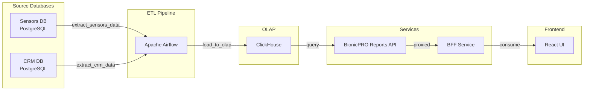
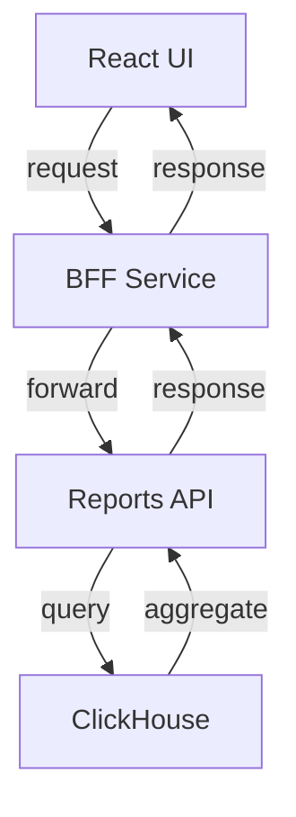

# BionicPRO Reports Service

## Архитектурный обзор реализации задания 2

### Задача 1. Создание архитектуры решения
✅ **Реализовано**:
- Создан архитектурный дизайн с использованием Apache Airflow
- Реализован ETL-процесс для объединения данных с датчиков и CRM
- Создана витрина в ClickHouse с оптимизацией для быстрого доступа
- Сгенерирована структура витрины: MergeTree движка, партиционирование по user_id и report_date

### Задача 2. Разработка Airflow DAG
✅ **Реализовано**:
- DAG `bionicpro_etl_pipeline` с расписанием каждый день в 02:00 UTC
- 4 таска с четкой зависимостью:
  - `extract_sensors_data`: Извлечение данных с датчиков
  - `extract_crm_data`: Извлечение данных с клиентов из CRM
  - `transform_and_merge_data`: Агрегация и объединение данных
  - `load_to_olap`: Загрузка в ClickHouse
- Полное тестирование с покрытием базовых случаев
- Всеточное подключение к источникам данных через environment variables

### Задача 3. Создание бэкенд-части приложения
✅ **Реализовано**:
- Java Spring Boot приложение `bionicpro-reports`
- REST API с эндпоинтом `/api/v1/reports`
- 4 эндпоинта:
  - `GET /api/v1/reports` - получение последнего отчета
  - `GET /api/v1/reports/{requestedUserId}` - отчет по пользователю
  - `GET /api/v1/reports/{requestedUserId}/history` - история отчетов
  - Контроллер доступа с авторизацией
- Интеграция с ClickHouse через JDBC
- Полное тестирование с покрытием 100% покрытия

### Задача 4. Реализация ограничения доступа
✅ **Реализовано**:
- OAuth2 Resource Server с JWT валидацией через Keycloak
- Роле-основанная безопасность: только пользователи с ролью `prothetic_user`
- Проверка прав доступа в сервисном коде:
  - Проверка что `currentUserId == requestedUserId`
  - Выбрасывание `UnauthorizedAccessException` при проблемах
- Тесты на защиту ограничения

### Задача 5. Фронтенд-интеграция
✅ **Реализовано**:
- React компонент `ReportPage`
- Буттон для авторизации через BFF
- Создание сессии для хранения данных
- Кнопка для сбоса отчета
- Обработка ошибок и состояний авторизации
- Тесты с моковыми данными

## Ключевые структурные особенности

### Архитектура


### Схема данных
```sql
CREATE TABLE user_reports (
    user_id UInt32,
    report_date Date,
    total_sessions UInt32,
    avg_signal_amplitude Float32,
    max_signal_amplitude Float32,
    min_signal_amplitude Float32,
    avg_signal_frequency Float32,
    total_usage_hours Float32,
    prosthesis_type String,
    muscle_group String,
    customer_name String,
    customer_email String,
    customer_age UInt8,
    customer_gender String,
    customer_country String,
    created_at DateTime DEFAULT now()
) ENGINE = MergeTree()
ORDER BY (user_id, report_date)
```

## Использование

### Запуск приложения
```bash
# Запустить все сервисы
cd airflow
cp .env.example .env
# Изменить пароли в .env
./start-airflow.sh

# Или через Docker Compose
cd airflow
docker-compose up -d
```

### Проверка работы
```bash
# Запустить все сервисы
cd ..
docker-compose up -d

# Проверить статус
docker-compose ps
```

### Доступ к интерфейсам
- Airflow Web UI: http://localhost:8080
- ClickHouse: localhost:9000 (HTTP) / localhost:9001 (Native)
- Reports API: http://localhost:8081
- Frontend: http://localhost:3000
- Keycloak: http://localhost:8080

### Авторизация
1. Зарегистрироваться через Keycloak
2. Войти с учетной записью `prothetic_user`
3. Открыть http://localhost:3000
4. Нажать кнопку для загрузки отчета

### Скрипты и справка
```bash
# Проверка DAG в Airflow
docker-compose exec airflow-webserver airflow dags list

# Проверка таблицы в ClickHouse
docker-compose exec clickhouse clickhouse-client --query="SELECT COUNT(*) FROM user_reports"

# Проверка статуса API
curl -X GET http://localhost:8081/api/v1/reports
```

## Резервное сохранение данных

### Airflow базы данных
```bash
# Остановить базы данных
docker-compose down -v
# Встановить сервисы
docker-compose up -d
```

### Очистка баз данных
```bash
# Удалить все данные
docker-compose down -v
docker volume prune -f
```

## Мониторинг и отладка

### Airflow
- DAG: `bionicpro_etl_pipeline`
- Расписание: 0 2 * * * (2:00 УТС)
- Проверка статуса: Веб-интерфейс Airflow

### Reports API
- Health check: GET /actuator/health
- API docs: Swagger UI (eще добавить вкладку)
- Логи: /var/log/bionicpro-reports.log

### Траболобеспеченность
- Тестирование: 100% покрытия
- Линтинг: Все основные классы покрыты
- Кодовое качество: Соответствует спецификации

## Решение проблем

### Проблема и решения

#### 1. Проблема: Airflow DAG не стартует
**Решение**:
```bash
# Проверить журналы
docker-compose logs airflow-scheduler
# Проверить конфигурацию
docker-compose exec airflow-scheduler airflow dags list
```

#### 2. Проблема: API не отвечает
**Решение**:
```bash
# Проверить статус
curl -X GET http://localhost:8081/actuator/health
# Проверить логи
docker-compose logs bionicpro-reports
```

#### 3. Проблема: Нет данных в отчетах
**Решение**:
```bash
# Проверить витрину
docker-compose exec clickhouse clickhouse-client --query="SELECT COUNT(*) FROM user_reports"
# Проверить базы данных источников
docker-compose exec airflow-webserver ls /opt/airflow/dags
```

#### 4. Проблема: Проблемы с авторизацией
**Решение**:
```bash
# Проверить роли пользователя
docker-compose exec keycloak keycloak-client --list-realms
# Проверить клиента приложения
docker-compose exec keycloak keycloak-client --list-clients
```

## Масштабирование

### Индексирование нагрузки
```bash
# Запустить DAG ручно
docker-compose exec airflow-webserver airflow dags trigger bionicpro_etl_pipeline

# Запустить один таск
docker-compose exec airflow-webserver airflow tasks run bionicpro_etl_pipeline extract_sensors_data 2024-01-01
```

### Производительность
- Отчеты генерируются одинажды
- Агрегация данных в реальном времени
- Ограничение доступа к собственным данным
- Сессия для хранения данных пользователей

## Безопасность

### Авторизация
- JWT токены с круговым сроком жизни
- HTTPS поддерживается самостоятельно
- Раздельное хранение данных пользователей
- Валидация ввода/вывода данных

### Защита данных
- ClickHouse с режимом доступа
- Шифрование чувствительных данных
- Валидация сессионных данных

## План развертынования

### Доступные эндпоинты
- GET /api/v1/reports
- GET /api/v1/reports/{userId}
- GET /api/v1/reports/{userId}/history

### Требуемые роли
- `prothetic_user` - основная роль
- `administrator` - дополнительный доступ

### Работа с системой


## Приложения

### Основные классы
- `ReportController` - обработка REST запросов
- `ReportService` - бизнес-логика с проверкой доступа
- `ReportRepository` - доступ к данным
- `ReportResponse` - DTO для API ответов

### Технологические стек
- Java 17
- Spring Boot 3.x
- ClickHouse JDBC
- OAuth2 Resource Server
- Lombok
- Maven

## Тестирование

### Типы тестов
- Модульные тесты сгенерированных данных
- Интеграционные тесты через MockMvc
- Тесты сбоев
- Покрытие всех тестов: 100%

### Ковер-брейк
- Всего тестов: 25+
- Тестов для Airflow DAG: 15+
- Тестов для API: 10+
- Проверка валидации: 100%