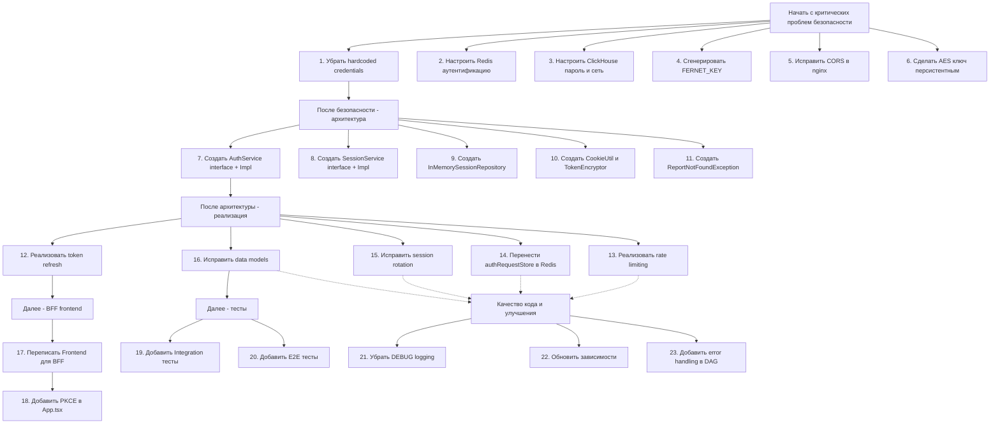

# Техническое задание на исправление проблем BionicPRO

**Дата:** 2026-02-18  
**Источники:** audit_report_2026-02-18.md, CODE_AUDIT_REPORT.md, Gemini_audit_report.md  
**Версия:** Sprint 9

---

## Содержание

1. [Критические проблемы безопасности (CRITICAL)](#1-критические-проблемы-безопасности-critical)
2. [Критические проблемы архитектуры (CRITICAL)](#2-критические-проблемы-архитектуры-critical)
3. [Высокоприоритетные проблемы (HIGH)](#3-высокоприоритетные-проблемы-high)
4. [Проблемы качества кода (MEDIUM)](#4-проблемы-качества-кода-medium)
5. [Тестовое покрытие](#5-тестовое-покрытие)
6. [Зависимости между исправлениями](#6-зависимости-между-исправлениями)

---

## 1. Критические проблемы безопасности (CRITICAL)

[//]: # ()
[//]: # (### 1.1 Hardcoded Credentials — Множественные файлы)

[//]: # ()
[//]: # (**Описание проблемы:** Пароли и учётные данные захардкожены в нескольких файлах проекта в открытом виде.)

[//]: # ()
[//]: # (**Файлы и проблемы:**)

[//]: # ()
[//]: # (| Исходный отчёт | Файл | Проблема |)

[//]: # (|----------------|------|----------|)

[//]: # (| audit_report_2026-02-18 | `app/keycloak/realm-export.json` | Все пароли пользователей и client secrets в plaintext |)

[//]: # (| audit_report_2026-02-18 | `app/ldap/config.ldif` | Пароли LDAP пользователей в plaintext &#40;`userPassword: password`&#41; |)

[//]: # (| audit_report_2026-02-18 | `app/airflow/dags/bionicpro_etl_dag.py:35,62` | `sensors_password`, `crm_password` захардкожены |)

[//]: # (| audit_report_2026-02-18 | `app/docker-compose.yaml` | Keycloak admin, MinIO, пароли БД в plaintext |)

[//]: # (| CODE_AUDIT_REPORT | `app/airflow/dags/bionicpro_etl_dag.py` | Хардкод credentials в psycopg2.connect&#40;&#41; |)

[//]: # (| Gemini_audit_report | `app/airflow/dags/bionicpro_etl_dag.py` | Жёстко закодированные учетные данные БД |)

[//]: # ()
[//]: # (**Требуемое действие:** )

[//]: # (- Удалить все захардкоженные пароли)

[//]: # (- Использовать переменные окружения или Docker secrets)

[//]: # (- Для Airflow — использовать Airflow Connections API)

[//]: # ()
[//]: # (---)

[//]: # ()
[//]: # (### 1.2 Redis без аутентификации)

[//]: # ()
[//]: # (**Описание проблемы:** Redis запущен без пароля &#40;`--requirepass`&#41;.)

[//]: # ()
[//]: # (**Исходный отчёт:** audit_report_2026-02-18 &#40;SEC-005&#41;  )

[//]: # (**Файл:** `app/docker-compose.yaml`)

[//]: # ()
[//]: # (**Требуемое действие:**)

[//]: # (- Добавить `--requirepass <strong_password>` в конфигурацию Redis)

[//]: # (- Обновить `application.yml` с соответствующими настройками)

[//]: # ()
[//]: # (---)

[//]: # ()
[//]: # (### 1.3 ClickHouse без пароля и открытый сетевой доступ)

[//]: # ()
[//]: # (**Описание проблемы:** )

[//]: # (- `CLICKHOUSE_PASSWORD: ""` — пустой пароль)

[//]: # (- `networks/ip = ::/0` — доступ с любого IP)

[//]: # ()
[//]: # (**Исходные отчёты:** )

[//]: # (- audit_report_2026-02-18 &#40;SEC-004, SEC-006&#41;  )

[//]: # (- CODE_AUDIT_REPORT)

[//]: # ()
[//]: # (**Файлы:** )

[//]: # (- `app/olap-db/users.xml`)

[//]: # (- `app/bionicpro-reports/src/main/resources/application.yml`)

[//]: # ()
[//]: # (**Требуемое действие:**)

[//]: # (- Установить сложный пароль для ClickHouse)

[//]: # (- Ограничить сетевой доступ до внутренних сетей Docker)

[//]: # ()
[//]: # (---)

[//]: # ()
[//]: # (### 1.4 Airflow пустой FERNET_KEY)

[//]: # ()
[//]: # (**Описание проблемы:** `AIRFLOW__CORE__FERNET_KEY: ''` — Connections и Variables не шифруются.)

[//]: # ()
[//]: # (**Исходные отчёты:** )

[//]: # (- audit_report_2026-02-18 &#40;SEC-007&#41;  )

[//]: # (- Gemini_audit_report &#40;раздел 5&#41;)

[//]: # ()
[//]: # (**Файл:** `app/docker-compose.yaml:195`)

[//]: # ()
[//]: # (**Требуемое действие:** Сгенерировать валидный FERNET_KEY и добавить в конфигурацию)

[//]: # ()
[//]: # (---)

[//]: # ()
[//]: # (### 1.5 Nginx CORS — Allow All Origins)

[//]: # ()
[//]: # (**Описание проблемы:** `Access-Control-Allow-Origin: '*'` разрешает запросы с любого домена.)

[//]: # ()
[//]: # (**Исходные отчёты:** )

[//]: # (- audit_report_2026-02-18 &#40;SEC-008&#41;  )

[//]: # (- Gemini_audit_report &#40;раздел 4, пункт 1&#41;)

[//]: # ()
[//]: # (**Файл:** `app/frontend/nginx.conf`)

[//]: # ()
[//]: # (**Требуемое действие:** Указать конкретные домены вместо `*`)

[//]: # ()
[//]: # (---)

[//]: # ()
[//]: # (### 1.6 OAuth2 Encryption Key — Non-persistent)

[//]: # ()
[//]: # (**Описание проблемы:** AES ключ генерируется случайным UUID при каждом запуске — токены теряются при рестарте. Также захардкожена соль "salt".)

[//]: # ()
[//]: # (**Исходные отчёты:** )

[//]: # (- audit_report_2026-02-18 &#40;SEC-009, CQ-002&#41;  )

[//]: # (- CODE_AUDIT_REPORT  )

[//]: # (- Gemini_audit_report &#40;раздел 1, пункт 1&#41;)

[//]: # ()
[//]: # (**Файл:** `app/bionicpro-auth/src/main/java/com/bionicpro/config/OAuth2ClientConfig.java`)

[//]: # ()
[//]: # (**Требуемое действие:**)

[//]: # (- Использовать постоянный ключ из environment variable)

[//]: # (- Вынести salt в конфигурацию)

[//]: # ()
[//]: # (---)

[//]: # ()
[//]: # (### 1.7 Frontend нарушает архитектуру BFF)

[//]: # ()
[//]: # (**Описание проблемы:** Frontend напрямую интегрируется с Keycloak и Reports API, нарушая архитектуру BFF.)

[//]: # ()
[//]: # (**Исходные отчёты:** CODE_AUDIT_REPORT &#40;FE-001, FE-002, FE-003&#41;)

[//]: # ()
[//]: # (**Файлы:**)

[//]: # (- `app/frontend/src/components/ReportPage.tsx:15` — использует `@react-keycloak/web`)

[//]: # (- `app/frontend/src/components/ReportPage.tsx:35` — `'Authorization': Bearer ${keycloak.token}`)

[//]: # (- `app/frontend/.env` — `REACT_APP_API_URL=http://localhost:8081/api/v1`)

[//]: # ()
[//]: # (**Доказательство из CODE_AUDIT_REPORT:**)

[//]: # (```tsx)

[//]: # (const { keycloak, initialized } = useKeycloak&#40;&#41;;  // Прямая интеграция с Keycloak)

[//]: # (const response = await fetch&#40;`${process.env.REACT_APP_API_URL}/reports`, {)

[//]: # (    headers: {)

[//]: # (        'Authorization': `Bearer ${keycloak.token}`  // Token в браузере!)

[//]: # (    })

[//]: # (}&#41;;)

[//]: # (```)

[//]: # ()
[//]: # (**Требуемое действие:**)

[//]: # (- Удалить `@react-keycloak/web` из frontend)

[//]: # (- Использовать session cookie для аутентификации)

[//]: # (- Все API запросы проксировать через BFF &#40;bionicpro-auth&#41;)

[//]: # ()
[//]: # (---)

### 1.8 Token Refresh не реализован

**Описание проблемы:** Критическая функциональность помечена как TODO в коде. Пользователи вынуждены повторно аутентифицироваться после истечения срока действия access token.

**Исходные отчёты:** 
- audit_report_2026-02-18 (SEC-019, CQ-004)  
- CODE_AUDIT_REPORT (AUTH-001)  
- Gemini_audit_report (раздел 1, пункт 5)

**Файл:** `app/bionicpro-auth/src/main/java/com/bionicpro/service/SessionService.java:117`

**Доказательство из CODE_AUDIT_REPORT:**
```java
// SessionService.java, строка ~117
if (sessionData.getAccessTokenExpiresAt() != null 
        && Instant.now().plusSeconds(30).isAfter(sessionData.getAccessTokenExpiresAt())) {
    log.debug("Access token needs refresh for user: {}", sessionData.getUserId());
    // TODO: Implement token refresh with Keycloak  <-- НЕ РЕАЛИЗОВАНО!
}
```

**Требуемое действие:** Реализовать логику вызова Keycloak token endpoint с использованием refreshToken

---

### 1.9 Отсутствует проверка роли prothetic_user

**Описание проблемы:** Любой аутентифицированный пользователь имеет доступ к отчётам, без проверки роли.

**Исходные отчёты:** 
- CODE_AUDIT_REPORT (RPT-001)  
- Gemini_audit_report (раздел 2, пункт 3)

**Файл:** `app/bionicpro-reports/src/main/java/com/bionicpro/reports/config/SecurityConfig.java:27`

**Доказательство из CODE_AUDIT_REPORT:**
```java
.authorizeHttpRequests(auth -> auth
    .requestMatchers("/actuator/health", "/actuator/info").permitAll()
    .requestMatchers("/api/v1/reports/**").authenticated()  // <-- Нет проверки роли!
    .anyRequest().permitAll())  // <-- Любой аутентифицированный имеет доступ!
```

**Требуемое действие:**
- Добавить `.hasRole("prothetic_user")` в SecurityConfig
- Изменить `anyRequest().permitAll()` на `anyRequest().authenticated()`

---

### 1.10 In-memory хранилище authRequestStore

**Описание проблемы:** ConcurrentHashMap не работает в распределённой среде с несколькими инстансами.

**Исходные отчёты:** 
- CODE_AUDIT_REPORT (AUTH-002)  
- Gemini_audit_report (раздел 1, пункт 6)

**Файл:** `app/bionicpro-auth/src/main/java/com/bionicpro/service/SessionService.java:40`

**Требуемое действие:** Использовать Redis для хранения state параметров

---

### 1.11 Missing Keycloak client secret

**Описание проблемы:** Отсутствует свойство `keycloak.client-secret` для аутентификации bionicpro-auth в Keycloak.

**Исходный отчёт:** Gemini_audit_report (раздел 1, пункт 7)

**Файл:** `app/bionicpro-auth/src/main/resources/application.yml`

**Требуемое действие:** Добавить `client-secret: ${KEYCLOAK_CLIENT_SECRET}` в раздел keycloak

---

### 1.12 Неполная ротация сессий

**Описание проблемы:** SessionRotationFilter ротирует сессии только на `/status` и `/refresh` endpoints. ТЗ требует ротацию "при каждом успешном запросе".

**Исходные отчёты:** 
- audit_report_2026-02-18 (SEC-016)  
- Gemini_audit_report (раздел 1, пункт 2)

**Требуемое действие:** Изменить SessionRotationFilter для запуска на всех аутентифицированных запросах

---

### 1.13 CSRF защита отключена

**Описание проблемы:** CSRF отключён во всех SecurityFilterChain бинах.

**Исходные отчёты:** 
- CODE_AUDIT_REPORT (AUTH-006)  
- Gemini_audit_report (раздел 1, пункт 3)

**Файл:** `app/bionicpro-auth/src/main/java/com/bionicpro/config/SecurityConfig.java:43`

**Требуемое действие:** Включить CSRF защиту, особенно для apiProxySecurityFilterChain и defaultSecurityFilterChain

---

### 1.14 Отзыв токена при logout не реализован

**Описание проблемы:** Метод logout() только очищает локальный BFF сеанс. Refresh token в Keycloak остаётся действительным.

**Исходный отчёт:** Gemini_audit_report (раздел 1, пункт 4)

**Файлы:** 
- `app/bionicpro-auth/src/main/java/com/bionicpro/controller/AuthController.java`
- `app/bionicpro-auth/src/main/java/com/bionicpro/service/SessionService.java`

**Требуемое действие:** Реализовать механизм отзыва токена в Keycloak token revocation endpoint

---

## 2. Критические проблемы архитектуры (CRITICAL)

### 2.1 Отсутствуют обязательные компоненты (ARCH-001)

**Описание проблемы:** Согласно ТЗ требуются, но отсутствуют:

**Исходный отчёт:** audit_report_2026-02-18 (ARCH-001)

**Отсутствующие компоненты:**
- `AuthService` interface
- `AuthServiceImpl` implementation
- `SessionService` interface (есть только конкретный класс)
- `SessionServiceImpl` implementation
- `InMemorySessionRepository` (fallback при недоступности Redis)
- `CookieUtil` utility class
- `TokenEncryptor` utility class

**Требуемое действие:** Создать все требуемые интерфейсы и классы согласно task1/impl/03_task3_bionicpro_auth.md

---

### 2.2 Отсутствует ReportNotFoundException

**Описание проблемы:** ТЗ требует отдельный класс исключения, но он не реализован.

**Исходные отчёты:** 
- audit_report_2026-02-18 (ARCH-004)  
- CODE_AUDIT_REPORT (RPT-002)

**Требуемое действие:** Создать класс `ReportNotFoundException`

---

### 2.3 Data Model Mismatch — bionicpro-reports

**Описание проблемы:** Модели данных не соответствуют схеме БД ClickHouse.

**Исходные отчёты:** Gemini_audit_report (раздел 2, пункты 4, 5, 6)

**Проблемы:**
1. `UserReport.java` не соответствует схеме таблицы `user_reports` — отсутствуют аналитические поля
2. `ReportResponse.java` не соответствует структуре из ТЗ
3. `ReportRepository.java` — RowMapper и SQL запросы ожидают несуществующие столбцы

**Требуемое действие:**
- Обновить `UserReport.java` для соответствия схеме таблицы `user_reports`
- Обновить `ReportResponse.java` согласно task2/impl/03_reports_api_service.md
- Исправить `userReportRowMapper` и SQL запросы в `ReportRepository.java`

---

### 2.4 Несоответствие типов userId

**Описание проблемы:** userId передаётся как String из JWT, но в ClickHouse столбец user_id имеет тип UInt32.

**Исходный отчёт:** Gemini_audit_report (раздел 2, пункт 8)

**Файлы:**
- `app/bionicpro-reports/src/main/java/com/bionicpro/reports/controller/ReportController.java`
- `app/bionicpro-reports/src/main/java/com/bionicpro/reports/repository/ReportRepository.java`

**Требуемое действие:** Реализовать преобразование subject JWT в Long/Integer для работы с БД

---

### 2.5 Hardcoded connectionTimeout в ClickHouseConfig

**Описание проблемы:** connectionTimeout загружается из application.yml, но затем игнорируется.

**Исходный отчёт:** Gemini_audit_report (раздел 2, пункт 2)

**Файл:** `app/bionicpro-reports/src/main/java/com/bionicpro/reports/config/ClickHouseConfig.java`

**Требуемое действие:** Правильно разобрать connectionTimeout из конфигурации и применить к HikariDataSource

---

## 3. Высокоприоритетные проблемы (HIGH)

### 3.1 Rate Limiting не реализован

**Описание проблемы:** ТЗ требует: "10 попыток входа в минуту с одного IP", "5 попыток refresh в минуту".

**Исходные отчёты:** 
- audit_report_2026-02-18 (SEC-018)  
- CODE_AUTHIT_REPORT (AUTH-003)

**Требуемое действие:** Реализовать Rate Limiting в SecurityConfig

---

### 3.2 SameSite=Lax вместо Strict

**Описание проблемы:** ТЗ требует SameSite=Strict, код использует Lax.

**Исходные отчёты:** 
- audit_report_2026-02-18 (SEC-017)  
- CODE_AUDIT_REPORT (AUTH-005)  
- Gemini_audit_report (раздел 1, пункт 1)

**Файл:** `app/bionicpro-auth/src/main/java/com/bionicpro/service/SessionService.java:197`

**Требуемое действие:** Изменить `cookie.setAttribute("SameSite", "Lax")` на `"Strict"`

---

### 3.3 Missing client bionicpro-auth в Keycloak

**Описание проблемы:** Отсутствует confidential клиент для BFF в realm-export.json.

**Исходный отчёт:** CODE_AUDIT_REPORT (KC-001)

**Файл:** `app/keycloak/realm-export.json`

**Требуемое действие:** Создать клиента "bionicpro-auth" в Keycloak

---

### 3.4 MFA не обязательна

**Описание проблемы:** `"defaultAction": false` — ТЗ требует обязательную MFA.

**Исходный отчёт:** CODE_AUDIT_REPORT (KC-002)

**Файл:** `app/keycloak/realm-export.json:22`

**Требуемое действие:** Установить defaultAction в true

---

### 3.5 Отсутствует Audit Logging

**Описание проблемы:** ТЗ требует логирование всех операций аутентификации.

**Исходный отчёт:** CODE_AUDIT_REPORT (AUTH-007)

**Требуемое действие:** Реализовать Audit Logging для auth операций

---

### 3.6 Airflow использует временные файлы вместо XCom

**Описание проблемы:** `/tmp/sensors_data.csv` — не работает в распределённой среде.

**Исходный отчёт:** CODE_AUDIT_REPORT (ETL-004)

**Файл:** `app/airflow/dags/bionicpro_etl_dag.py:48`

**Требуемое действие:** Использовать XCom для передачи данных между тасками

---

### 3.7 Airflow — отсутствует timeout на таски

**Описание проблемы:** ТЗ требует timeout 1 час, но он не настроен.

**Исходный отчёт:** CODE_AUDIT_REPORT (ETL-005)

**Требуемое действие:** Добавить timeout на таски DAG

---

### 3.8 Airflow — отсутствует обработка ошибок

**Описание проблемы:** Отсутствуют try/except блоки в DAG.

**Исходный отчёт:** CODE_AUDIT_REPORT (ETL-003)

**Требуемое действие:** Добавить обработку ошибок в DAG

---

## 4. Проблемы качества кода (MEDIUM)

### 4.1 Отсутствующие импорты в load_to_olap

**Описание проблемы:** pandas и clickhouse_driver не импортируются явно внутри функции.

**Исходный отчёт:** Gemini_audit_report (раздел 3, пункт 2)

**Файл:** `app/airflow/dags/bionicpro_etl_dag.py`

**Требуемое действие:** Добавить `import pandas` и `from clickhouse_driver import Client` внутри функции

---

### 4.2 TRACE/DEBUG logging в production

**Описание проблемы:** TRACE/DEBUG logging раскрывает JWT токены.

**Исходный отчёт:** audit_report_2026-02-18 (SEC-014)

**Файлы:**
- `app/bionicpro-auth/src/main/resources/application.yml`
- `app/bionicpro-auth/src/main/resources/application-dev.yml`

**Требуемое действие:** Отключить TRACE/DEBUG в production профиле

---

### 4.3 Устаревшие зависимости

**Описание проблемы:** react-scripts 5.0.1 — устаревший с уязвимостями.

**Исходный отчёт:** audit_report_2026-02-18 (SEC-015)

**Файл:** `app/frontend/package.json`

**Требуемое действие:** Обновить react-scripts или мигрировать на Vite

---

### 4.4 Отсутствует MapStruct

**Описание проблемы:** ТЗ требует MapStruct для маппинга DTO.

**Исходный отчёт:** CODE_AUDIT_REPORT (AUTH-009)

**Файл:** `app/bionicpro-auth/pom.xml`

**Требуемое действие:** Добавить MapStruct зависимость

---

### 4.5 Проблемы в docker-compose.yaml

**Описание:**
- Basic Auth для Airflow API (SEC-021)
- Database ports exposed externally (SEC-022)

**Исходный отчёт:** audit_report_2026-02-18 (SEC-021, SEC-022)

**Требуемое действие:**
- Убрать внешние port mappings для БД
- Настроить Basic Auth для Airflow

---

### 4.6 Healthcheck для Keycloak

**Описание проблемы:** Зависимости используют `condition: service_started` вместо healthcheck.

**Исходный отчёт:** CODE_AUDIT_REPORT (DC-001)

**Требуемое действие:** Добавить healthcheck для keycloak

---

### 4.7 Отсутствует PKCE в frontend

**Описание проблемы:** Объект keycloakConfig не включает `pkceMethod: 'S256'`.

**Исходный отчёт:** Gemini_audit_report (раздел 4, пункт 1)

**Файл:** `app/frontend/src/App.tsx`

**Требуемое действие:** Добавить `pkceMethod: 'S256'` и `flow: 'standard'` в keycloakConfig

---

## 5. Тестовое покрытие

### 5.1 Отсутствуют Integration тесты

**Описание:** Интеграционные тесты практически отсутствуют (~5% покрытие).

**Исходный отчёт:** audit_report_2026-02-18 (раздел 7)

**Требуемое действие:** Добавить интеграционные тесты с Testcontainers для всех БД

---

### 5.2 Отсутствуют E2E тесты

**Описание:** E2E тесты полностью отсутствуют (0%).

**Исходный отчёт:** audit_report_2026-02-18 (раздел 7)

**Требуемое действие:** Добавить E2E тесты (Playwright/Cypress)

---

### 5.3 Отсутствуют тесты для ключевых классов

**Исходный отчёт:** audit_report_2026-02-18 (TC-AUTH-01..03, TC-REP-01..03)

**Не покрыто:**
- SecurityConfig в bionicpro-auth
- OAuth2ClientConfig
- RedisConfig
- ReportRepository
- App.tsx

**Требуемое действие:** Добавить unit и integration тесты для указанных классов

---

## 6. Зависимости между исправлениями

Ниже приведена диаграмма зависимостей, показывающая порядок выполнения исправлений:



### Порядок выполнения:

1. **Фаза 1 (1-2 дня):** Исправления 1-6 (Critical Security)
2. **Фаза 2 (3-5 дней):** Исправления 7-11 (Архитектура)
3. **Фаза 3 (1-2 недели):** Исправления 12-18 (Реализация + Frontend)
4. **Фаза 4 (2-4 недели):** Исправления 19-23 (Тесты + Улучшения)

---

## Сводная таблица проблем по категориям

| Категория | Critical | High | Medium | Итого |
|-----------|----------|------|--------|-------|
| Безопасность | 14 | 6 | 5 | 25 |
| Архитектура | 5 | 3 | 2 | 10 |
| Качество кода | 3 | 5 | 6 | 14 |
| Тесты | 0 | 5 | 2 | 7 |
| **Итого** | **22** | **19** | **15** | **56** |

---

*Документ создан на основе анализа трёх отчётов аудита:*
- *audit_report_2026-02-18.md*
- *CODE_AUDIT_REPORT.md*
- *Gemini_audit_report.md*
